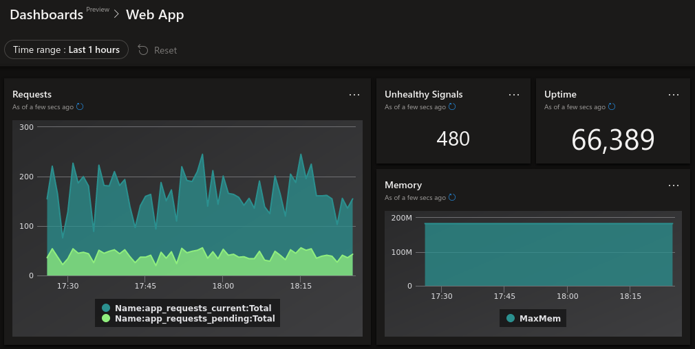
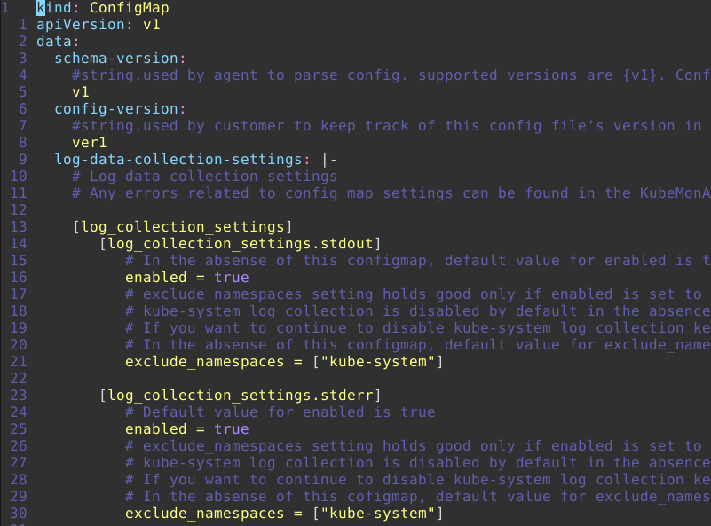

Part of running a production-quality Kubernetes cluster is being able to monitor it. One of the nice things about having your Kubernetes cluster in Azure is that many things are easy to setup and work with right out of the box.

Metrics are one part of an effective monitoring strategy (read here for info about [Logging to Azure from an AKS Cluster](https://trstringer.com/native-azure-logging-aks/)), but a very critical one. Metrics allow you to have insight into how your software and systems are running, from alerting to dashboards that look like this:



That dashboard looks great, but it's just the visual representation of a few KQL queries against the logged custom/app metrics data!

This blog post will show you how to go from an AKS cluster to custom metrics.

## How AKS does custom metrics

AKS utilizes [Azure Monitor for containers](https://docs.microsoft.com/en-us/azure/azure-monitor/insights/container-insights-overview). The part of Azure Monitor for containers that handles custom metrics is designed to consume Prometheus metrics from containers. The custom metrics themselves will be available in the Log Analytics workspace that you created (or is automatically created) for you when you create an AKS cluster with monitoring enabled.

The layer that exposes Prometheus metrics to Azure Monitor for containers is a **Prometheus exporter**. I wrote extensively about [how to create a quick and easy Prometheus exporter](https://trstringer.com/quick-and-easy-prometheus-exporter/). Once you have your pod exporting Prometheus metrics, you can now wire up the custom metrics.

## Enable custom metrics

To start collecting metrics, there are a few steps that you need to take. First, you either need to create an AKS cluster with monitoring:

```
$ az aks create --resource-group rg --name aks --enable-addons monitoring
```

Or update your existing AKS cluster:

```
$ az aks enable-addons --resource-group rg --name aks --addons monitoring
```

Now you need to apply configuration for Azure Monitor for containers to start collecting metrics. The first step is to retrieve the configuration template, which is nothing more than a Kubernetes `ConfigMap`:

```
$ curl -o monitoring-config.yaml https://aka.ms/container-azm-ms-agentconfig
```

If you look at this manifest, it is a little long but it is commented *really* well, so hopefully it can explain itself and how each option applies:



The part that we want to focus on is setting `monitor_kubernetes_pods` to `true`. This will tell Azure Monitor for containers to start scraping metrics. Once the configuration is modified locally, you just need to create the `ConfigMap` in your AKS cluster:

```
$ kubectl apply -f ./monitoring-config.yaml
```

And that's it! Now Azure Monitor for containers is scraping pods for Prometheus metrics. But... how does it know which pods to scrape? The answer is in the comments of the configuration (pasted below for reference). You configure your pods with annotations that include the following:

- **prometheus.io/scrape**: Enable scraping for this pod
- **prometheus.io/scheme**: If the metrics endpoint is secured then you will need to set this to `https` & most likely set the tls config.
- **prometheus.io/path**: If the metrics path is not /metrics, define it with this annotation.
- **prometheus.io/port**: If port is not 9102 use this annotation

Those four annotations tell Azure Monitor for containers what and how to scrape metrics. So I'm going to modify my deployment manifest to reflect this:

```yaml
kind: Deployment
apiVersion: apps/v1
metadata:
  name: webapp
spec:
  replicas: 8
  selector:
    matchLabels:
      app: webapp
  template:
    metadata:
      labels:
        app: webapp
      annotations:
        prometheus.io/scrape: "true"
        prometheus.io/port: "9877"
    spec:
      containers:
        - name: webapp
          image: mycontainerregistry/webapp:latest
          imagePullPolicy: Always
          ports:
            - containerPort: 5000
              name: http
        - name: exporter
          image: mycontainerregistry/webappexporter:latest
          imagePullPolicy: Always
          env:
            - name: POLLING_INTERVAL_SECONDS
              value: "5"
            - name: APP_PORT
              value: "5000"
            - name: EXPORTER_PORT
              value: "9877"
          ports:
            - containerPort: 9877
              name: http
```

In my pod template, I added `prometheus.io/scrape: "true"` and set the non-default port to scrape from with `promethious.io/port: "9877"`.

## Querying custom metrics

Now that we are collecting custom metrics in our Log Analytics workspace, it's time to work with those metrics: Querying, dashboards, alerts, etc.

To query your metrics, you can use the [Azure Data Explorer Web UI](https://dataexplorer.azure.com), and add your Log Analytics workspace with the following URL format: `https://ade.loganalytics.io/subscriptions/<subscription_id>/resourcegroups/<resource_group>/providers/microsoft.operationalinsights/workspaces/<workspace_name>`.

Start writing your queries!! Here are a few from the dashboard above that I created:

**All current and pending requests for the past hour**

```
InsightsMetrics
| where TimeGenerated > ago(1h)
| where Namespace == "prometheus"
| where Name in ("app_requests_current", "app_requests_pending")
| summarize Total = sum(Val) by TimeGenerated, Name
| sort by TimeGenerated asc, Name asc
```

**Count of app health signals for the past hour**

```
InsightsMetrics
| where TimeGenerated between (_startTime .. _endTime)
| where Namespace == "prometheus"
| where Name == "app_health"
| where Val == 0
| summarize Count = count()
```

**Application uptime**

```
InsightsMetrics
| where Namespace == "prometheus"
| where Name == "app_uptime"
| summarize MinUptime = min(Val) by TimeGenerated
| top 1 by TimeGenerated desc
| project MinUptime
```

**Memory consumption**

```
InsightsMetrics
| where TimeGenerated > ago(1h)
| where Namespace == "prometheus"
| where Name == "process_virtual_memory_bytes"
| summarize MaxMem = max(Val) by TimeGenerated
| sort by  TimeGenerated asc
```

*Note: These above queries work for my custom metrics that I defined, so you would have to create your queries for your particular custom metrics.*

## Summary

Metrics are a key component of production software, and AKS makes it an easy task to collect, analyze, and visualize your metrics in a meaningful way.
