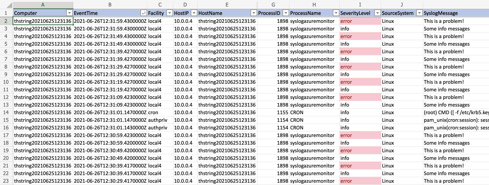

One of the cost-saving approaches to Azure Monitor Log Analytics is to minimize the data retention if it goes past 31 days. Up until that point it is free, but after then it will start costing money to retain your data. If you *do* need to retain log data past 31 days (maybe for telemetry, auditing, etc.) you can export the data from Azure Monitor directly to something cheaper, like Azure Storage.

In this blog post I'm going to show you how you can setup this data export into Azure Storage, and then how you can easily pull those logs from the storage account for analysis (after all, we save logs so they can usually be read).

This post builds off of the other blog post I wrote on [how to use the Azure Monitor Agent to store syslog entries](https://trstringer.com/azure-monitor-agent-linux-syslog-systemd-journal/). It's not necessarily important that I'm using syslog data, so any logs in your workspace can be used with this approach.

## Create the Azure Storage account

The first step is to create the storage account:

```
$ az storage account create \
    --resource-group rg1 \
    --name storage1 \
    --bypass AzureServices
```

We had to create a rule to allow Azure Monitor to access this storage account for this to work.

## Create the data export rule

Now that we have our target Azure Storage account, we need to create the data export rule in the Log Analytics workspace:

```
$ az monitor log-analytics workspace data-export create \
    --resource-group rg1 \
    --workspace-name workspace1 \
    --name exportsyslog \
    --tables Syslog \
    --destination $(az storage account show \
        --resource-group rg1 \
        --name storage1 \
        --query id -o tsv)
```

This command creates a data export for just a single workspace table, `Syslog`. See the [list of supported Log Analytics tables that can be exported](https://docs.microsoft.com/en-us/azure/azure-monitor/logs/logs-data-export?tabs=azure-cli#supported-tables). I only had a single table to export, but you can export multiple tables.

## Getting exported logs

The way that Azure Monitor exports logs to a Storage account is by creating an append blob every hour in a container that is named `am-TABLE`, where `TABLE` is the name of the Log Analytics table it is exporting. So to list all of the blobs that contain your exported table, you can do this:

```
$ az storage blob list \
    --auth-mode login \
    --account-name storage1 \
    --container am-syslog \
    --query '[*].name' -o tsv
```

In my case, the container is named `am-syslog` but that could be different if you're exporting different Log Analytics tables.

## Downloading log blobs

I really don't like manual work, but I do like the ability to quickly go from logs in Azure Storage to actually data I'm looking at nicely. Here's a quick one-liner shell command to download all blobs in a container locally:

```
$ az storage blob list \
        --auth-mode login \
        --account-name storage1 \
        --container am-syslog \
        --query '[*].name' -o tsv | 
    xargs -r -I{} bash -c "az storage blob download \
        --auth-mode login \
        --account-name storage1 \
        --container am-syslog \
        --file /tmp/logs_\$(date +%s).json \
        --name {} && sleep 2"
```

This downloads the blobs in the format of a timestamp. I add a 2 second delay just to add some extra guarantee I'm not overwriting with the same file name in case it is quicker than I expect. There are probably a bunch of ways to solve that problem, but that was the first one I came up with.

## Converting log blobs to CSV

The format of the log blobs is JSON lines. Basically each line (separated with a newline character) is valid JSON. That's great, but not easy to consume elsewhere. So I wanted to convert these JSON line files to CSV. Here's a quick Python script I wrote to accomplish this:

**jsonl_to_csv.py**

```python
import csv
import json
import sys

if len(sys.argv) < 3:
    print("python jsonl_to_csv.py <source_jsonl> <source_jsonl> ... <destination_csv>")
    sys.exit(1)

input_files = sys.argv[1:-1]
output_file = sys.argv[-1]

print(f"Input file(s): {input_files}")
print(f"Output file: {output_file}")

rows_added = False
rows_of_log = 0
with open(output_file, "w") as csv_output:
    csv_writer = csv.writer(csv_output)
    for input_file in input_files:
        with open(input_file, "r") as input_jsonl:
            for input_line in input_jsonl:
                input_json = json.loads(input_line)
                if not rows_added:
                    csv_writer.writerow(input_json.keys())
                    rows_added = True
                csv_writer.writerow(input_json.values())
                rows_of_log += 1

print(f"{rows_of_log} entries written")
```

To invoke this script I run (inside a Python 3 virtual environment):

```
$ python jsonl_to_csv.py /tmp/logs_*.json /tmp/logs_output.csv
Input file(s): ['/tmp/logs_1624710597.json', '/tmp/logs_1624710605.json', '/tmp/logs_1624710614.json', '/tmp/logs_1624710623.json', '/tmp/logs_1624710631.json', '/tmp/logs_1624710640.json', '/tmp/logs_1624710649.json', '/tmp/logs_1624710658.json', '/tmp/logs_1624710666.json', '/tmp/logs_1624710675.json', '/tmp/logs_1624710683.json', '/tmp/logs_1624710692.json', '/tmp/logs_1624710700.json', '/tmp/logs_1624710710.json', '/tmp/logs_1624710719.json', '/tmp/logs_1624710728.json', '/tmp/logs_1624710736.json', '/tmp/logs_1624710745.json', '/tmp/logs_1624710754.json']
Output file: /tmp/logs_output.csv
17709 entries written
```

## Analyze in Excel

Now that the logs are in a single CSV file, you can consume that data however you prefer. One option is to use Excel to load, filter, and search through the logs:



With a little sorting, some conditional formatting, and filtering you can have a nice view on the logs.

## Summary

The ability to offload your Azure Monitor logs to Azure Storage could mean some really big savings if you require longer retention of logs. Hopefully this post showed you how to get the logs into Azure Storage but also quickly and effectively retrieve and analyze those same logs!
