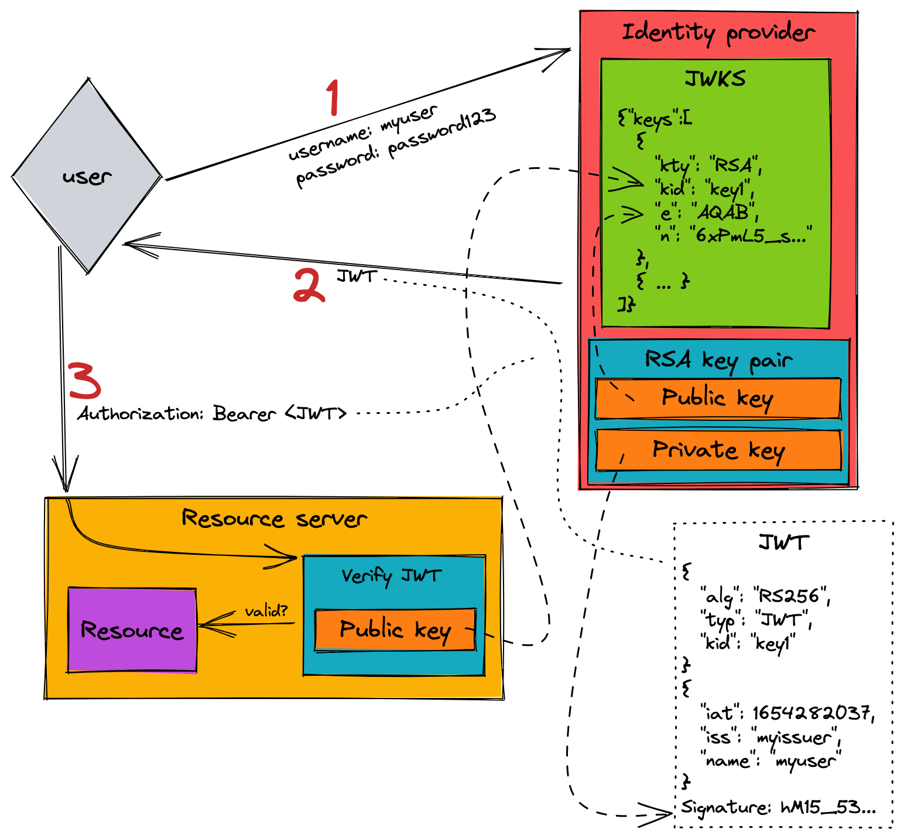

A  modern approach to authorization is through JSON web tokens (JWT). There is a lot of really great information out there that explains what a JWT is, and I highly recommend you take a look at the [details of what makes up a JWT](https://jwt.io/introduction), as this information is a prerequisite to getting the most out of this blog post. Something that I feel that is a bit lacking, though, is the scenario of an identity provider and using it to create JWTs and how they are used for authorization to a resource server (and its containing resources). Hopefully this post can help illustrate this.

Here is a diagram that we can use to follow the authorization flow with JWTs:



## Workflow explanation

There are three different actors in this authz flow:

* **User** - This is the client needing to access resources that require authorization
* **Resource server** - The resource-owning entity that provides access to the user-desired resources
* **Identity provider** - The entity that is in charge of taking user credentials and providing a JWT

There is a trust relationship between the **resource server** and the **identity provider** so that the former can be absolutely sure that the **user** is who they say they are.

Walking through this scenario, the beggining step is for the user to authenticate with the identity provider. We do this all the time. You provide your username and password and then the identity provider tells you that you have signed in successfully. *But*, a lot has happened to get to this point already. The identity provider creates a JWT for us. A JWT is comprised of three different parts:

* **Header** - This includes the type ("JWT"), the algorithm (usually either "RS256" for RSA private/public key pair or "HS256" for HMAC signing with a secret), and in some cases it'll include the key ID
* **Claims payload** - All of the "data" for the token. This can be anything, but the standard information is when it was issued at, when it expires, the issuer, subject, etc.
* **Signature** - This is the combination of the header and the payload that is signed by either a private key (RS256) or a secret (HS256)

Let's see an example:

**Header**

```json
{
  "alg": "RS256",
  "typ": "JWT",
  "kid": "key1"
}
```

This header tells us that this JWT is signed with an RSA private key. The key can be referenced in a JWKS (JSON web key set) with by the ID "key1" (more on JWKSs below).

**Payload**

```json
{
  "iat": 1654304343,
  "iss": "myissuer",
  "sub": "hello world",
  "exp": 1654304473
}
```

The payload, or data that we pass to the resource server, tells us when the token was issued at (`iat`) and when it expires (`exp`). If `exp` has elapsed then this token isn't valid. The issuer (`iss`) is the identity provider that issued the token, and the subject (`sub`) is some data that pertains to the token.

Finally the **signature** is the signed string (in this case of RS256, it is signed using an RSA private key) of combining `base64(header) + "." + base64(payload)`. Why? Because this ensures that the header and payload can't be tampered with. Another very convenient thing about reading the output JWT token string is that it is in the format of `base64(header).base64(payload).signature`. This makes it easy to parse the different parts and verify (you can look at the header and payload by base64 decoding the separate parts).

Once the JWT is created the user will now take that token and pass it to the resource server. The resource server will need to *verify* this token and make sure that it is valid. There are a lot of validity checks, and some of them are:

* Is it expired?
* Is the signature valid compared to the header and payload?
* Do I trust the signer?

In order to verify a JWT that was signed with an RSA **private key** by the identity provider, the resource server needs the RSA **public key**. The resource server will verify the JWT and, provided that it is valid, it will finally allow the user to accomplish the task that they set out to do in the request.

## Identity provider and resource server in action

That was a great overview, but let's now see this in action. The underlying foundation of this is based on RSA private/public key pairs, so we need to set that up first. A *real world* identity provider would have the infrastructure for provisioning the key pairs, but in my case for my identity provider I'm just going to create one now:

```
$ openssl genrsa -out ~/dev/tmp/private_key.pem 2048
$ openssl rsa -in ~/dev/tmp/private_key.pem -pubout -out ~/dev/tmp/public_key.pem
```

Like always, I would store this private key in the appropriate way. This is *never* meant to be shared. But, the public key is meant for distribution. Above I mentioned this in passing (and you can see it in the diagram), but the way that this happens is through a JWKS (JSON web key set). This is nothing more than an endpoint that is accessible from the resource server and provides *all* the public keys (and key IDs) that are available. In my case, this is a single key:

```json
{
  "keys": [
    {
      "kty": "RSA",
      "kid": "key1",
      "e": "AQAB",
      "n": "<public_key_modulus>"
    }
  ]
}
```

Each entry says the key type (in this case, "RSA") and the key ID (`kid`). This can be any identitifier that the resource server will use to reference the needed public key. This is usually passed in the JWT header in the `kid` field so the resource server knows what public key to request. Finally, it has the public key portion which is comprised of the public exponent (`e`) which in this case is 65537 (encoded is "AQAB") and the modulous (`n`). The combination of `e` and `n` is what makes up the public key.

Back to the example: Now I'm the identity provider and I have my RSA private key to sign JWTs with, and my public key that is living in my accessible JWKS, it is time to create the JWT. [I've created a CLI utility `jwt-creator` that creates and verifies JWTs](https://github.com/trstringer/jwt-creator), so I'll use that here to create the token:

```
$ jwt-creator create \
    --private-key-file ~/dev/tmp/private_key.pem \
    --issued-at-now --expires-in-seconds 120 \
    --subject "hello world" \
    --issuer "myissuer" \
    --key-id "key1"
eyJhbGciOiJSUzI1NiIsImtpZCI6ImtleTEiLCJ0eXAiOiJKV1QifQ.eyJleHAiOjE2NTQzMDQ0NzMsImlhdCI6MTY1NDMwNDM0MywiaXNzIjoibXlpc3N1ZXIiLCJzdWIiOiJoZWxsbyB3b3JsZCJ9.YY3...bAQ
```

I have omitted the (long) part of the signature of the JWT and abbreviated it as `YY3...bAQ`. In reality this will be *much* longer. Let's take a look at a few parts of this. The first part is the header that is encoded. Let's decode it:

```
$ echo "eyJhbGciOiJSUzI1NiIsImtpZCI6ImtleTEiLCJ0eXAiOiJKV1QifQ" | base64 -d
{"alg":"RS256","kid":"key1","typ":"JWT"}
```

And now let's look at the payload:

```
$ echo "eyJleHAiOjE2NTQzMDQ0NzMsImlhdCI6MTY1NDMwNDM0MywiaXNzIjoibXlpc3N1ZXIiLCJzdWIiOiJoZWxsbyB3b3JsZCJ9" | base64 -d
{"exp":1654304473,"iat":1654304343,"iss":"myissuer","sub":"hello world"}
```

The identity provider will pass this JWT back to the user, and the user will put it in the authorization header on requests to the resource server:

```
Authorization: Bearer <JWT>
```

Then the resource server will get the request and it needs to verify the JWT. I'll use `jwt-creator` to verify this token:

```
$ jwt-creator verify \
    --public-key-file ~/dev/tmp/public_key.pem \
    --token "eyJhbGciOiJSUzI1NiIsImtpZCI6ImtleTEiLCJ0eXAiOiJKV1QifQ.eyJleHAiOjE2NTQzMDQ0NzMsImlhdCI6MTY1NDMwNDM0MywiaXNzIjoibXlpc3N1ZXIiLCJzdWIiOiJoZWxsbyB3b3JsZCJ9.YY3...bAQ"
Token is valid
```

The token is valid! Now the resource server knows that this user can access the desired resource. Success! This token is valid for 120 seconds (actually it is 130 seconds because the `iat` was generated with 10 seconds in the past to deal with any clock drift). When that time has elapsed, the token is no longer valid:

```
$ # Wait until it the token expires...

$ jwt-creator verify \
    --public-key-file ~/dev/tmp/public_key.pem \
    --token "eyJhbGciOiJSUzI1NiIsImtpZCI6ImtleTEiLCJ0eXAiOiJKV1QifQ.eyJleHAiOjE2NTQzMDQ0NzMsImlhdCI6MTY1NDMwNDM0MywiaXNzIjoibXlpc3N1ZXIiLCJzdWIiOiJoZWxsbyB3b3JsZCJ9.YY3...bAQ"
invalid token: Token is expired
```

In this invalid token state, the resource server would deny the request to the resource.

Hopefully this blog post has illustrated how the JWT authorization workflow happens between a user, identity provider, and a resource server!
