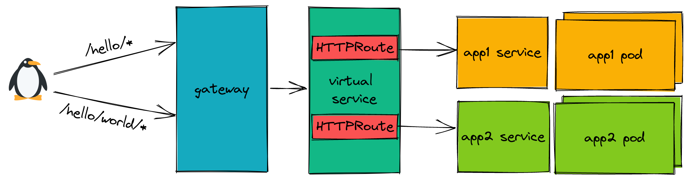

In a microservices world, it is common to have nested URL routes going to various different services. Let's take this example:


In this case, you want your HTTP requests for `/hello/world/*` to go to App2. But all other requests to `/hello/*` should go to App1. Thankfully, this routing scenario can be solved with Istio, specifically using HTTP route rules in a `VirtualService`. Let's see this diagram now with a more detailed implementation:



By using a `VirtualService` and specifying the ordered `HTTPRoute` rules, we can direct traffic to differen services. Here is how we can accomplish that with a `VirtualService`:

```yaml
apiVersion: networking.istio.io/v1beta1
kind: VirtualService
metadata:
  name: appvs
spec:
  hosts:
    - "httpbin2.com"
  gateways:
    - app-routing
  http:
    - match:
        - uri:
            prefix: /hello/world
      route:
        - destination:
            host: app2
    - match:
        - uri:
            prefix: /hello
      route:
        - destination:
            host: app1
```

We have to specify the nested (more specific) URL first. In this case, that is `/hello/world` that we want to direct to App2. Any requests that don't match this route rule will continue to the next. So that means any route that is `/hello/` but not followed by `world` will then be directed to App1.

*Note: All of the manifests are available below for this full example.*

Let's curl these endpoints to see this in action:

```
$ INGRESS_IP=$(kubectl get svc -n istio-system istio-ingressgateway -o jsonpath='{.status.loadBalancer.ingress[0].ip}')

$ curl -H "host: httpbin2.com" http://${INGRESS_IP}/hello/galaxy
(app1-549c548585-8cqld)

$ curl -H "host: httpbin2.com" http://${INGRESS_IP}/hello/world
(app2-75548c4dd9-cjdzd)
```

We see that our `/hello/world` goes to App2, and all other `/hello` routes go to App1! Using Istio we can achieve complex routing scenarios to match our microservices environment!

The manifests for this entire end-to-end example are below:

```yaml
apiVersion: apps/v1
kind: Deployment
metadata:
  name: app1
spec:
  replicas: 1
  selector:
    matchLabels:
      app: app1
  template:
    metadata:
      labels:
        app: app1
    spec:
      containers:
        - name: app1
          image: ghcr.io/trstringer/httpbin2:0.1.0
          command: ["/httpbin2"]
          args:
            - "--message-hostname"
            - "--port"
            - "8080"
          ports:
            - containerPort: 8080
---
apiVersion: v1
kind: Service
metadata:
  name: app1
spec:
  selector:
    app: app1
  ports:
    - name: http
      port: 80
      targetPort: 8080
---
apiVersion: apps/v1
kind: Deployment
metadata:
  name: app2
spec:
  replicas: 1
  selector:
    matchLabels:
      app: app2
  template:
    metadata:
      labels:
        app: app2
    spec:
      containers:
        - name: app2
          image: ghcr.io/trstringer/httpbin2:0.1.0
          command: ["/httpbin2"]
          args:
            - "--message-hostname"
            - "--port"
            - "8080"
          ports:
            - containerPort: 8080
---
apiVersion: v1
kind: Service
metadata:
  name: app2
spec:
  selector:
    app: app2
  ports:
    - name: http
      port: 80
      targetPort: 8080
---
apiVersion: networking.istio.io/v1beta1
kind: Gateway
metadata:
  name: app-routing
spec:
  selector:
    istio: ingressgateway
  servers:
    - port:
        number: 80
        name: http
        protocol: HTTP
      hosts:
        - "httpbin2.com"
---
apiVersion: networking.istio.io/v1beta1
kind: VirtualService
metadata:
  name: appvs
spec:
  hosts:
    - "httpbin2.com"
  gateways:
    - app-routing
  http:
    - match:
        - uri:
            prefix: /hello/world
      route:
        - destination:
            host: app2
    - match:
        - uri:
            prefix: /hello
      route:
        - destination:
            host: app1
```
