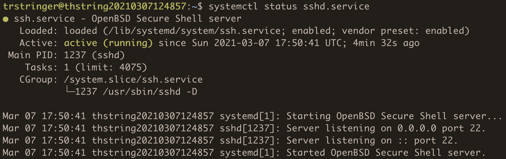
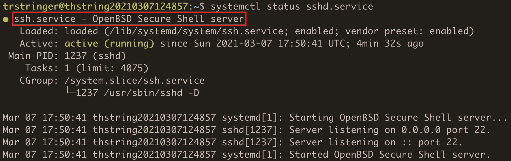
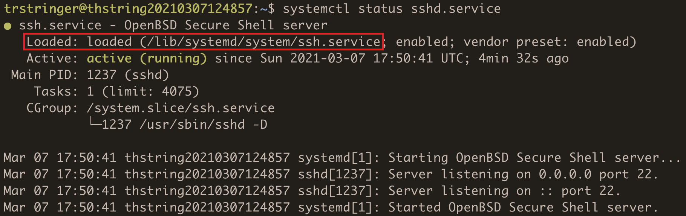
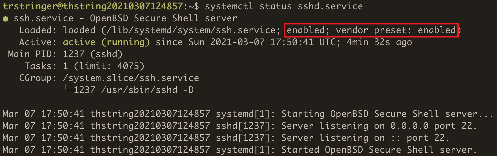
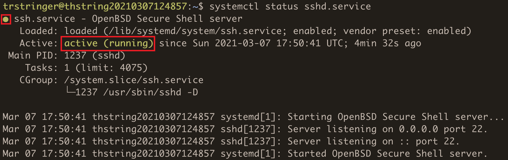
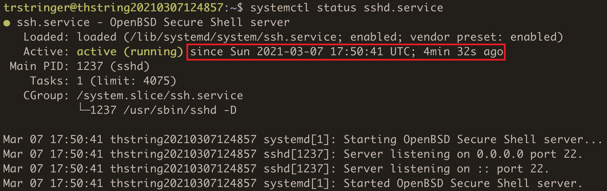
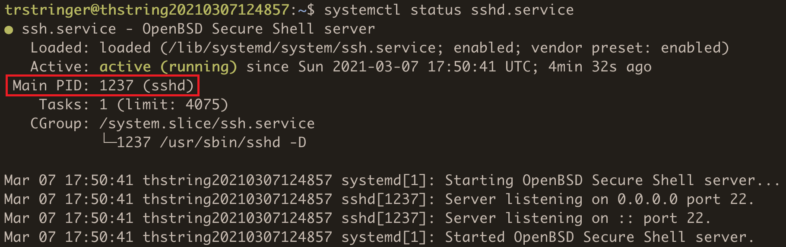
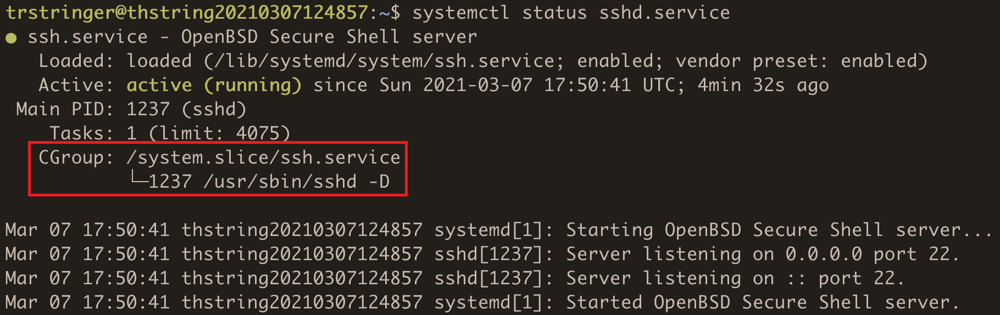

When trying to learn a little bit about a systemd unit, one of the most common (if not the most common?) commands you might run is `systemctl status`. There is a *lot* of really valuable information in the status output. This blog post will disect each part of the output and explain what it means.

For the purpose of this blog post, I'll use the status of the famous `ssh.service` unit:



Let's takes each part of the status output and break it down.



The first line includes the **name - description** for the service. The description can be verified as `systemctl status -p Description ssh.service`. It is also used in journal events for different state changes.



This is the indication of the loaded state of the unit. This just means that it was loaded in memory (and the source unit file). This is the "normal" status for a unit, but could also be "error" if there was a problem loading the unit file. "bad-setting" if there is an error in the unit file syntax. "masked" would indicate that the unit is [masked](https://fedoramagazine.org/systemd-masking-units/).



This tells whether the unit is **enabled** or **disabled**. An enabled unit will start at boot. `vendor preset` tells you if the unit was enabled on installation. If the unit is disabled and you want it to run at boot, you can run `systemctl enable <unit>`. Likewise, if you want to stop the unit from running at boot, you can run `systemctl disable <unit>`.



These are the activation state indicators. The small dot is green for a unit that is active or activating. If the dot is red then it indicates a failed unit. If the dot is white then this is for an inactive unit. For more information on how activation state affects service units, see [my blog post that includes an explanation of a few activation states](https://trstringer.com/simple-vs-oneshot-systemd-service/#activation-states).



This is the datetime (and the duration) since the state change. This is a good indication of how long the unit has been in this current state.



This is the process ID of the of the process behind the unit. You can verify this with `ps`:

```
$ ps 1237
  PID TTY      STAT   TIME COMMAND
 1237 ?        Ss     0:00 /usr/sbin/sshd -D
```

This information can also be found in the cgroup data (explained next).



The control group (cgroup) that this unit's process belongs to. A cgroup is a subset of processes that can have their resources limited and handled together. In this case, `sshd` is the only process in this cgroup, but in the case where it was being shared by other processes their pids would be listed here as well.


Another really cool feature of `systemctl status` is a quick summary of journal logged events for the unit. While this is sometimes a good quick view at what's happening with the unit, it's more thorough to read the journal entries from `journalctl`:

```
$ journalctl -u ssh.service
```

Optionally add `-b 0` to see logged journal entries only from the current boot.

Hopefully this blog post has explained the output of one of the most common commands run with `systemctl`!
