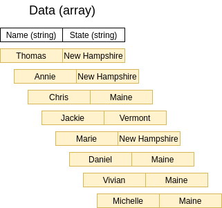
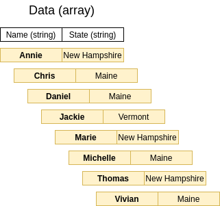
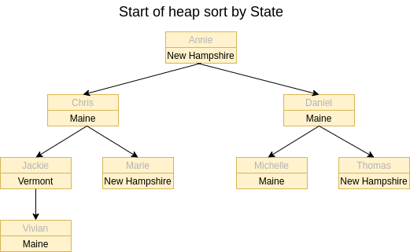
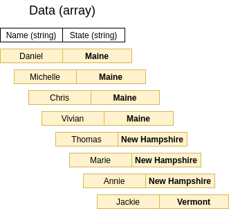
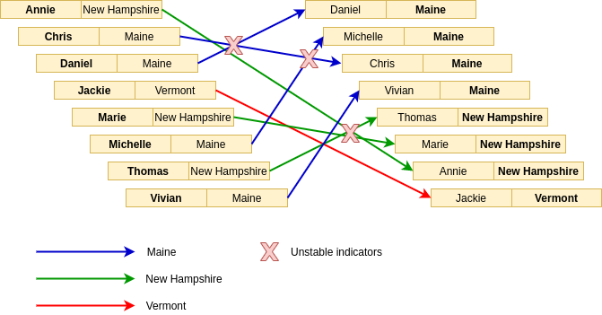
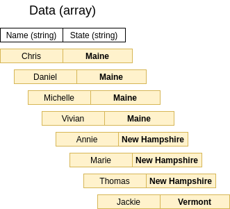
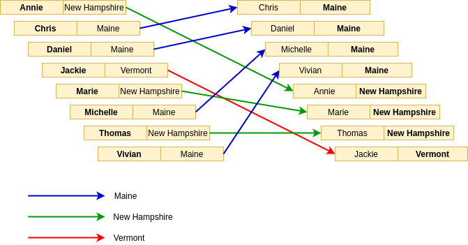

There are many sorting algorithms out there that are widely accepted: Insertion sort, quick sort, heap sort, merge sort, bucket sort... and so on and so forth. There are *a lot* of qualities of each sorting algorithm that allow you to choose what algorithm fits your requirements, but one of the sorting algorithm qualities I want to talk about in this post is **stability**.

## Sorting stability

Stability of a sorting algorithmn is the label that indicates whether or not it will preserve the order of two or more elements in the array **if they have equal sorting keys**. A sorting algorithm is **stable** if it preserves the order of multiple elements with the same keys. Conversely, a sorting algorithm is **unstable** if it cannot guarantee order preservation of multiple elements with equal keys.

An example in real life: There is a line of people that need to be ordered by age. If there are two people with the same age standing in line, the sorter would be using a stable approach if there is a guarantee that their order in line relative to each remains the same.

## When does stability matter?

Sorting stability is interesting by itself, but when do we care about it? We care in a situation when we *require* the output to have the guarantee of preserving order for duplicate keys.

### Example data

Let's see another example and dissect it. Let's say we have an array of data, where each element has two fields: `Name` and `State`. Here is a visual respresentation of the data:

### Requirement

Sort the data by state and then by name, so that the final data is ordered by state first and then by name.

### Approach

This data will be sorted twice so that the requirements can be met:

1. Sort first by `Name`
1. Sort second by `State`

The first sort by `Name` doesn't require a stable sorting algorithm, as the order for duplicate sorting keys (names) doesn't matter. So in this case, we could do a heap sort (a naturally unstable sorting algorithmn) on this array by name.

The output from sorting by `Name` is:

The second sort by `State` is where it can get interesting. If we were to try a heap sort by `State`, this is how we would setup our complete binary tree:

If we were to continue the heap sort by `State`, we would end up with an array sorted like:

Yes, the array is sorted correctly by `State`, but let's see how the elements themselves transitioned:

The fact that elements with the same sorting key (`State`) have overlapping sections to the destination array elements indicates that **their order was not preserved**, showing that this is a **unstable** sorting algorithmn.

### The solution

If we were to look back at the requirements, the heap sort by `State` does not work: The output is sorted by `State` but it is no longer sorted also by `Name` within each `State`.

Let's try doing a second sort (by `State`) with a naturally stable sorting algorithm: Merge sort. The output of the second sort if we were to use a merge sort (instead of a heap sort) would be:

Of course, `State` is correctly sorted but now let's see how the elments transitioned from being sorted by `Name` to a merge sort by `State`:

Now because we used a stable sorting algorithmn (merge sort) on `State`, we preserved the order of elements with the same `State` key value, giving us the desired output of a dataset that is sorted by state and then by name.

## Summary

Sorting algorithmns are a large part of computing, and understanding the behaviors of different algorithms will help in determining the right one for your requirements.
