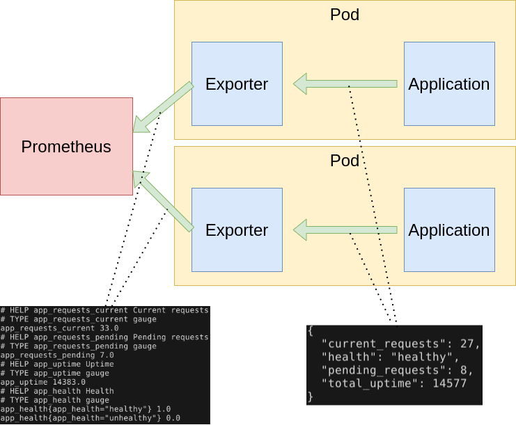
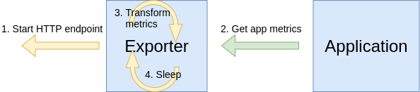

[Prometheus](https://prometheus.io/) is a clear leader in the cloud native world for metrics. Prometheus follows an HTTP pull model: It scrapes Prometheus metrics from endpoints routinely. Typically the abstraction layer between the application and Prometheus is an **exporter**, which takes application-formatted metrics and converts them to Prometheus metrics for consumption. Because Prometheus is an HTTP pull model, the exporter typically provides an endpoint where the Prometheus metrics can be scraped.

The relationship between Prometheus, the exporter, and the application in a Kubernetes environment can be visualized like this:



As you can see from above, the role of the exporter is to consume application-formatted metrics and transform them into Prometheus metrics. In the Kubernetes world, the exporter is a container that lives in the same pod as the application it is exporting.

## Do I need to write my own exporter?

You might need to write your own exporter if...

- You're using 3rd party software that doesn't have an [existing exporter](https://prometheus.io/docs/instrumenting/exporters/#third-party-exporters) already
- You want to generate Prometheus metrics from software that you have written

If you decide that you need to write your exporter, there are a handful of available clients to make things easier: [Python](https://github.com/prometheus/client_python), [Go](https://github.com/prometheus/client_golang), [Java](https://github.com/prometheus/client_java), and a [list of others](https://prometheus.io/docs/instrumenting/clientlibs/).

## Using Python

As you can see above, there are a multiple languages and client libraries that you can use to create your exporter, but I've found that the Python approach is the quickest and easiest to get a working exporter.

There are advantages and disadvantages to choosing Python over something like Go, but one of the main driving forces behind Python is rapid development. So if you're in a DevOps shop that is tasked with writing exporters with a strict timeline, Python might be the best option for you.

The way an exporter works it shown below:



Steps 2, 3, and 4 happen in a loop.

Let's see a small but complete exporter implemented in Python (notes and explanation in comments and below the snippet):

**exporter.py**

```python
"""Application exporter"""

import os
import time
from prometheus_client import start_http_server, Gauge, Enum
import requests

class AppMetrics:
    """
    Representation of Prometheus metrics and loop to fetch and transform
    application metrics into Prometheus metrics.
    """

    def __init__(self, app_port=80, polling_interval_seconds=5):
        self.app_port = app_port
        self.polling_interval_seconds = polling_interval_seconds

        # Prometheus metrics to collect
        self.current_requests = Gauge("app_requests_current", "Current requests")
        self.pending_requests = Gauge("app_requests_pending", "Pending requests")
        self.total_uptime = Gauge("app_uptime", "Uptime")
        self.health = Enum("app_health", "Health", states=["healthy", "unhealthy"])

    def run_metrics_loop(self):
        """Metrics fetching loop"""

        while True:
            self.fetch()
            time.sleep(self.polling_interval_seconds)

    def fetch(self):
        """
        Get metrics from application and refresh Prometheus metrics with
        new values.
        """

        # Fetch raw status data from the application
        resp = requests.get(url=f"http://localhost:{self.app_port}/status")
        status_data = resp.json()

        # Update Prometheus metrics with application metrics
        self.current_requests.set(status_data["current_requests"])
        self.pending_requests.set(status_data["pending_requests"])
        self.total_uptime.set(status_data["total_uptime"])
        self.health.state(status_data["health"])

def main():
    """Main entry point"""

    polling_interval_seconds = int(os.getenv("POLLING_INTERVAL_SECONDS", "5"))
    app_port = int(os.getenv("APP_PORT", "80"))
    exporter_port = int(os.getenv("EXPORTER_PORT", "9877"))

    app_metrics = AppMetrics(
        app_port=app_port,
        polling_interval_seconds=polling_interval_seconds
    )
    start_http_server(exporter_port)
    app_metrics.run_metrics_loop()

if __name__ == "__main__":
    main()
```

In the above code, I defined a helper class `AppMetrics` to contain the Prometheus metrics and app metric loop logic. Creating the class wasn't necessary, but I think it is a bit cleaner and more future-proof to start this way and keep the logic and data contained in an object. Effectively the code just loops and makes an HTTP request to the application metrics (available on `localhost:APP_PORT/status`) and transforms that to the Prometheus metrics.


- Step 1 is the call to `start_http_server` in `main` (line 58)
- Step 2 is `AppMetrics.fetch` (line 31), which is invoked from the loop implemented in `AppMetrics.run_metrics_loop` (line 24)
- Step 3 is the multiple calls `set` and `state` calls on the Prometheus metrics in `AppMetrics.fetch` (lines 42 - 45)
- Step 4, the sleep, is implemented in `AppMetrics.run_metrics_loop` so that we have some delay in metrics scraping

In Kubernetes, this could be deployed alongside the application container like this:

**deployment.yaml**

```yaml
kind: Deployment
apiVersion: apps/v1
metadata:
  name: webapp
spec:
  replicas: 8
  selector:
    matchLabels:
      app: webapp
  template:
    metadata:
      labels:
        app: webapp
    spec:
      containers:
        - name: webapp
          image: mycontainerregistry/webapp:latest
          imagePullPolicy: Always
          ports:
            - containerPort: 5000
              name: http
        - name: exporter
          image: mycontainerregistry/webappexporter:latest
          imagePullPolicy: Always
          env:
            - name: POLLING_INTERVAL_SECONDS
              value: "5"
            - name: APP_PORT
              value: "5000"
            - name: EXPORTER_PORT
              value: "9877"
          ports:
            - containerPort: 9877
              name: http
```

Now with this exporter, Prometheus can scrape metrics from this pod on port 9877, all thanks to the exporter shim that was put between Prometheus and the application!

## More on exporters

Exporters are a much more indepth topic, and I highly recommend you read [more about writing exporters](https://prometheus.io/docs/instrumenting/writing_exporters/). Also [familiarize yourself with the different types of Prometheus metrics](https://github.com/prometheus/client_python#instrumenting) available.

## Summary

Prometheus is a really great and powerful tool. At first glance, it could seem like a daunting task to create an exporter, but hopefully this blog post has shown that in just a few lines of Python code you can instrument an effective exporter and start pulling your application metrics right away into Prometheus!
