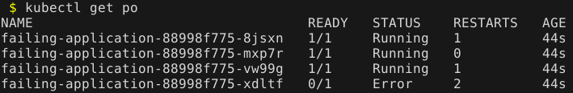
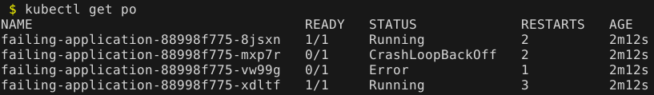
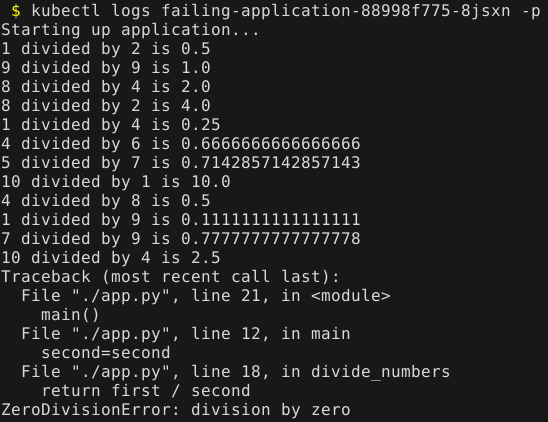
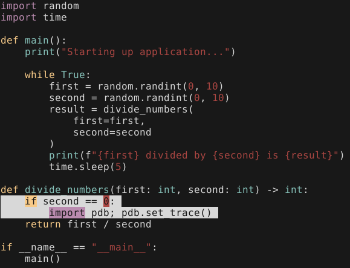
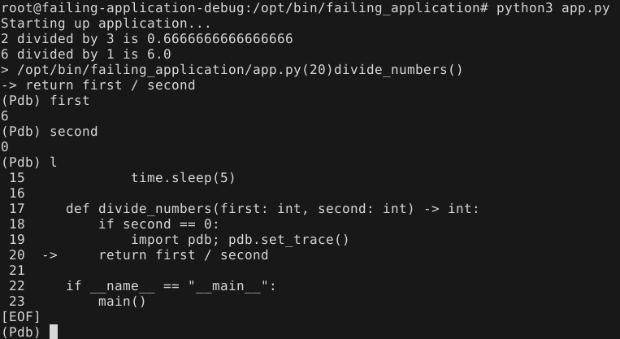

Software breaks. It stops doing what we think it should be doing. It throws errors, and it fails in unexpected ways. This is the reality that we live in.

As a software programmer, it is absolutely critical that you are able to debug software. By debugging, I'm specifically referring to an interactive debugging session. Also commonly referred to as *breaking into the debugger*.

Debugging software running on your local dev machine can be challenging. Debugging software running on a VM can be hard. **Debugging software running in a Kubernetes cluster can be a different level of difficulty!** With the power and capabilities that Kubernetes brings us, it also adds an additional complexity for debugging our software.

## Python debugging

Debugging a Python application is typically done with `pdb`. As a Python developer, you inject `import pdb; pdb.set_trace()` or the newer [`breakpoint()`](https://docs.python.org/3/library/functions.html#breakpoint) function (as of Python 3.7). When your Python code reaches either of these it will halt code execution and break into the interactive debugger.

## Failing Kubernetes application

Python makes debugging a running application a little tricky. Unfortunately there is no native way to attach `pdb` to a running process, so we usually have to get a little creative. And adding in Kubernetes to the mix could prove an extra set of challenges for Python.

Let's see an example of a Python application running in Kubernetes.

**Dockerfile**

```dockerfile
FROM debian:latest
RUN apt-get update && apt-get install -y python3
WORKDIR /opt/bin/failing_application
COPY app.py .
CMD ["python3", "./app.py"]
```

**deployment.yaml**

```yaml
kind: Deployment
apiVersion: apps/v1
metadata:
  name: failing-application
spec:
  replicas: 4
  selector:
    matchLabels:
      app: failing-application
  template:
    metadata:
      labels:
        app: failing-application
    spec:
      containers:
        - name: failing-application
          image: mycontainerregistry/failing-application:latest
          imagePullPolicy: Always
```

The Python application is packaged up in the `mycontainerregistry/failing-application:latest` image. If you have been running Kubernetes already, perhaps the following illustration isn't the first time you've seen it:



You see a few interesting things here:

- A pod with the state of **Error**, indicating there is a problem
- Multiple pods with **RESTARTS** > 0

Or maybe you're seeing something like this:



You usually want to show the logs of the failures:



Great, so now we see the error that is thrown. My contrived example is obvious what the problem (and fix) is, but usually debugging is not so easy.

## Python debugging challenges

A typical next step is to debug the application. We have a stack trace, and that's usually a pretty good tool in knowing where you should set your breakpoint.

But... this application runs in Kubernetes, and you possibly (probably) can't reproduce this issue on your local dev machine (remember, it's never usually that easy).

We have a few challenges for debugging:

- When the application fails, it restarts the pod or goes into a backoff state, so this greatly limits any chance of post-mortem debugging
- If we scale up the deployment to create additional **Running** replicas, or if we try to connect (`kubectl exec -it`) to a **Running** pod, we are still confined to `pdb`'s inability to attach to a running process

## The solution

There are a few things here that you can do to break into the debugger, but there is a big consideration. Picture the scenario: You have an intermittent failure in **production**. Every once in awhile you have a pod failure and restart. You see the logs and the stack trace (just like above). But you can't really alter the deployment itself. You probably don't want to bring down the production deployment and all of its pods, as that would cause an outage.

Another solution that leaves the deployment unaffected is to create a duplicate pod *outside of the deployment* of the running application. The easiest way to do this is to output one of the deployment's existing pods YAML into a temporary file:

```
$ kubectl get pod failing-application-88998f775-8jsxn -o yaml > ./pod.yaml
```

Now you can edit `pod.yaml` and remove all the unnecessary fields (like statuses and other runtime information). I've boiled my manifest down to the following below.

Everything is from the original pod's manifest except the name of the pod and another important item (**note the additional line I've added at the bottom**):

**pod.yaml**

```yaml
apiVersion: v1
kind: Pod
metadata:
  name: failing-application-debug
  namespace: default
  labels:
    app: failing-application
spec:
  containers:
  - name: debug
    image: mycontainerregistry/failing-application:latest
    imagePullPolicy: Always
    # Added a sleep to override the application startup
    command: ["/bin/bash", "-c", "sleep 10000"]
```

By specifying `command` we are overriding the application startup and telling the container to just sleep for a long time. The reason behind that is it allows us to go in the pod *before* the Python application starts.

To accomplish this we need to do the following steps:

1. Create the new debug pod
1. Exec into the container for an interactive session
1. Set the breakpoint in the source code
1. Manually run the Python application

Let's see that in action:

```
$ kubectl apply -f ./pod.yaml
$ kubectl exec -it failing-application-debug -- /bin/bash
```

Now we should be in the pod itself, and we can finish the steps in the container:

```
root@failing-application-debug:/opt/bin/failing_application# ls -la
total 12
drwxr-xr-x 1 root root 4096 Dec 22 21:59 .
drwxr-xr-x 1 root root 4096 Dec 22 14:54 ..
-rw-r--r-- 1 root root  465 Dec 22 21:58 app.py
```

I prefer Vim to edit files, so I need to install it before running:

```
root@failing-application-debug:/opt/bin/failing_application# apt update && apt install -y vim
root@failing-application-debug:/opt/bin/failing_application# vim app.py
```

Now I can set the breakpoint where I want in the Python code (I set a conditional breakpoint for my scenario):



I can save the modification and exit. Now for the next step, I need to manually start the application inside the container. In my case it is as simple as running `python3 ./app.py`, but this is very application-specific.

Once this is done in the pod, we just want to wait until the breakpoint is hit:



Now while still exec'd into the pod my breakpoint is hit and I can debug my application with `pdb`, and hopefully uncover the issue.

## Summary

Debugging a Python application is already a challenging task, and it is even more difficult in Kubernetes. Hopefully this has shown you a way that you can interactively debug your Python application without affecting a production workload (more than it already is!). Happy debugging!
