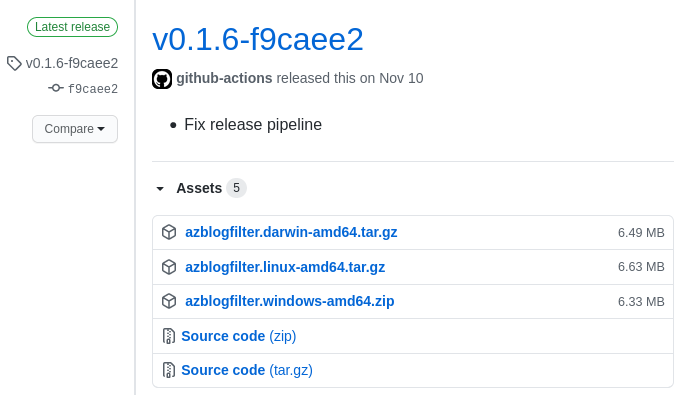
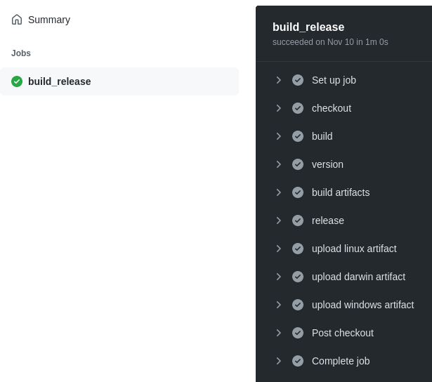

When working in the full software lifecycle, CI/CD is one of the key mechanisms for providing software to the end users.

The "D" in "CI/CD" refers to "delivery" and "deployment". This blog post will focus on the former: **Continuous delivery** with GitHub Actions to a repo release.

## What is Continuous Delivery?

Continuous delivery is the automation of releasing software for consumption. It's typically the step before continuous deployment for a full end-to-end CI/CD pipeline. Continuous delivery focuses on delivering the software artifacts to the end users or administrators.

With GitHub it is common to deliver your software through [releases](https://docs.github.com/en/free-pro-team@latest/github/administering-a-repository/managing-releases-in-a-repository). GitHub releases contain the source code at the given tag, but it is also typical to deliver binary artifacts within releases themselves.



The above is what a GitHub release with artifacts looks like. With this release, users of this software can navigate to the releases section and download the tarball (Linux/MacOS) or zip file (Windows).

## Automating release delivery with GitHub Actions

Being able to automate release creation and artifact upload with GitHub Actions allows you to fully leverage continuous and automated delivery.

### Creating a release

To create a release in your repo, your GitHub Actions workflow should utilize the [create-release](https://github.com/actions/create-release) Action. Here is my implementation of it:


```yaml
  - name: build
    run: make build
  - name: version
    run: echo "::set-output name=version::$(./bin/azblogfilter --version)"
    id: version
  - name: release
    uses: actions/create-release@v1
    id: create_release
    with:
      draft: false
      prerelease: false
      release_name: ${{ steps.version.outputs.version }}
      tag_name: ${{ github.ref }}
      body_path: CHANGELOG.md
    env:
      GITHUB_TOKEN: ${{ github.token }}
```


I've included the logically dependent steps `build` and `version`, because my `release` step gets the `release_name` from the version information. I personally like my release names to be the version.

I have this workflow running for all tags:


```yaml
on:
  push:
    tags:
      - '*'
```


I set my `tag_name` as `github.ref` because in this instance it will be the tag ref.

For this example (and repo) I have the release "content" to be my `CHANGELOG.md` file in my repo root, which is a markdown-formatted file. I maintain that prior to pushing a release tag.

`draft` and `prerelease` are settings for creating a draft or pre-release. In my case, I'm directly creating a full non-draft release.

### Upload artifacts

So now that the workflow creates the release, I want to have my artifacts uploaded to this release so that users can download the new software. This can be done with the [upload-release-asset](https://github.com/actions/upload-release-asset) Action:


```yaml
  - name: build artifacts
    run: make build-linux && make build-windows && make build-darwin
  - name: upload linux artifact
    uses: actions/upload-release-asset@v1
    env:
      GITHUB_TOKEN: ${{ github.token }}
    with:
      upload_url: ${{ steps.create_release.outputs.upload_url }}
      asset_path: ./bin/azblogfilter.linux-amd64.tar.gz
      asset_name: azblogfilter.linux-amd64.tar.gz
      asset_content_type: application/gzip
  - name: upload darwin artifact
    uses: actions/upload-release-asset@v1
    env:
      GITHUB_TOKEN: ${{ github.token }}
    with:
      upload_url: ${{ steps.create_release.outputs.upload_url }}
      asset_path: ./bin/azblogfilter.darwin-amd64.tar.gz
      asset_name: azblogfilter.darwin-amd64.tar.gz
      asset_content_type: application/gzip
  - name: upload windows artifact
    uses: actions/upload-release-asset@v1
    env:
      GITHUB_TOKEN: ${{ github.token }}
    with:
      upload_url: ${{ steps.create_release.outputs.upload_url }}
      asset_path: ./bin/azblogfilter.windows-amd64.zip
      asset_name: azblogfilter.windows-amd64.zip
      asset_content_type: application/zip
```


The `build artifacts` step uses `make` to build the bins across all three platforms. And then finally I have an `upload <platform> artifact` step for each of them: Linux, MacOS, and Windows.

For the upload to target the release, all you have to do is set `upload_url` to the `upload_url` in the output of the release step. Then likewise you set the `asset_path` to the artifact to upload, and `asset_name` to what you want it named in the release.

Finally you set the `asset_content_type` appropriately. In my case, this is `application/gzip` for the tarballs and `application/zip` for the zip file.

## Summary

And there it is! With these steps in your GitHub Action you can have a similar continuous delivery experience!



To see the full source of this workflow, visit my [azblogfilter GitHub repo](https://github.com/trstringer/azblogfilter/blob/master/.github/workflows/release.yaml).
