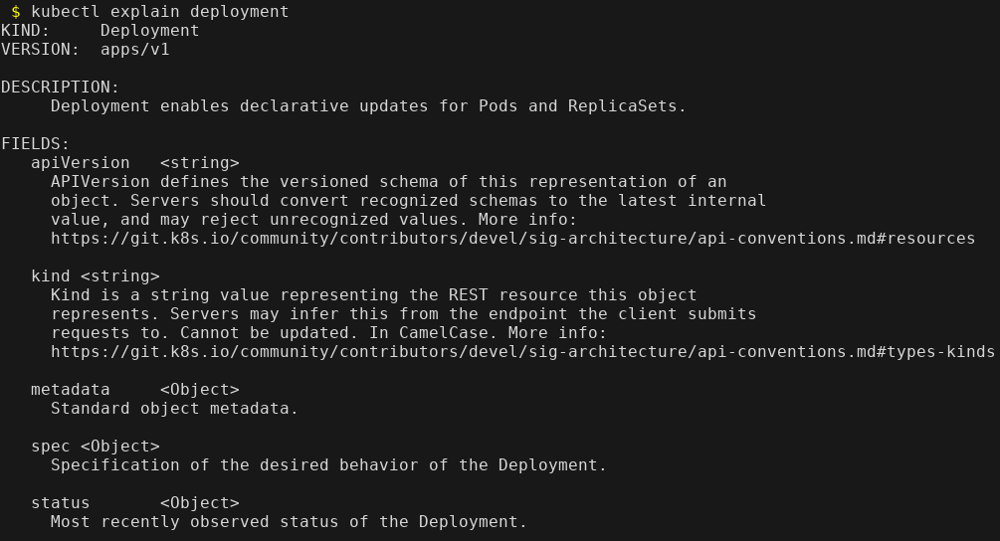
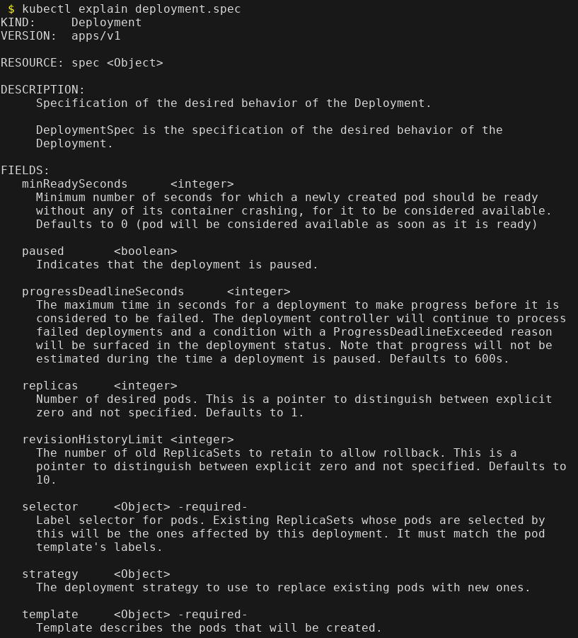
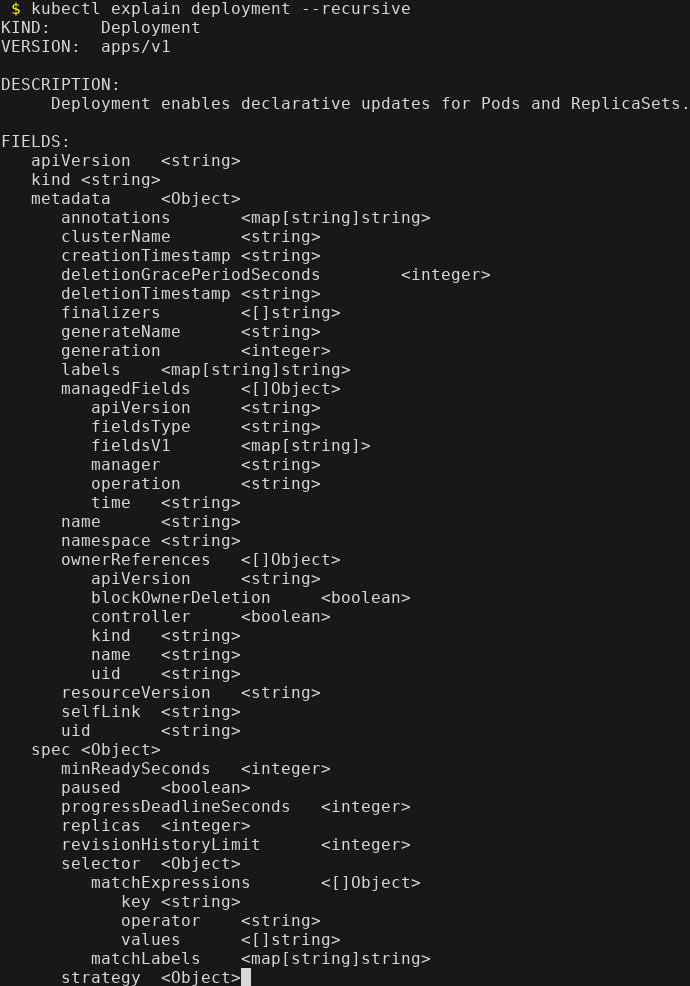

Did you know it's possible to search the Kubernetes API reference docs right from `kubectl`? I had no clue until recently I learned about this pretty cool (and I think, not-so-well-known) feature.

Typically when I am writing my resource manifests, I navigate to the [online Kubernetes API reference docs](https://kubernetes.io/docs/reference/generated/kubernetes-api/v1.20/) to find my answers and help my memory.

Not anymore! This can all be done directly through the command line with `kubectl explain`. For instance, if you want to get the API reference for a `Deployment`, you can run `kubectl explain deployment`:



But this is much more useful even than that. You can drill into the different fields with dot notation:

```
$ kubectl explain deployment.spec
```



This is great, as it gives you the descriptions and possible fields. You can continue this as you drill into the nested fields:

```
$ kubectl explain deployment.spec.template.spec
```

That shows the PodSpec that is used in the deployment's template. Now when I'm creating my Kubernetes resource manifests, I don't have to look through the browser: I can just stay in the terminal and find everything I need directly through `kubectl`.

Another interesting feature if you just want to see all of the field names, you can run it recursively:

```
$ kubectl explain deployment --recursive
```



I love this tooling feature, as it really allows me to save time and stay where I always am (in the terminal). Kubernetes is a complex platform, and the tooling around it like `kubectl` have so many features to make the developer and administrator's life easier!
