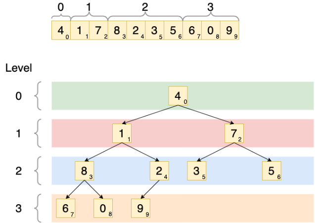

A complete binary tree is a really interesting data structure. It is the starting point of a heap sort and in this blog post I want to illustrate what a complete binary tree is and the properties of it that provide its usefulness.

By definition, a complete binary tree is a data structure where each node has at most two child nodes. Specifically, the tree is designed so that nodes are filled in from top left to bottom right. Put another way, all nodes are as far top and left as they can be. Let's say you have an array of numbers: **[4, 1, 7, 8, 2, 3, 5, 6, 0, 9]**. This can be constructed as a complete binary tree by filling all the nodes in from top to bottom, left to right:

What makes a complete binary tree important though, and mathematically what properties can we derive from it?

The **level capacity of a complete binary tree** can be defined as 2<i>level_index</i>. For example, the root level (level 0) of the binary tree can contain only a single element: *20 = 1*. The level with index of 2 can contain 4 elements: *22 = 4*. It's worth noting that the final level of a complete binary tree may not (and usually is not) be completely full. In the above example, the final level (level index 3) has the capacity for 8 nodes (*23 = 8*), but only contains 3 nodes. This is completely normal. But it is also worth noting that one of the properties of a complete binary tree is that only the last level can be an incomplete level. All preceding levels must be full.

The **child element indexes** can be found:

* **Left child node index** - *2 x parent_index + 1*
* **Right child node index** - *2 x parent_index + 2*

For instance, to get the child nodes of the node with **8** as its value and **3** as its index, the left child node index would be *2 x 3 + 1*, which is index **7** (node value is **6**). The right child node index is *2 x 3 + 2*, which is index **8** (node value is **0**).

The **parent node index** can be calculated by *floor((index - 1) / 2)*. Example: to find the parent node of the element with index **5** (value **3**), you would calculate that with *floor((5 - 1) / 2) = 2*. So that node's parent has an index of **2** (value is **7**).

Hopefully this blog post introduced you to what a complete binary tree is, how to construct one, and its mathematical properties that make it a viable data structure for many uses!
