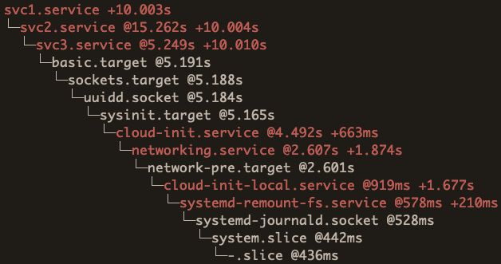
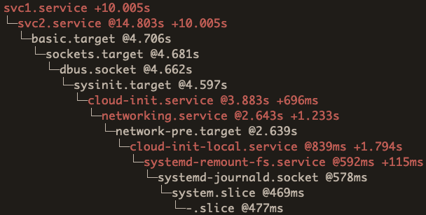
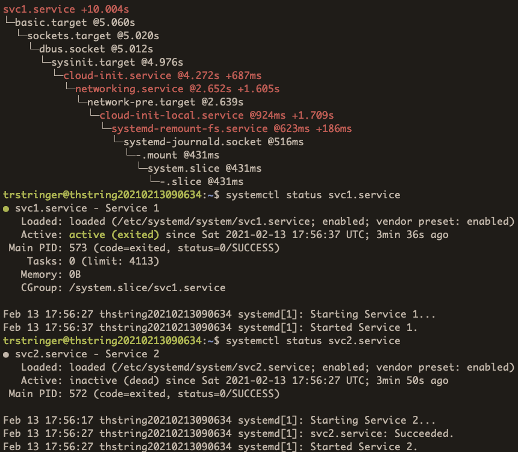
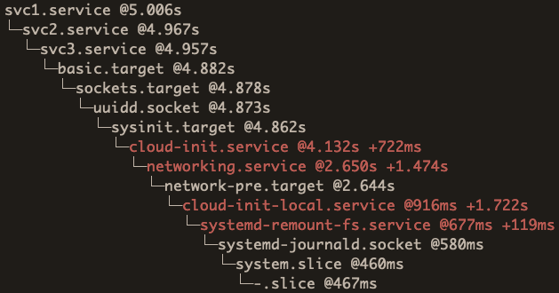
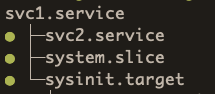

systemd is a great, but complex component. One of the things that I love about systemd is that it really empowers and enables the administrator/developer to really understand what is happening.

## What is a critical chain?

One of the troubleshooting (or better yet, "visualization") tools that I will be talking about today is the critical chain for a systemd unit. The critical chain for a unit accounts for ~~all~~ most (we'll see below why it's not really "all") of the preceeding units that need to be activated prior to the unit in question. **By analyzing the critical chain of a unit we can understand why it took a certain amount of time for that unit to get activated.**

Let's take these units for example:

**svc1.service**

```text
[Unit]
Description=Service 1
Wants=svc2.service
After=svc2.service

[Service]
Type=oneshot
ExecStart=/usr/bin/sleep 10
RemainAfterExit=yes

[Install]
WantedBy=multi-user.target
```

**svc2.service**

```text
[Unit]
Description=Service 2
After=svc3.service

[Service]
Type=simple
ExecStart=/usr/bin/sleep 10
RemainAfterExit=yes

[Install]
WantedBy=multi-user.target
```

**svc3.service**

```text
[Unit]
Description=Service 3

[Service]
Type=oneshot
ExecStart=/usr/bin/sleep 10
RemainAfterExit=yes

[Install]
WantedBy=multi-user.target
```

Not much going on here. **svc1.service** has a dependency on **svc2.service** (as well as an ordering directive to start after it), and **svc2.service** has an ordering directive on **svc3.service** to start after it, but no dependency. To get the critical chain for **svc1.service**, we just need to run:

```
$ systemd-analyze critical-chain svc1.service
```

Here is the output:



This gives us a lot of great information. The number after "@" is at what time the unit is activated, and for some units (more below) you will see "+" with a number after that, just like above. That's the amount of time it took for the unit to start.

So if your question is "why did it take so long for **svc1.service** to get started?", then this tells you what that unit was waiting on.

## Unit failures

If there is a failed unit in the critical chain of a unit, it will not show up in the critical chain. For instance, say we change **svc3.service** to look like this:

```text
[Unit]
Description=Service 3

[Service]
Type=oneshot
ExecStart=/bin/bash -c "sleep 10 && false"
RemainAfterExit=yes

[Install]
WantedBy=multi-user.target
```

This unit will fail (because of the `false` in the `ExecStart`) after it has taken the 10 seconds, but you won't see that reflected in the critical chain:



Notice how between `basic.target` and `svc2.service` there is a 10 second gap. That is the sleep from **svc3.service**, but since it failed it will not show in the critical chain. So you have this "hole" in the chain.

## Oneshot with no RemainAfterExit

You'll notice in my original service unit files, all services are type oneshot with `RemainAfterExit` set to `yes`. I did that on purpose, because for oneshot services if `RemainAfterExit` is *not* set (the default), they will be in an `inactive` state which will cause them to not appear in the critical chain of a unit.

**svc2.service**

```text
[Unit]
Description=Service 2
After=svc3.service

[Service]
Type=oneshot
ExecStart=/usr/bin/sleep 10

[Install]
WantedBy=multi-user.target
```

**svc3.service**

```text
[Unit]
Description=Service 3

[Service]
Type=oneshot
ExecStart=/usr/bin/sleep 10

[Install]
WantedBy=multi-user.target
```

By removing `RemainAfterExit` for these two services, let's see what the critical chain looks like now:



Because **svc2.service** (and **svc3.service**) is inactive (shown by `systemctl status svc2.service`), you can see that they are missing in the critical chain.

## Simple service

The original services were all oneshot services. Take a look at [this blog post that I wrote that describes the differences between oneshot and simple services](https://trstringer.com/simple-vs-oneshot-systemd-service/#follow-up-units-timing), which will explain that a simple service will have its follow-up units started immediately, instead of waiting until completion like a oneshot service. So let's change all of our services to simple by replacing `Type=oneshot` with `Type=simple`.

The critical chain will now look like this:



You can see now that the critical chain highlights that difference in the simple service types, we no longer see the "+" and time, because the follow-up units (**svc2.service** from **svc3.service**, and **svc1.service** from **svc2.service**) do not wait for the unit to complete, it just starts immediately. We see that with the "@" times, which illustrate that there is no real delay between the units' start times.

## Not the complete story

This blog post was intended to also show that the critical chain cannot be the complete story. It showed examples of other units impacting a particular unit's starting time, but not necessarily appearing in the critical chain for that unit.

You have to utilize other tools, such as listing dependencies, which can also paint the picture on what happened:



As you can see here, even if **svc2.service** doesn't show up in the critical chain (maybe because it is a oneshot that doesn't `RemainAfterExit`, or maybe it failed) you can see that it is indeed a dependency of **svc1.service**.

Another helpful tool is to just cat out the unit definition with `systemctl cat <unit>`.

## Summary

Hopefully this blog post has showed another tool, critical chains, which can help you in understanding why certain units are being started at different times. By knowing how to diagnose and investigate systemd units, it will contribute to quicker resolutions and more understanding!
