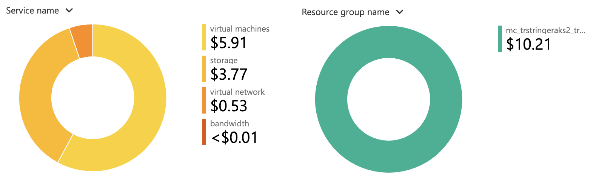

I recently wrote about how to [run Kubernetes in Azure the cheap way](https://trstringer.com/cheap-kubernetes-in-azure/). Since then I've learned that there is another thing we can do for even more savings!

**Note: Just like the in previous blog post, I want to explicitly state that this approach to a Kubernetes cluster is not meant for production. This is suited for learning, development, and testing.**

Something that we can take advantage of for savings is utilizing a [load balancer with the Basic SKU](https://docs.microsoft.com/en-us/azure/load-balancer/load-balancer-overview#pricing-and-sla). It's free! So when you create your AKS cluster, specify this free load balancer: `az aks create --load-balancer-sku basic ...`.

Now for a week of running this AKS cluster now with a basic load balancer, here are the costs:

With this new revision, you can run an AKS cluster for only about **$10.21 per week**. This is only about **$1.46 per day**.

And just a reminder that if you aren't using your AKS cluster [you should stop it for even more savings](https://trstringer.com/cheap-kubernetes-in-azure/#stop-your-cluster).

Enjoy running Kubernetes for very little money in Azure! Perfect for learning!
