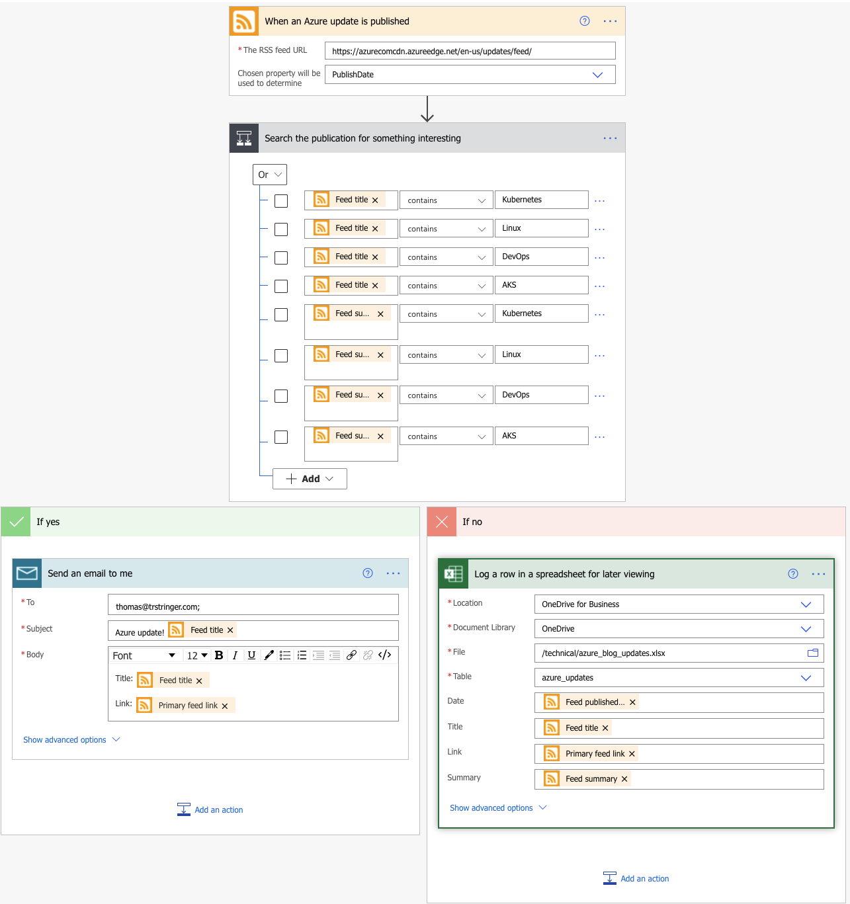
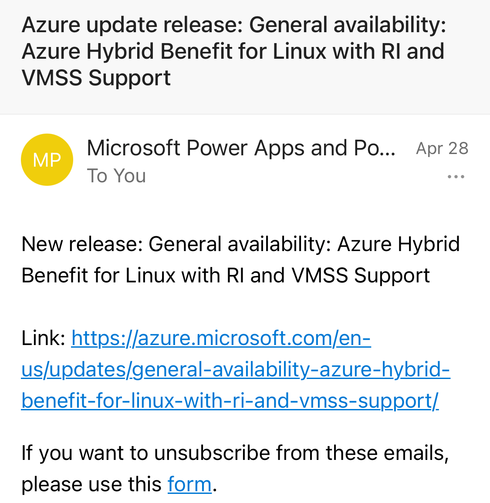
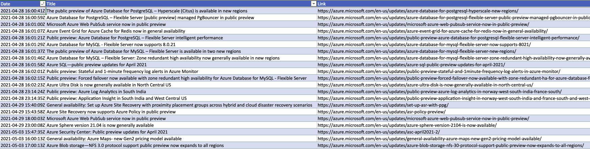
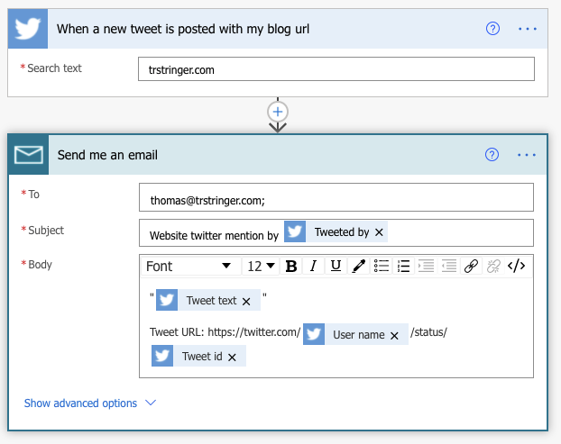
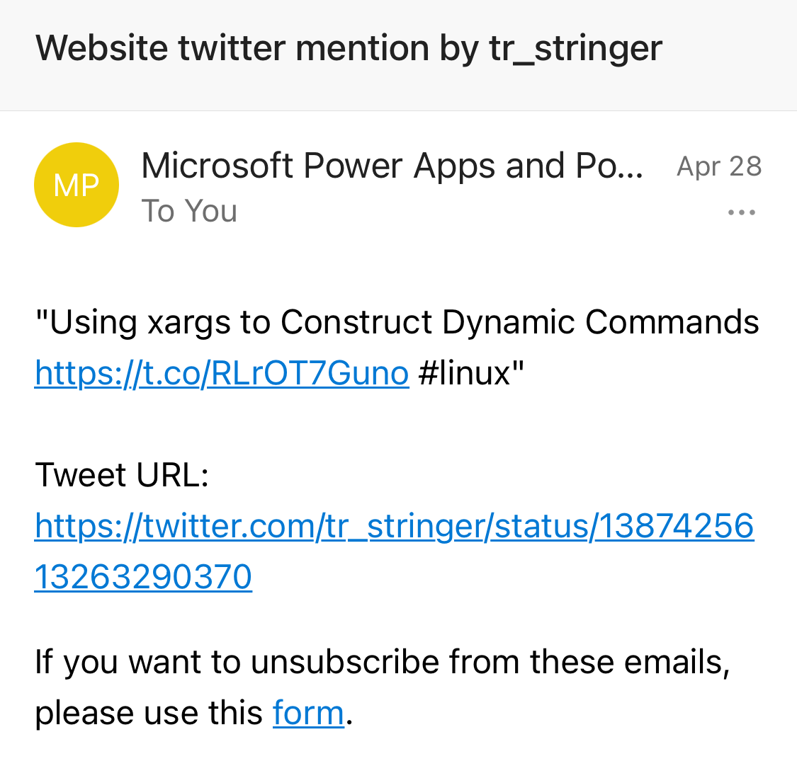

I *love* automating my tasks. If I'm doing something that I'll do more than once, I'm already thinking about a way to automate it. The typical way to do this is to write code. Sometimes a lot of code. And that's fine, I'm a computer programmer so I'm happy and comfortable doing that. But that takes time. Sometimes a lot of time.

Recently I stumbled on a Microsoft product called [Power Automate](https://docs.microsoft.com/en-us/power-automate/), and it is a great solution to a subset of my personal automation needs.

**An example**: Azure is big. It's huge, and there are a *lot* of teams and services doing really cool things every single day. Like most cloud providers, there is an [updates blog](https://azure.microsoft.com/en-us/updates/) showing all of this great work. But... I am only interested in a subset of these cloud updates. And I can't seem to get in a good routine of checking the Azure blog daily. I was missing updates that I care about all the time. [So I wrote some software](https://github.com/trstringer/azblogfilter) that fetches and parses updates and then allows me to get desktop notifications for what I care about.

After 59 git commits on my personal time over the course of almost 2 months I developed software that did what I wanted. And it is great, exactly what I need. But this past week I spent about 15 minutes and created a Power Automate flow that accomplished the same thing in a similar way. Here's what it looks like:

I have a flow that looks for all updates on the Azure blog. If it has a title or summary that includes the keywords "Linux", "Kubernetes", "DevOps", or "AKS" then I want to get an email. But if it doesn't match that condition, I want a row to be inserted into an Excel spreadsheet that I have in OneDrive so that I can casually review whenever. So for anything that is matched, I get an email:

And if there is an update that doesn't match this, I can see it in a spreadsheet:

Another example is that I like to know when somebody tweets something that includes this blog. So I created a quick flow for this:

Now I get emails when somebody mentions my blog in a tweet:

And if I click on the link I can see the tweet:

So when you start to find something that you want automated, take a first look at Power Automate and it might be complete in a matter of minutes! It might save you a ton of time!
