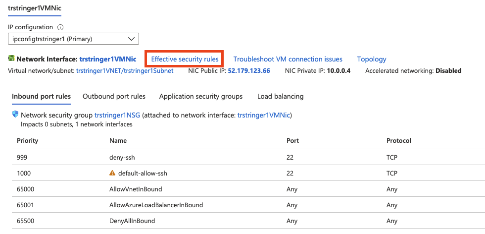
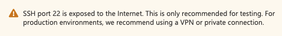

SSH'ing into any Linux machine is the common way to interact with it. But there are times when you might run into issues and having Linux running in a cloud provider, like Azure, can add another layer of complexity between you and the VM. There are some common errors when you fail to SSH, and I've recently written about [how to troubleshoot the infamous permission denied publickey](https://trstringer.com/azure-linux-vm-ssh-public-key-denied/) error.

In this blog post I want to talk about another common error you may run into when trying to SSH:

> ssh: connect to host machine.region.cloudapp.azure.com port 22: Connection refused

This typically means that you are unable to connect to the VM because there is some network protection blocking your request. So how can you troubleshoot this from Azure's side? This is one of the few times that I think it is probably easiest to just go into the Azure portal. Locate your Linux VM resource and click on **Networking**:

Here you will see the networking for the VM, including a listing of network security group rules. In my case, I don't have many so the problem might stick out quickly. But one of the tools I like to use is viewing the **Effective security rules**:

And here you can see the listing of effective security rules. The are a few things to understand here:

- The higher priority (numerically lower *Priority* number) will be the effective rule for a matching connection. For instance, a connection that matches a rule with priority 999 will be the effective rule for that connection and not another one that also matches it but a higher number (like 1000 in this example).
- The *Source* can either be IP addresses but there are also predefined service tags. In this case, **Internet** is one that has a list of address prefixes for the tag.

The exercise is to look down this list of rules, starting at the higher priority (numerically lower number) rules and see where your connection (source host IP address and port, which is TCP 22 for SSH by default). In my example, I can see that the `deny-ssh` rule is what is causing my SSH connection to fail.

The fix for the issue is dependent on your situation and your environment. SSH access is, by definition, a vulnerable surface attack area (especially from the public internet). As a note, allowing SSH traffic shows an appropriate warning in the portal:

Hopefully this blog post has showed a way to troubleshoot a common cause for the *Connection refused* error when trying to SSH into an Azure Linux VM!
