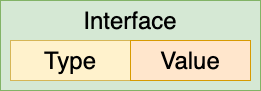
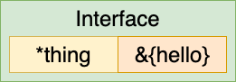
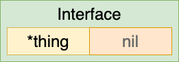
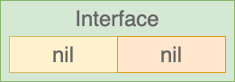

Interfaces in Go are one of the cornerstones of writing code that is both flexible and testable. But oftentime there is confusion when working with interfaces that can be nil. What does that even mean in Go? To better answer that question, you must first understand what an interface is comprised of:



An interface contains both the **type** and the **value** of the underlying concrete struct that it represents. I like the above illustration to visualize this relationship. So now let's step through some code.

Let's say we have our **interface**:

```go
type messagePrinter interface {
    printMessage()
}
```

This is just a simple interface that has a single method signature, `printMessage` (the implementation of this method is irrelevant for this blog post). Now let's say we have our **concrete type** that implements this interface:

```go
type thing struct {
    message string
}

func (t thing) printMessage() {
    fmt.Printf("Message: %s\n", t.message)
}
```

Now we have a function that takes anything that implements the `messagePrinter` interface and prints out some information about the interface itself:

```go
func analyzeInterface(mp messagePrinter) {
    fmt.Printf("Interface type: %T\n", mp)
    fmt.Printf("Interface value: %v\n", mp)
    fmt.Printf("Interface is nil: %t\n", mp == nil)
}
```

This is just a helper function to analyze and illustrate the experimentation.

Here's what it looks like with an underlying concrete type defined and passed into `analyzeInterface`:

```go
t1 := &thing{message: "hello"}
analyzeInterface(t1)
```

So the `messagePrinter` interface has the type set to `*thing` and it has a value as well, because it is not nil. The visual represenation of this interface is:



And the output of `analyzeInterface` is:

```
Interface type: *main.thing
Interface value: &{hello}
Interface is nil: false
```

Probably no surprises here. Neither the interface *or* the underlying struct is nil. If we were to use delve and break into the debugger, we can see the representation of the interface like this:

```
(dlv) p mp
main.messagePrinter(*main.thing) *{message: "hello"}
```

Now let's see what it looks like when we have an underlying concrete type that itself is nil:

```go
var t2 *thing
analyzeInterface(t2)
```

A little different, as `t2` is a nil pointer to a type `thing`. So the interface can be visualized like this:



The output of `analyzeInterface` is:

```
Interface type: *main.thing
Interface value: <nil>
Interface is nil: false
```

So this is an interesting case. Even though the underlying struct is a pointer with a nil value, the interface itself is *not* nil. In the debugger the represenation of the interface is:

```
(dlv) p mp
main.messagePrinter(*main.thing) nil
```

Finally, if we pass `nil` to `analyzeInterface` like this:

```go
analyzeInterface(nil)
```

This is the equivalent of:



And the output of `analyzeInterface` is:

```
Interface type: <nil>
Interface value: <nil>
Interface is nil: true
```

This is the case where the interface itself *is* nil, when the interface type is also nil. And for completeness, the debugger shows the following for the interface:

```
(dlv) p mp
main.messagePrinter nil
```

Hopefully this blog post has cleared up any confusion about working with interfaces and under what circumstances they are nil, and what possibly misleading scenarios where you may expect nil but that is indeed not the case!
