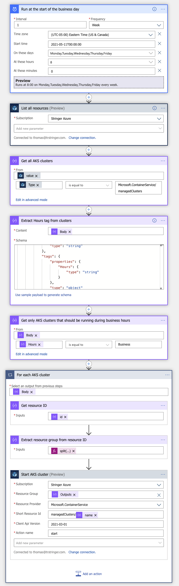
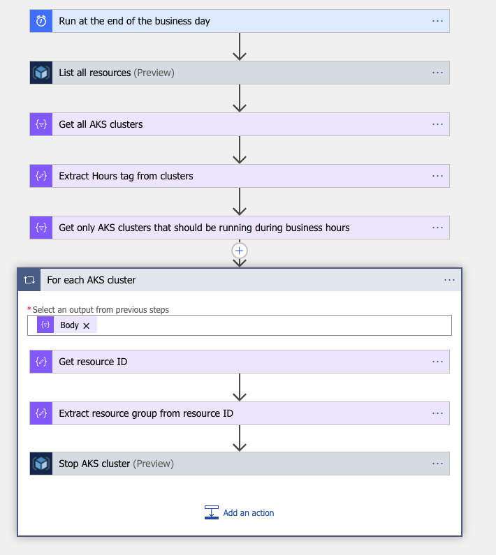
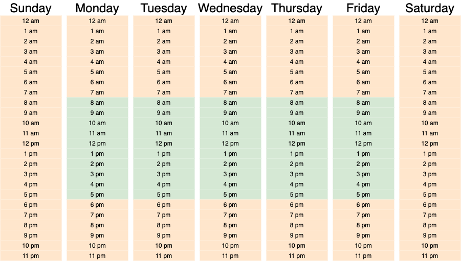

Want your dev AKS clusters running only during working hours?

Need your test AKS clusters to run only when weekly tests are running?

One of the really great features of AKS is the ability to stop your clusters when you aren't using them, which is a great way to [save money on your non-production clusters](https://trstringer.com/cheap-kubernetes-in-azure/#stop-your-cluster).

That's great, but what if you don't want to have to manually stop and start your AKS clusters? What if you want your clusters to be running on a schedule?

## My solution - Logic Apps

Currently there is no way within AKS to schedule the clusters to be running during certain times. So it is up to the imagination and the creativity of the implementer. There's no doubt that there are probably 100 ways to accomplish this task, but I chose [Azure Logic Apps](https://docs.microsoft.com/en-us/azure/logic-apps/logic-apps-overview) to be able to quickly come up with a solution.

Logic Apps allowed me to have a solution up and running quicker than anything else I could've done. Some other approaches could've been an Azure Functions App. Even though code is the largest part of my computing life I didn't want to have to spend the time figuring out how to do with the SDK, and all of the testing. I could've also written a bash script and then just run this in an Azure Linux VM as a [timed task](https://trstringer.com/systemd-timer-vs-cronjob/), but I didn't want to have to pay for the infrastructure costs to run that myself (this is for my personal Azure subscription, so I'm looking to ease development *and* cost).

## Using tags for automatic management

Another major design decision of this solution was that I wanted certain AKS clusters to be automatically managed. I didn't want to have to hard code my current (and future) AKS clusters in my Logic Apps for a few reasons:

1. This is annoying and prone to errors (e.g. set the cluster IDs incorrectly)
1. I might forget to do this for new AKS clusters that I create (which leads to wasted money on running clusters when I'm not using them)
1. I don't want to have to modify my Logic Apps when I create or delete an AKS cluster

The solution to this problem I came up with is tagging. I wanted my Logic Apps to manage all AKS clusters that have the tag `Hours` that is set to the value of `Business`. This was my own schema that I came up with. My personal definition of "business hours" is Monday through Friday, 8am to 5pm. Of course you can define whatever schedule that fits your needs.

What I *really* like about this design is that it gives you the flexibility to define other types of `Hours`. For instance, say you run weekly tests on an AKS cluster. You can have another Logic App duplicated that starts your AKS cluster before your tests start, and stops them when they are over. The `Hours` tag could then be `Weekly Tests`, or something to that effect.

## Logic App Definition

Here's what I came up with (Logic App code is available in the following section). Stepping through my Logic App, you'll see that I get all AKS clusters that have the tag `Hours` set to `Business`, and at the start of the day at 8am (the first Logic App) it'll start the clusters. And at the end of the day at 5pm (the second Logic App) it'll stop those clusters.

Take a look at the Logic Apps workflows, hopefully they explain themselves as they are read from top to bottom!

**Start AKS clusters**



**Stop AKS clusters**



And just like that, now with some tagging I have AKS clusters automatically managed to start and stop with the following schedule:



## Logic App Code

One of the great things about Logic Apps is the designer, allowing you to use the GUI to create your logic. But being able to share the code that's behind it is also helpful. Below I've pasted the code for these two Logic Apps.

*Note: I replaced my subscription ID with `SUBSCRIPTION_ID`.*

### Start AKS clusters

```json
{
    "definition": {
        "$schema": "https://schema.management.azure.com/providers/Microsoft.Logic/schemas/2016-06-01/workflowdefinition.json#",
        "actions": {
            "Extract_Hours_tag_from_clusters": {
                "inputs": {
                    "content": "@body('Get_all_AKS_clusters')",
                    "schema": {
                        "items": {
                            "properties": {
                                "id": {
                                    "type": "string"
                                },
                                "identity": {
                                    "properties": {
                                        "principalId": {
                                            "type": "string"
                                        },
                                        "tenantId": {
                                            "type": "string"
                                        },
                                        "type": {
                                            "type": "string"
                                        }
                                    },
                                    "type": "object"
                                },
                                "location": {
                                    "type": "string"
                                },
                                "name": {
                                    "type": "string"
                                },
                                "tags": {
                                    "properties": {
                                        "Hours": {
                                            "type": "string"
                                        }
                                    },
                                    "type": "object"
                                },
                                "type": {
                                    "type": "string"
                                }
                            },
                            "required": [
                                "id",
                                "name",
                                "type",
                                "location",
                                "identity",
                                "tags"
                            ],
                            "type": "object"
                        },
                        "type": "array"
                    }
                },
                "runAfter": {
                    "Get_all_AKS_clusters": [
                        "Succeeded"
                    ]
                },
                "type": "ParseJson"
            },
            "For_each_AKS_cluster": {
                "actions": {
                    "Extract_resource_group_from_resource_ID": {
                        "inputs": "@split(outputs('Get_resource_ID'), '/')[4]",
                        "runAfter": {
                            "Get_resource_ID": [
                                "Succeeded"
                            ]
                        },
                        "type": "Compose"
                    },
                    "Get_resource_ID": {
                        "inputs": "@items('For_each_AKS_cluster')?['id']",
                        "runAfter": {},
                        "type": "Compose"
                    },
                    "Start_AKS_cluster": {
                        "inputs": {
                            "host": {
                                "connection": {
                                    "name": "@parameters('$connections')['arm']['connectionId']"
                                }
                            },
                            "method": "post",
                            "path": "/subscriptions/@{encodeURIComponent('SUBSCRIPTION_ID')}/resourcegroups/@{encodeURIComponent(outputs('Extract_resource_group_from_resource_ID'))}/providers/@{encodeURIComponent('Microsoft.ContainerService')}/@{encodeURIComponent('managedClusters/',items('For_each_AKS_cluster')?['name'])}/@{encodeURIComponent('start')}",
                            "queries": {
                                "x-ms-api-version": "2021-03-01"
                            }
                        },
                        "runAfter": {
                            "Extract_resource_group_from_resource_ID": [
                                "Succeeded"
                            ]
                        },
                        "type": "ApiConnection"
                    }
                },
                "foreach": "@body('Get_only_AKS_clusters_that_should_be_running_during_business_hours')",
                "runAfter": {
                    "Get_only_AKS_clusters_that_should_be_running_during_business_hours": [
                        "Succeeded"
                    ]
                },
                "type": "Foreach"
            },
            "Get_all_AKS_clusters": {
                "inputs": {
                    "from": "@body('List_all_resources')?['value']",
                    "where": "@equals(item()?['type'], 'Microsoft.ContainerService/managedClusters')"
                },
                "runAfter": {
                    "List_all_resources": [
                        "Succeeded"
                    ]
                },
                "type": "Query"
            },
            "Get_only_AKS_clusters_that_should_be_running_during_business_hours": {
                "inputs": {
                    "from": "@body('Extract_Hours_tag_from_clusters')",
                    "where": "@equals(item()?['tags']?['Hours'], 'Business')"
                },
                "runAfter": {
                    "Extract_Hours_tag_from_clusters": [
                        "Succeeded"
                    ]
                },
                "type": "Query"
            },
            "List_all_resources": {
                "inputs": {
                    "host": {
                        "connection": {
                            "name": "@parameters('$connections')['arm']['connectionId']"
                        }
                    },
                    "method": "get",
                    "path": "/subscriptions/@{encodeURIComponent('SUBSCRIPTION_ID')}/resources",
                    "queries": {
                        "x-ms-api-version": "2016-06-01"
                    }
                },
                "runAfter": {},
                "type": "ApiConnection"
            }
        },
        "contentVersion": "1.0.0.0",
        "outputs": {},
        "parameters": {
            "$connections": {
                "defaultValue": {},
                "type": "Object"
            }
        },
        "triggers": {
            "Run_at_the_start_of_the_business_day": {
                "recurrence": {
                    "frequency": "Week",
                    "interval": 1,
                    "schedule": {
                        "hours": [
                            "8"
                        ],
                        "minutes": [
                            0
                        ],
                        "weekDays": [
                            "Monday",
                            "Tuesday",
                            "Wednesday",
                            "Thursday",
                            "Friday"
                        ]
                    },
                    "startTime": "2021-05-11T00:00:00",
                    "timeZone": "Eastern Standard Time"
                },
                "type": "Recurrence"
            }
        }
    },
    "parameters": {
        "$connections": {
            "value": {
                "arm": {
                    "connectionId": "/subscriptions/SUBSCRIPTION_ID/resourceGroups/logicapp1/providers/Microsoft.Web/connections/arm",
                    "connectionName": "arm",
                    "id": "/subscriptions/SUBSCRIPTION_ID/providers/Microsoft.Web/locations/eastus/managedApis/arm"
                }
            }
        }
    }
}
```

### Stop AKS clusters

```json
{
    "definition": {
        "$schema": "https://schema.management.azure.com/providers/Microsoft.Logic/schemas/2016-06-01/workflowdefinition.json#",
        "actions": {
            "Extract_Hours_tag_from_clusters": {
                "inputs": {
                    "content": "@body('Get_all_AKS_clusters')",
                    "schema": {
                        "items": {
                            "properties": {
                                "id": {
                                    "type": "string"
                                },
                                "identity": {
                                    "properties": {
                                        "principalId": {
                                            "type": "string"
                                        },
                                        "tenantId": {
                                            "type": "string"
                                        },
                                        "type": {
                                            "type": "string"
                                        }
                                    },
                                    "type": "object"
                                },
                                "location": {
                                    "type": "string"
                                },
                                "name": {
                                    "type": "string"
                                },
                                "tags": {
                                    "properties": {
                                        "Hours": {
                                            "type": "string"
                                        }
                                    },
                                    "type": "object"
                                },
                                "type": {
                                    "type": "string"
                                }
                            },
                            "required": [
                                "id",
                                "name",
                                "type",
                                "location",
                                "identity",
                                "tags"
                            ],
                            "type": "object"
                        },
                        "type": "array"
                    }
                },
                "runAfter": {
                    "Get_all_AKS_clusters": [
                        "Succeeded"
                    ]
                },
                "type": "ParseJson"
            },
            "For_each_AKS_cluster": {
                "actions": {
                    "Extract_resource_group_from_resource_ID": {
                        "inputs": "@split(outputs('Get_resource_ID'), '/')[4]",
                        "runAfter": {
                            "Get_resource_ID": [
                                "Succeeded"
                            ]
                        },
                        "type": "Compose"
                    },
                    "Get_resource_ID": {
                        "inputs": "@items('For_each_AKS_cluster')?['id']",
                        "runAfter": {},
                        "type": "Compose"
                    },
                    "Stop_AKS_cluster": {
                        "inputs": {
                            "host": {
                                "connection": {
                                    "name": "@parameters('$connections')['arm']['connectionId']"
                                }
                            },
                            "method": "post",
                            "path": "/subscriptions/@{encodeURIComponent('SUBSCRIPTION_ID')}/resourcegroups/@{encodeURIComponent(outputs('Extract_resource_group_from_resource_ID'))}/providers/@{encodeURIComponent('Microsoft.ContainerService')}/@{encodeURIComponent('managedClusters/',items('For_each_AKS_cluster')?['name'])}/@{encodeURIComponent('stop')}",
                            "queries": {
                                "x-ms-api-version": "2021-03-01"
                            }
                        },
                        "runAfter": {
                            "Extract_resource_group_from_resource_ID": [
                                "Succeeded"
                            ]
                        },
                        "type": "ApiConnection"
                    }
                },
                "foreach": "@body('Get_only_AKS_clusters_that_should_be_running_during_business_hours')",
                "runAfter": {
                    "Get_only_AKS_clusters_that_should_be_running_during_business_hours": [
                        "Succeeded"
                    ]
                },
                "type": "Foreach"
            },
            "Get_all_AKS_clusters": {
                "inputs": {
                    "from": "@body('List_all_resources')?['value']",
                    "where": "@equals(item()?['type'], 'Microsoft.ContainerService/managedClusters')"
                },
                "runAfter": {
                    "List_all_resources": [
                        "Succeeded"
                    ]
                },
                "type": "Query"
            },
            "Get_only_AKS_clusters_that_should_be_running_during_business_hours": {
                "inputs": {
                    "from": "@body('Extract_Hours_tag_from_clusters')",
                    "where": "@equals(item()?['tags']?['Hours'], 'Business')"
                },
                "runAfter": {
                    "Extract_Hours_tag_from_clusters": [
                        "Succeeded"
                    ]
                },
                "type": "Query"
            },
            "List_all_resources": {
                "inputs": {
                    "host": {
                        "connection": {
                            "name": "@parameters('$connections')['arm']['connectionId']"
                        }
                    },
                    "method": "get",
                    "path": "/subscriptions/@{encodeURIComponent('SUBSCRIPTION_ID')}/resources",
                    "queries": {
                        "x-ms-api-version": "2016-06-01"
                    }
                },
                "runAfter": {},
                "type": "ApiConnection"
            }
        },
        "contentVersion": "1.0.0.0",
        "outputs": {},
        "parameters": {
            "$connections": {
                "defaultValue": {},
                "type": "Object"
            }
        },
        "triggers": {
            "Run_at_the_end_of_the_business_day": {
                "recurrence": {
                    "frequency": "Week",
                    "interval": 1,
                    "schedule": {
                        "hours": [
                            "17"
                        ],
                        "minutes": [
                            0
                        ],
                        "weekDays": [
                            "Monday",
                            "Tuesday",
                            "Wednesday",
                            "Thursday",
                            "Friday"
                        ]
                    },
                    "startTime": "2021-05-11T00:00:00",
                    "timeZone": "Eastern Standard Time"
                },
                "type": "Recurrence"
            }
        }
    },
    "parameters": {
        "$connections": {
            "value": {
                "arm": {
                    "connectionId": "/subscriptions/SUBSCRIPTION_ID/resourceGroups/logicapp1/providers/Microsoft.Web/connections/arm",
                    "connectionName": "arm",
                    "id": "/subscriptions/SUBSCRIPTION_ID/providers/Microsoft.Web/locations/eastus/managedApis/arm"
                }
            }
        }
    }
}
```

## Summary

Saving costs on non-production AKS clusters can really add up. This quick solution with Logic Apps allows you to automate this without having to give it another thought!
