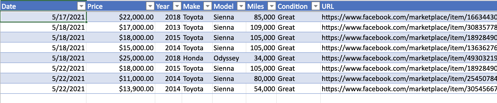
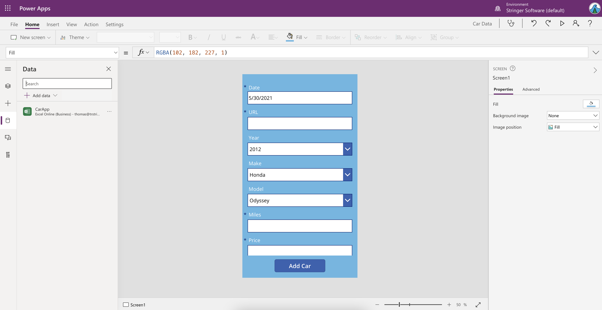
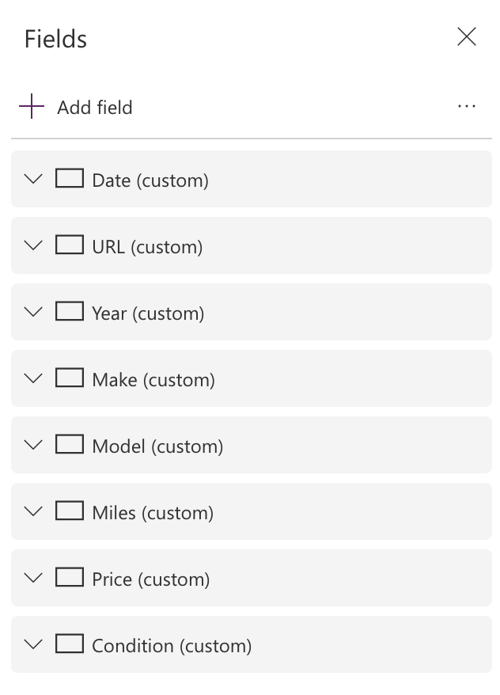
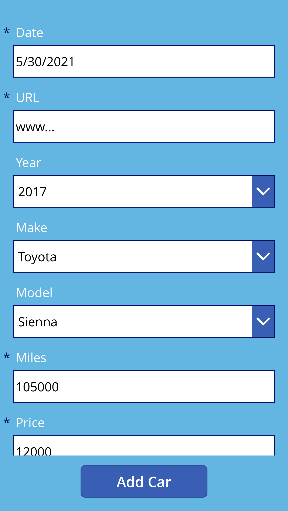

I've recently started learning more about the Microsoft Power Platform, and these rapid solutions are proving to make my life a lot easier. I've found that [Power Automate can handle a lot of my routine tasks](https://trstringer.com/power-automate/). And now I've found Power Apps to be the perfect solution to a real life problem I am trying to solve. Here's the story...

So I'm looking to buy a used car. There are a few years, makes, and models that I'm specifically looking at. When I'm going to make a big purchase (like a car) I like to do a lot of research so I make sure I'm getting a good one. Good quality, but also at a good price. The latter point requires me to look at the market of available cars and understand what exactly a good price is for certain variables (e.g. year, mileage, condition, etc.).

The way I do this is I try to daily look at cars online, and if something matches my search criteria in my location then I open up an Excel worksheet that I created specifically for this, and I put the data in there:

This is great information! But... the last thing I want to do at the end of the day is open up my computer to look at cars and do data entry in a spreadsheet. It wasn't working, I wasn't getting this data and this solution wasn't effective at all.

I am ok with using my phone for this, but I was finding that trying to do data entry in Excel on a phone is a *very* painful experience. The solution became even less effective.

Then I remember hearing about how Power Apps allows you to quickly create no/low-code solutions. So I started playing with it a little bit.

On the left, you can see that I was able to set the data source to the same Excel spreadsheet that I've been using. Then in the form I set this data source and it populated all of the data entry controls for the respective fields in the spreadsheet:

In a *shockingly small amount of time*, this app was completed and deployed to Power Apps, so that I could access it on my phone:

And then just like that, in less than a day I was able to create an app that I can use on my iPhone that quickly and easily enters data into an Excel spreadsheet in my personal Microsoft 365 account! This solution is efficient and easy to use.

I could've written a mobile or web app to do this, but it would've taken weeks/months and that's time I'd rather be spending doing other things. The fact that I was able to create this in a short day is so shocking but very welcome! Now I can spend my time on actually finding that car.
