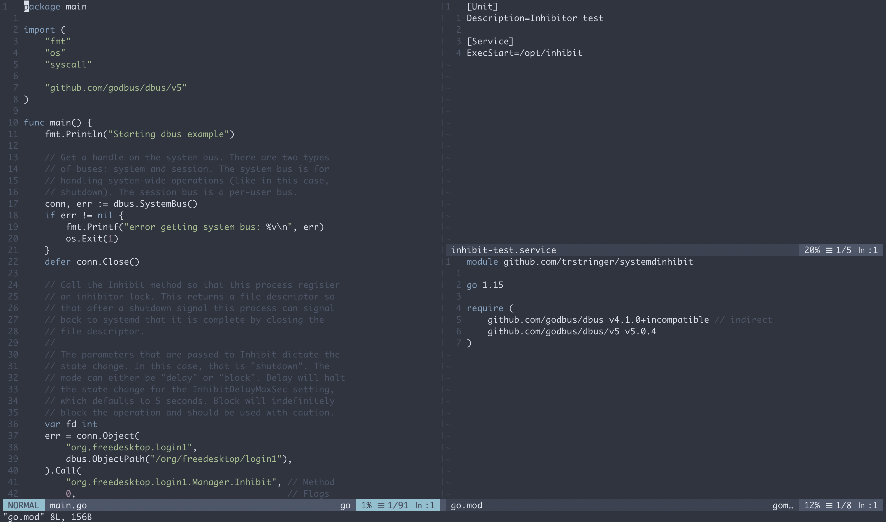

Software tools come and go. But one of the constants in my digital life is Vim: My favorite text editor. What do I use Vim for? Everything related to text. Not just basic editing, but it is also my programming environment.


*Yes, I love Vim so much I painted a cup with the Vim logo.*

But what is it about Vim that I really like? Well... a lot. But specifically here are some of my favorite features that I think allow me to take text editing to the next level.

## Splits and tabs

This sounds very basic, and I think most modern text editors have the ability to create tabs and splits. But I really love how Vim approaches this. With a few keystrokes, I can have my editor looking like this:



Want to open up a duplicate buffer to the side? `:vsplit`. Need a new space below? `:new`. Want a whole new tab? `:$tabe`. Quick and easy, without taking your fingers off of the keyboard.

## Marks

I like to jump around open files a lot, *especially* as a programmer. What's not efficient is to go to a particular part of a file, and then want to go back to your original and you start jumping in chunks with page up and page down. That is slow, frustrating, and very annoying. So if I know that I'm going to jump to another place but want to come back, I'll set a mark. That's as easy as `ma`, where `m` tells Vim to set the mark and `a` is the label (name?) for the mark. You could use any label, but I typically like to stick with `a`. And if I'm using multiple marks I just go down the alphabet (e.g. `mb`, `mc`, etc.).

No more "scrolling" in frustration.

## Macros

This is a feature that I ignored for years because it seemed difficult. I was wrong. And this is also one of those features that I don't use every day, or even every week. But... when I need it, macros make a long task so quick. Here's an example:

```
This is my first line of text.
Second line.
Last one that is longer than the second.
```

Let's say you want to change the ending punctuation from `.` to `!`. You could go line for line and replace those characters. Three lines, not a big deal. 300 lines? That's a big deal. This is where macros can really shine. Macros allow you to "record" actions and then replay them multiple times. Here's how: To start recording the macro type `qa`, where `q` tells Vim to start recording the macro and, just like with marks, the `a` is the name of the macro for reference later on. Now on the first line I'll type `$r!j`. `$` will take me to the end of the line, `r!` will replace the period with the exclamation mark, and `j` will move to the next line. Now I will type `q` to stop the macro recording. Replay this macro as many times as you want by typing `300@a`. The prefix number (in this case `300`) tells Vim to play the macros 300 times (a little excessive for our example), and `@a` tells Vim to play the macro named `a`.

And just like that, before your eyes, Vim will play this action a number of times instantly, with no interaction from you:

```
This is my first line of text!
Second line!
Last one that is longer than the second!
```

## Searching through buffers

This is one that I use all the time. I don't like to use a filesystem explorer in Vim, not to mention I have a bad memory for where certain things are in multiple files. Let's say I'm working in some source code and I need to find the definition of a function called `MyFunction`. Instead of remembering which file that function definition is part of, I would instead search through all files for the function definition pattern.

This can be done with `:vim /^func MyFunction/ **/*.go`. This will search through all files that match `*.go` and look for any lines that start with `func MyFunction`. Multiple matches? Open up the quickfix list with `:cope` to view the multiple lines that matched and navigate to these occurrences.

## Searching for files

In general, I think being able to find things is much more important than already knowing where they are. I just talked about how to find specific text in the files, but what if you need to find a particular file name? I prefer to *not* click through filesystem explorers, even in Vim. So I'll just do `:f *.service`, which will find all files in my current directory (and subdirectories) that are systemd unit files (matching `*.service`). Quick and easy, and I'm editing my desired file quicker than I could if I used a filesystem explorer.

## Summary

Vim has allowed me to be quick and efficient when editing text, whether it is a massive codebase, or just some small text file. Want to learn Vim? Take a look at `vimtutor`, which is available in most places where Vim is. Happy text editing!
