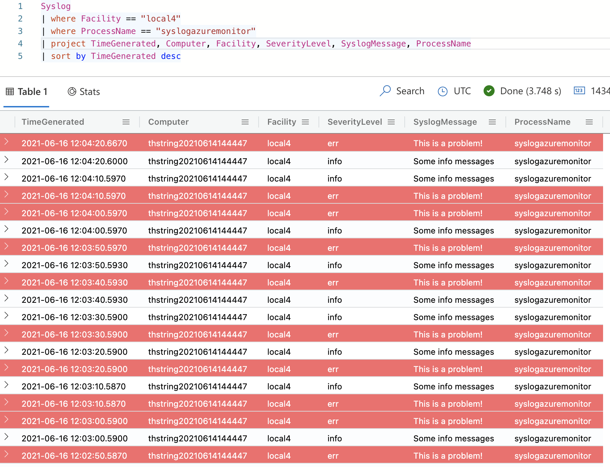

A massive benefit of the cloud is the ability to centralize logging. It makes things easier whether you're using VMs, web apps, containerized workloads, etc. Having one (or a few) place to go allows for easier administration, lower troubleshooting overhead, simplified alerting, and better correlation and telemetry. After all, would you rather SSH into 1,000 VMs or just check a single log management tool and run a few queries?

[Azure Monitor](https://docs.microsoft.com/en-us/azure/azure-monitor/overview) is that solution in the Microsoft cloud. But... how does this work for Linux VMs? We are used to living in a logging world dominated by things like systemd's journal and syslog. How can we get *those* log messages to Azure Monitor?

## Scenario

I think there's value in understand when and why you would want to send your Linux machine's journal logs to Azure Monitor. Let's say you have an application running in an Azure Linux VM, and everything is running well... until it isn't. The way we typically troubleshoot is by SSH'ing into the VM and reading some logs through `journalctl` or by just `cat`'ing some log files. Even doing that with one VM is annoying. But let's say you have 10 application servers. Or 100. Now you're having to write a script to just retrieve all of the logs from those VMs. That's inefficient and unacceptable for most situations.

You see those log entries that your service is dumping to systemd's journal? We want those in Azure in a central place.

Let's say this is your systemd unit:

**svc1.service**

```
[Unit]
Description=Testing syslog to log analytics

[Service]
ExecStart=/bin/bash -c "while true; do echo Some info messages; sleep 10; done"
```

This is a simple service that just outputs "Some info messages" every 10 seconds.

## Send logs to Azure Monitor

Now that we know we want our Linux VM logs (particularly for this application) centrally logged in Azure Monitor, how can we accomplish this? Here are the steps that will be explained in depth:

1. Create an Azure Monitor Log Analytics workspace
1. Install the Azure Monitor agent on the Linux VM
1. Configure what logs are sent to Azure Monitor
1. Query application logs in Azure Monitor

### Create the Azure Monitor workspace

Before we do anything, we need to first create the workspace that we want our logs to get sent to:

```
$ az monitor log-analytics workspace create \
    --resource-group rg1 \
    --workspace-name workspace1
```

### Install the agent on the VM

In order for us to send our logs to this new Log Analytics workspace, we need to install the [Log Analytics agent for Linux (GitHub)](https://github.com/microsoft/OMS-Agent-for-Linux) (also known as the OMS agent). The format of this installation is:

```
$ wget https://raw.githubusercontent.com/Microsoft/OMS-Agent-for-Linux/master/installer/scripts/onboard_agent.sh && \
    sh onboard_agent.sh \
        -w <WORKSPACE_ID> \
        -s <WORKSPACE_KEY> \
        -d opinsights.azure.com
```

Where `WORKSPACE_ID` can be pulled with:

```
$ az monitor log-analytics workspace show \
    --resource-group rg1 \
    --workspace-name workspace1 \
    --query customerId -o tsv
```

And the `WORKSPACE_KEY`:

```
$ az monitor log-analytics workspace get-shared-keys \
    --resource-group rg1 \
    --workspace-name workspace1 \
    --query primarySharedKey -o tsv
```

*Note: It is a good practice to analyze the install script before running it.*

### Configure which logs are sent to Azure Monitor

Once that is complete you need to now add some syslog configuration to your VM. I'm using Ubuntu, so this is rsyslog for me. The [documentation on setting up syslog forwarding to Azure Monitor (Microsoft docs)](https://docs.microsoft.com/en-us/azure/azure-monitor/agents/data-sources-syslog#rsyslog) has rsyslog config like this:

```
kern.warning       @127.0.0.1:25224
user.warning       @127.0.0.1:25224
daemon.warning     @127.0.0.1:25224
auth.warning       @127.0.0.1:25224
syslog.warning     @127.0.0.1:25224
uucp.warning       @127.0.0.1:25224
authpriv.warning   @127.0.0.1:25224
ftp.warning        @127.0.0.1:25224
cron.warning       @127.0.0.1:25224
local0.warning     @127.0.0.1:25224
local1.warning     @127.0.0.1:25224
local2.warning     @127.0.0.1:25224
local3.warning     @127.0.0.1:25224
local4.warning     @127.0.0.1:25224
local5.warning     @127.0.0.1:25224
local6.warning     @127.0.0.1:25224
local7.warning     @127.0.0.1:25224
```

This configuration is in the format of `facility.log_level`. So, for example, `kern.warning` means that we will forward syslog entries for the `kern` facility that is at a level of `warning` or higher. The above configuration is a good default, but in my case I don't particularly want to log all of these facilities.

What exacly is a syslog facility? It is nothing more than a "bucket" that syslog categorizes logs in. [Many of the facilities (ArchWiki)](https://wiki.archlinux.org/title/rsyslog#Facility_levels) are self-explanatory, but notice that there are eight that are prefixed with `local` and then a number 0 - 7. These are the custom buckets for local use. So I am going to pick a random local facility, `local4`, for my application. And I will want all of those logs. So my config will contain only a single line:

```
local4.debug     @127.0.0.1:25224
```

I put this config in `/etc/rsyslog.d/90-azuremonitor.conf` and I restarted `rsyslog.service` to pick up the new configuration.

We need to modify our systemd service though, because [by default the syslog facility will be `daemon` (freedesktop)](https://www.freedesktop.org/software/systemd/man/systemd.exec.html#SyslogFacility=). And also, I want to [set the syslog identifier to a nicer string (freedesktop)](https://www.freedesktop.org/software/systemd/man/systemd.exec.html#SyslogIdentifier=) for easier querying in the Log Analytics workspace.

There's another interesting part of syslog logging. We were able to set the facility to `local4`, and we're capturing all debug messages and above (which is everything), but how do we actually log errors or warnings (or any other log level message)? By default, all messages are `info` but you can [prefix the messages with a string (freedesktop)](https://www.freedesktop.org/software/systemd/man/sd-daemon.html#) to change the log level of the particular message. See that documentation for specifics, but for instance you can prefix a message with `<3>` to indicate it is an error message. Let's add that to the sample service as well.

Now the service should look like this:

```
[Unit]
Description=Testing syslog to log analytics

[Service]
ExecStart=/bin/bash -c "while true; do echo Some info messages; echo '<3>This is a problem!'; sleep 10; done"
SyslogFacility=local4
SyslogIdentifier=syslogazuremonitor
```

### Querying the logs

Great! Now we should have logs going into our Azure Monitor workspace. But how do we query them? You can go through the Azure portal and query through the Log Analytics resource itself, but I like to use the [Azure Data Explorer Web UI](https://dataexplorer.azure.com/). To access the workspace, just click add cluster and use the following URL format:

```
https://ade.loganalytics.io/subscriptions/SUBSCRIPTION_ID/resourcegroups/RESOURCE_GROUP/providers/microsoft.operationalinsights/workspaces/WORKSPACE_NAME
```

Where `SUBSCRIPTION_ID` is the subscription ID, `RESOURCE_GROUP` is the resource group of the containing Log Analytics workspace, and `WORKSPACE_NAME` is whatever name you gave the Azure Monitor Log Analytics workspace.

And now I'll write a quick query to get my log entries:

```
Syslog
| where Facility == "local4"
| where ProcessName == "syslogazuremonitor"
| project TimeGenerated, Computer, Facility, SeverityLevel, SyslogMessage, ProcessName
| sort by TimeGenerated desc
```

And I get my results!



## Summary

This blog post has shown you how you can send your systemd journal entries to Azure Monitor through syslog. This is a powerful feature that allows you to centralize your logging and make for more efficient troubleshooting!
