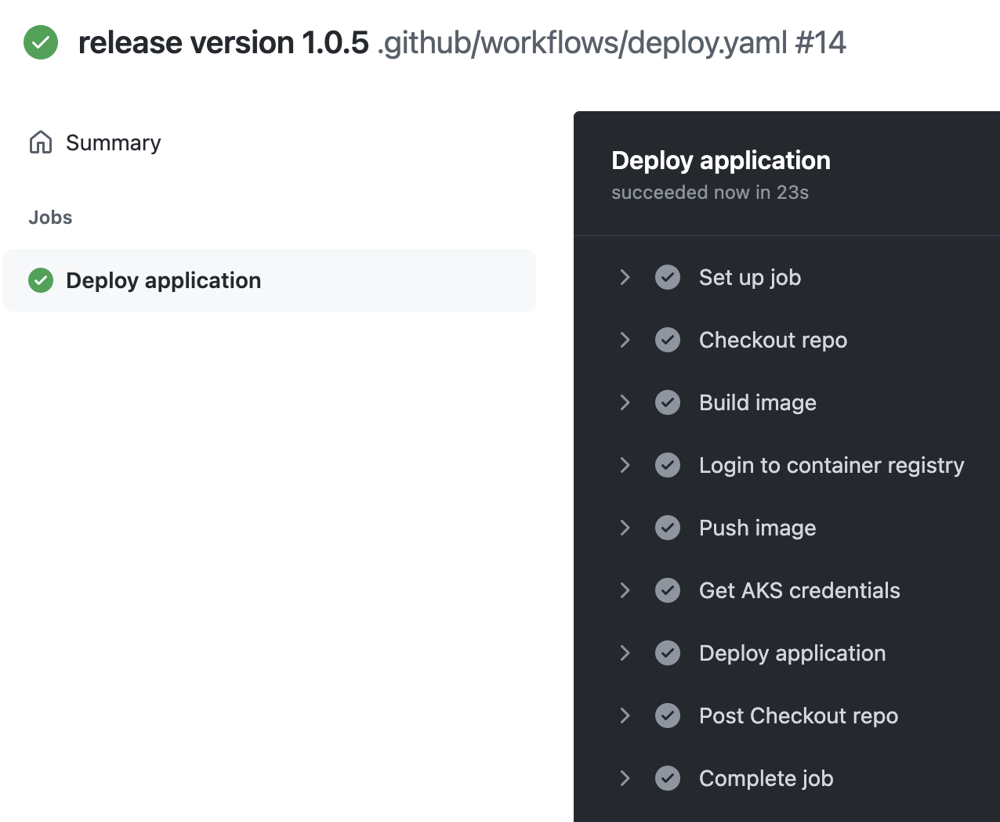

Creating a CI/CD pipeline to deploy to your Kubernetes application is a really great exercise to make an efficient and automated way to deliver your software. This blog post will show how to deploy to an Azure Kubernetes Service (AKS) cluster from GitHub Actions.

All of the code for this blog post is available in [my GitHub repository](https://github.com/trstringer/aks-deploy-from-github-actions).

## Setup

This pipeline does not handle setting up the infrastructure. For this demo, we will need to pre-stage the cluster.

First create your AKS cluster:

```
$ az group create \
    --location $LOCATION \
    --name $RG

$ az aks create \
    --resource-group $RG \
    --name $CLUSTER \
    ... additional AKS options ...
```

Now we want to create a container registry so that we can store our container images in and have the cluster pull from here:

```
$ az acr create \
    --resource-group $RG \
    --name $ACR \
    --sku basic

$ az aks update \
    --resource-group $RG \
    --name $CLUSTER \
    --attach-acr $ACR
```

All of these operations that interact with Azure (pushing the image and deploying the updated application) require a way to authenticate to the respective services. In order to do that in a hosted environment, we will leverage an Azure AD service principal. This will be the security context that our runner will use to perform operations in the subscription.

First we need to create the service principal:

```
$ az ad sp create-for-rbac \
    --name upgrade-test \
    --skip-assignment
```

Once that create completes, it will give us an output of information data we need to secretly store in the repository. Go into your GitHub repository and go to **Settings** -> **Secrets** and click **New repository secret**. Add the following secrets from the output of `az ad sp create-for-rbac`:

- Create a secret called `SERVICE_PRINCIPAL_APP_ID` and add the `az ad sp create-for-rbac` output value `appId`
- Create a secret called `SERVICE_PRINCIPAL_SECRET` and add the `az ad sp create-for-rbac` output value `password`
- Create a secret called `SERVICE_PRINCIPAL_TENANT` and add the `az ad sp create-for-rbac` output value `tenant`

We also need to add three more repository secrets here:

- Create a secret named `CLUSTER_RESOURCE_GROUP_NAME` with the name of the resource group of the AKS cluster created above (`$RG`)
- Create a secret named `CLUSTER_NAME` with the name of the AKS cluster created above (`$CLUSTER`)
- Create a secret named `ACR_NAME` with the name of the container registry (`$ACR`)

Now we need to give this service principal a few more permissions. First, grant it the ability to push an image to the container registry:

```
$ az role assignment create \
    --role AcrPush \
    --assignee-principal-type ServicePrincipal \
    --assignee-object-id $(az ad sp show \
        --id $SERVICE_PRINCIPAL_APP_ID \
        --query objectId -o tsv) \
    --scope $(az acr show --name $ACR --query id -o tsv)
```

That command grants the service principal the `AcrPush` role for the container registry that was created above.

Grant the service principal the ability to retrieve the credentials of the AKS cluster (`az aks get-credentials`):

```
$ az role assignment create \
    --role "Azure Kubernetes Service Cluster User Role" \
    --assignee-principal-type ServicePrincipal \
    --assignee-object-id $(az ad sp show \
        --id $SERVICE_PRINCIPAL_APP_ID \
        --query objectId -o tsv) \
    --scope $(az aks show \
        --resource-group $RG \
        --name $CLUSTER \
        --query id -o tsv)
```

Finally, we want to grant this service principal the ability to read and write to the default namespace. I like to follow *the principle of least privilege* and grant it as few permissions as possible. In this case, I want to deploy my application to the default namespace so I will give it only permissions to do that:

```
$ az role assignment create \
    --role "Azure Kubernetes Service RBAC Writer" \
    --assignee-principal-type ServicePrincipal \
    --assignee-object-id $(az ad sp show \
        --id $SERVICE_PRINCIPAL_APP_ID \
        --query objectId -o tsv) \
    --scope "$(az aks show \
        --resource-group $RG \
        --name $CLUSTER \
        --query id -o tsv)/namespaces/default"
```

For more information on AKS RBAC take a look at [this blog post I wrote on using Azure RBAC to secure AKS clusters](https://trstringer.com/aks-azure-rbac-security/).

## Creating the GitHub workflow

Now that we've got the setup complete, we can start to create the GitHub Actions workflow. For a reference to the complete workflow, see [the GitHub repo that includes the workflow configuration](https://github.com/trstringer/aks-deploy-from-github-actions/blob/main/.github/workflows/deploy.yaml).

I want this workflow to be triggered on a tag release. But initially I also wanted to be able to run this workflow manually, so in addition to the tag I specified `workflow_dispatch`:

```yaml
on:
  workflow_dispatch:
  push:
    tags:
      - '*'
```

For the job steps of this workflow, I created a Makefile to include all of the things I need to do to deploy this application. I like the ability to just use `make` to run the different steps:

```
VERSION_FILE := version
VERSION := $(shell cat ${VERSION_FILE})
IMAGE_REPO := $(ACR_NAME).azurecr.io/upgrade-test

.PHONY: build
build:
        docker build -t $(IMAGE_REPO):$(VERSION) .

.PHONY: registry-login
registry-login:
        @az login \
                --service-principal \
                --username $(SERVICE_PRINCIPAL_APP_ID) \
                --password $(SERVICE_PRINCIPAL_SECRET) \
                --tenant $(SERVICE_PRINCIPAL_TENANT)
        @az acr login --name $(ACR_NAME)

.PHONY: push
push:
        docker push $(IMAGE_REPO):$(VERSION)

.PHONY: deploy
deploy:
        sed 's|IMAGE_REPO|$(IMAGE_REPO)|g; s/VERSION/$(VERSION)/g' ./deployment.yaml | \
                kubectl apply -f -
```

Here I specify the targets to `build` the image, login to the container registry (`registry-login`), `push` it to the container registry, and finally `deploy` the application to the AKS cluster.

*Note: The `deploy` target uses `sed` to replace the image repository and version tag information. An even better approach is to use Helm, which I will cover in another blog post.*

Back to the GitHub workflow, I run these targets with the necessary variables set:


```yaml
jobs:
  deploy:
    name: Deploy application
    runs-on: ubuntu-latest
    steps:
      - name: Checkout repo
        uses: actions/checkout@v2
      - name: Build image
        env:
          ACR_NAME: ${{ secrets.ACR_NAME }}
        run: make build
      - name: Login to container registry
        env:
          SERVICE_PRINCIPAL_APP_ID: ${{ secrets.SERVICE_PRINCIPAL_APP_ID }}
          SERVICE_PRINCIPAL_SECRET: ${{ secrets.SERVICE_PRINCIPAL_SECRET }}
          SERVICE_PRINCIPAL_TENANT: ${{ secrets.SERVICE_PRINCIPAL_TENANT }}
          ACR_NAME: ${{ secrets.ACR_NAME }}
        run: make registry-login
      - name: Push image
        env:
          ACR_NAME: ${{ secrets.ACR_NAME }}
        run: make push
      - name: Get AKS credentials
        env:
          CLUSTER_RESOURCE_GROUP_NAME: ${{ secrets.CLUSTER_RESOURCE_GROUP_NAME }}
          CLUSTER_NAME: ${{ secrets.CLUSTER_NAME }}
        run: |
          az aks get-credentials \
            --resource-group $CLUSTER_RESOURCE_GROUP_NAME \
            --name $CLUSTER_NAME \
            --overwrite-existing
      - name: Deploy application
        env:
          ACR_NAME: ${{ secrets.ACR_NAME }}
        run: make deploy
```


## Deploying the application

This workflow is triggered by a tag creation, so to deploy this simple application I would make any changes to the application (in this case, just bump up `./version` to `1.0.5` for example). And then I'll commit this to the repository and create a tag:

```
$ echo "1.0.5" > ./version
$ git add .
$ git commit -m "release version 1.0.5"
$ git tag v1.0.5
```

Finally I'll push both the commit and the tag to my GitHub repository:

```
$ git push origin main --tags
```

Now the GitHub Actions workflow will start and deploy the new software version to the AKS cluster:



And looking at the application output I can see that my software was upgraded to the new version:

```
$ kubectl logs upgrade-test-864bb8786-9fdr6
Sun Sep 19 22:21:58 UTC 2021 - Current version is 1.0.5
Sun Sep 19 22:22:03 UTC 2021 - Current version is 1.0.5
Sun Sep 19 22:22:08 UTC 2021 - Current version is 1.0.5
Sun Sep 19 22:22:13 UTC 2021 - Current version is 1.0.5
Sun Sep 19 22:22:18 UTC 2021 - Current version is 1.0.5
```

## Summary

The ability to deploy to an AKS cluster directly from GitHub Actions is a powerful way to automate software delivery. Hopefully this blog post has illustrated a straightforward way to accelerate shipping your code!
