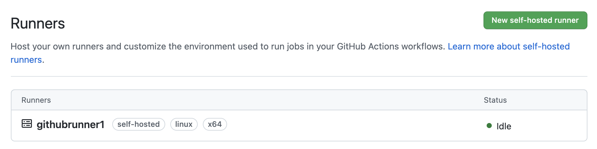
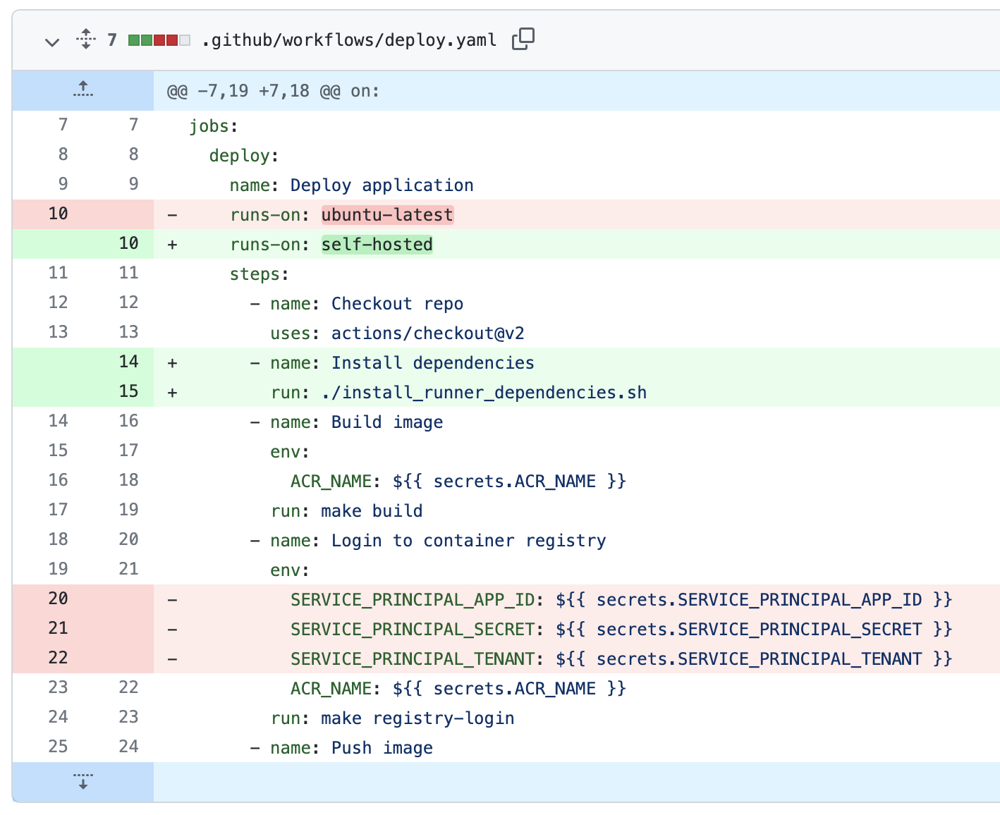
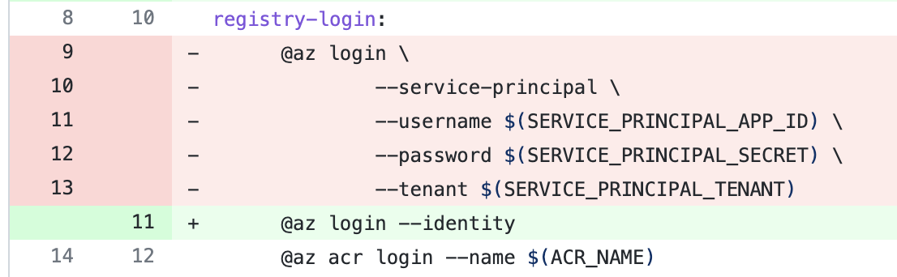

Last blog post I talked about how to [Deploy to AKS from GitHub Actions](https://trstringer.com/deploy-to-aks-from-github-actions/). This was great and quick because it utilized *GitHub-hosted runners*. For many users and projects, this is completely fine. But sometimes you want more control over your pipeline runners (for instance, if you want to start utilizing managed identities to interact with your Azure resources - e.g. AKS in this instance). The way you can get control over that is by telling GitHub that you want to use your own runners (also known as, **self-hosted runners**).

All of the accompanying code and instructions for this blog post can be found in a [forked repo](https://github.com/trstringer/aks-deploy-from-github-actions-self-hosted) from [the original GitHub-hosted runner repo](https://github.com/trstringer/aks-deploy-from-github-actions).

There many advantages to self-hosted runners:

* You control and own the pipeline infrastructure
* Able to utilize managed identities to access Azure resources
* Your code runs on your compute

There are also disadvantages to self-hosted runners:

* You pay for the runners
* You have to manage the runners
* You have to fix them when they don't work

## Runner setup

To use a self-hosted runner, of course we need to setup the machine to act as our runner. Because one of main advantages of using a self-hosted runner is the ability to use a managed identity, we'll first create that identity:

```
$ az identity create --resource-group $RG --name $IDENTITY
```

Now let's create the VM that'll act as our runner. I'm creating a Ubuntu Focal VM:

```
$ az vm create \
    --resource-group $RG \
    --name $RUNNER \
    --image "canonical:0001-com-ubuntu-server-focal:20_04-lts:latest" \
    --size Standard_DS1_v2 \
    --ssh-key-values $SSH_PUB_KEY \
    --admin-username $ADMIN_USERNAME \
    --authentication-type ssh \
    --public-ip-address-dns-name $DNS_NAME \
    --assign-identity $(az identity show \
        --resource-group $RG \
        --name $IDENTITY \
        --query id -o tsv)
```

We had to make very few changes to the pipeline itself, but now we are no longer using a service principal to access our Azure resources (Azure Container Registry and Azure Kubernetes Service cluster). So we need to grant access to these resources for the managed identity that the VM runs with.

First, grant the managed identity permissions on the container registry:

```
$ az role assignment create \
    --role AcrPush \
    --assignee-principal-type ServicePrincipal \
    --assignee-object-id $(az identity show \
        --resource-group $RG \
        --name $IDENTITY \
        --query principalId -o tsv) \
    --scope $(az acr show \
        --name $ACR \
        --query id -o tsv)
```

Now give the managed identity the permissions to get the Kubernetes config and write to the default namespace:

```
$ az role assignment create \
    --role "Azure Kubernetes Service Cluster User Role" \
    --assignee-principal-type ServicePrincipal \
    --assignee-object-id $(az identity show \
        --resource-group $RG \
        --name $IDENTITY \
        --query principalId -o tsv) \
    --scope $(az aks show \
        --resource-group $RG \
        --name $CLUSTER \
        --query id -o tsv)

$ az role assignment create \
    --role "Azure Kubernetes Service RBAC Writer" \
    --assignee-principal-type ServicePrincipal \
    --assignee-object-id $(az identity show \
        --resource-group $RG \
        --name $IDENTITY \
        --query principalId -o tsv) \
    --scope "$(az aks show \
        --resource-group $RG \
        --name $CLUSTER \
        --query id -o tsv)/namespaces/default"
```

We want the GitHub Actions runner process to run as a system user (following the principle of least privilege). SSH into the new VM create the user:

```
$ sudo adduser githubrunner1 --system --group
```

Now we need to ensure that this new system user can run sudo (with no password) for only the commands that it needs to install dependencies (more on that soon). Add the following line to `/etc/sudoers` on the runner VM (you should do this with `visudo`):

```
githubrunner1 ALL = NOPASSWD:/usr/bin/apt-get, /usr/sbin/usermod, /usr/bin/gpg, /usr/bin/tee, /usr/bin/curl
```

## Creating the runner in the repository

Now that the VM is mostly setup, we need to go back into GitHub in our repository and select **Settings** -> **Actions** -> **Runners** -> **New self-hosted runner**. Follow the setup instructions and run those commands on the runner VM through SSH. Once the config has been completed, you should be able to start the runner:

```
$ sudo -u githubrunner1 ./run.sh
```

The runner should now show a message:

```
√ Connected to GitHub

2021-09-25 13:09:18Z: Listening for Jobs
```

And back in the repository you should see the runner ready and waiting:



## Workflow changes

We've setup our infrastructure, but now we need to make a few modifications to the workflow and secrets. The major benefit of using a managed identity instead of a service principal is that we don't need to store and handle the client ID or secret to authenticate to the Azure resources. So now our secrets only includes `ACR_NAME`, `CLUSTER_NAME`, and `CLUSTER_RESOURCE_GROUP_NAME`. Much more secure and easier to manage without the `SERVICE_PRINCIPAL_*` secrets!

But how does our workflow change? I think the easiest way to visualize this is with a [git diff](https://github.com/trstringer/aks-deploy-from-github-actions-self-hosted/compare/aa4c7bc..HEAD) from the GitHub-hosted runner workflow to our new self-hosted runner:



The changes we made were that we now use the `self-hosted` label. And we remove the references to the `SERVICE_PRINCIPAL_*` secrets! And because we aren't using GitHub's runner image anymore, we need to install all of the necessary dependencies.



Now in the `Makefile` we do `az login` with `--identity` instead of having to pass service principal credentials.

## Runner dependencies

Like mentioned above, the Ubuntu Focal image I'm using doesn't have a lot of the dependencies installed already so I need to handle this from the pipeline. I created an install script to handle this logic, and it is invoked from the workflow:

**install_runner_dependencies.sh**

```bash
#!/bin/bash

if ! command -v docker; then
    echo "Docker not available, installing dependencies..."

    sudo apt-get update
    sudo apt-get upgrade -y
    sudo apt-get install -y \
        make \
        apt-transport-https \
        ca-certificates \
        curl \
        gnupg \
        lsb-release

    curl -fsSL https://download.docker.com/linux/ubuntu/gpg |
        sudo gpg --dearmor --yes -o /usr/share/keyrings/docker-archive-keyring.gpg

    echo \
        "deb [arch=amd64 signed-by=/usr/share/keyrings/docker-archive-keyring.gpg] https://download.docker.com/linux/ubuntu \
        $(lsb_release -cs) stable" | sudo tee /etc/apt/sources.list.d/docker.list > /dev/null

    sudo apt-get update -y
    sudo apt-get install -y docker-ce docker-ce-cli containerd.io
    sudo usermod -aG docker githubrunner1
fi

if ! command -v az; then
    echo "Installing Azure CLI"
    sudo apt-get update
    sudo apt-get install ca-certificates curl apt-transport-https lsb-release gnupg

    curl -sL https://packages.microsoft.com/keys/microsoft.asc |
        gpg --dearmor |
        sudo tee /etc/apt/trusted.gpg.d/microsoft.gpg > /dev/null

    AZ_REPO=$(lsb_release -cs)
    echo "deb [arch=amd64] https://packages.microsoft.com/repos/azure-cli/ $AZ_REPO main" |
        sudo tee /etc/apt/sources.list.d/azure-cli.list

    sudo apt-get update
    sudo apt-get install azure-cli
fi

if ! command -v kubectl; then
    echo "Installing kubectl"
    sudo apt-get update
    sudo apt-get install -y apt-transport-https ca-certificates curl
    sudo curl -fsSLo /usr/share/keyrings/kubernetes-archive-keyring.gpg https://packages.cloud.google.com/apt/doc/apt-key.gpg
    echo "deb [signed-by=/usr/share/keyrings/kubernetes-archive-keyring.gpg] https://apt.kubernetes.io/ kubernetes-xenial main" |
        sudo tee /etc/apt/sources.list.d/kubernetes.list
    sudo apt-get update
    sudo apt-get install -y kubectl
fi
```

## Running the workflow

This run can either be run manually (because it still has the `workflow_dispatch` trigger) or with a new tag release. Now on the runner we can see the workflow runs:

```
$ sudo -u githubrunner1 ./run.sh

√ Connected to GitHub

2021-09-25 13:09:18Z: Listening for Jobs
2021-09-25 13:09:57Z: Running job: Deploy application
2021-09-25 13:10:17Z: Job Deploy application completed with result: Succeeded
2021-09-25 13:15:32Z: Running job: Deploy application
2021-09-25 13:15:45Z: Job Deploy application completed with result: Succeeded
```

## Summary

This blog post has explained why you would want to use a self-hosted runner with GitHub Actions, and some of the disadvantages to doing so. I showed how to setup a runner in your Azure subscription and utilize a managed identity to connect to the Azure resources for continuous delivery and deployment for a more secure and easier to manage solution.
