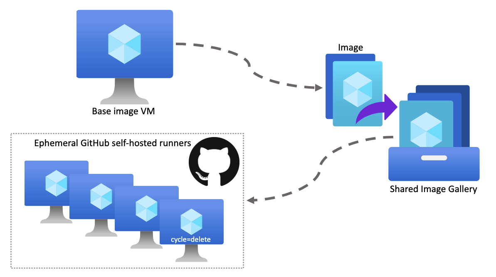
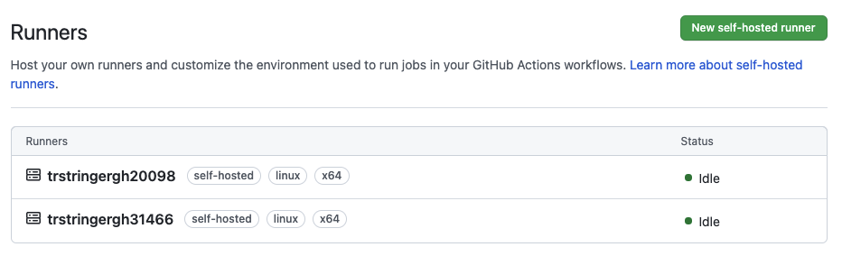
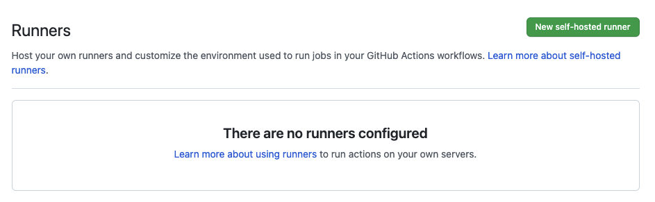

In a recent blog post, I talked about how to work with [GitHub Actions self-hosted runners](https://trstringer.com/deploy-to-aks-from-github-actions-self-hosted/). This was a really great advancement over [deploying with GitHub-hosted runners](https://trstringer.com/deploy-to-aks-from-github-actions/) because it allowed us to use managed identities and have our pipeline run in our own Azure subscription.

This is great, but it left us with a few major disadvantages:

* They required manual setup and configuration
* The runners are meant to be long-running VMs
* We care about individual runners (goes against the "pets vs. cattle" DevOps principle, because we are now treating these runners like pets)
* Runners might be mutated from a pipeline run, which could affect subsequent pipeline runs (or even other workflows). This might no longer be deterministic...

## Ephemeral runners

GitHub Actions provides the ability to have ephemeral runners so that each one is only used for a single workflow run. In this blog post I'm going to show how to create the first part of the process to automate this entire ephemeral runner workflow. Here's the approach we're going to take so that we can easily create ephemeral runners:



The overview of the steps are:

* Create a base image for the runners
* Place the image in a Shared Image Gallery (SIG)
* Create VMs with the runner image to automatically configure itself as an ephemeral runner

Let's look at the details.

## Creating the base image

If you remember back to using the GitHub-hosted runners, we were using GitHub machines and therefore we were confined to GitHub images. Now that we are owning that whole process, it's usually a good idea to have images that include a lot of the dependencies already and other setup already complete. This adds a few benefits, namely cutting down on the testing time because dependency installation and setup can take a *lot* of time. So right away we are shortening our pipeline loop.

### Create the base VM

In my walkthrough example, I created an Azure Linux VM using the Ubuntu Focal image:

```bash
$ az vm create \
    --resource-group $RG \
    --name $BASE_VM \
    --image "canonical:0001-com-ubuntu-server-focal:20_04-lts:latest" \
    --size Standard_DS1_v2 \
    --ssh-key-values $SSH_KEY_PATH \
    --admin-username $ADMIN_USERNAME \
    --authentication-type ssh \
    --public-ip-address-dns-name $BASE_DNS
```

### Install dependencies

Now I need to install my dependencies. In my case for this runner image, I want to install a few utilities like `jq`, the Azure CLI, `kubectl`, and `docker`. Now is when I'll do that. I recommend using some form of Infrastructure-as-Code (Ansible, cloud-init config, etc.) so that these operations are versioned and repeatable.

### Create the runner user

Because we want to have a system user on the machine the run the GitHub runner process with, we'll also create that:

```bash
$ sudo adduser githubrunner1 --system --group
```

Then we need to add this user to the `docker` group so that it can build the container image and deliver to the container registry. I also needed to make sure that this user can run a few binaries as sudo, so I'll add this line to `/etc/sudoers`:

```
githubrunner1 ALL = NOPASSWD:/usr/bin/apt-get, /usr/sbin/usermod, /usr/bin/gpg, /usr/bin/tee, /usr/bin/curl
```

### Get the GitHub runner

Now that we've setup the user and a few dependencies, we need to retrieve the GitHub runner itself. When you go to create a new GitHub runner it will show you the steps. You can just add those steps to your image setup and config script. Mine looks like this:

```bash
$ sudo -u githubrunner1 bash -c '\
    mkdir -p ~/actions-runner && \
    cd ~/actions-runner && \
    curl -o actions-runner-linux-x64-2.283.2.tar.gz -L https://github.com/actions/runner/releases/download/v2.283.2/actions-runner-linux-x64-2.283.2.tar.gz && \
    tar xzf ./actions-runner-linux-x64-2.283.2.tar.gz'
```

### Create the runner systemd service

Because we want this to be automated and started when the machines are booted up, we need to create a systemd service to execute the runner process:

```
# /etc/systemd/system/github-runner.service
[Unit]
Description=GitHub Runner

[Service]
User=githubrunner1
Type=oneshot
Environment="RESOURCE_GROUP=my-resource-group"
Environment="REPO_NAME=my-github-repo"
Environment="REPO_URL=https://github.com/my-repo"
Environment="GITHUB_USERNAME=my-username"
Environment="TOKEN_KEY_VAULT_NAME=my-keyvault-name"
Environment="TOKEN_KEY_VAULT_SECRET_NAME=my-keyvault-secret-name"
ExecStart=-/bin/bash -c 'az login --identity && cd /home/githubrunner1/actions-runner && ./config.sh --url $REPO_URL --token $(curl -u "$GITHUB_USERNAME:$(az keyvault secret show --vault-name $TOKEN_KEY_VAULT_NAME --name $TOKEN_KEY_VAULT_SECRET_NAME --query value -o tsv)" -X POST -H "Accept: application/vnd.github.v3+json" "https://api.github.com/repos/${GITHUB_USERNAME}/${REPO_NAME}/actions/runners/registration-token" | jq ".token" -r) --ephemeral --unattended --name $(hostname) && ./run.sh'
ExecStart=/bin/bash /opt/githubrunner/completed_cycle.sh

[Install]
WantedBy=multi-user.target
```

There is a *lot* happening here. Let's look at the first `ExecStart`:

```
ExecStart=-/bin/bash -c 'az login --identity && cd /home/githubrunner1/actions-runner && ./config.sh --url $REPO_URL --token $(curl -u "$GITHUB_USERNAME:$(az keyvault secret show --vault-name $TOKEN_KEY_VAULT_NAME --name $TOKEN_KEY_VAULT_SECRET_NAME --query value -o tsv)" -X POST -H "Accept: application/vnd.github.v3+json" "https://api.github.com/repos/${GITHUB_USERNAME}/${REPO_NAME}/actions/runners/registration-token" | jq ".token" -r) --ephemeral --unattended --name $(hostname) && ./run.sh'
```

Working from the inside out, we need to curl the [`registration-token` from GitHub](https://docs.github.com/en/rest/reference/actions#create-a-registration-token-for-a-repository), which will allow us to configure the VM as a runner by passing this token in to `config.sh` with `--token`. One of the ways to authenticate to the GitHub API is to use a personal access token. But we don't want to store that personal access token in the image for security reasons. A good place to store that is in an Azure Key Vault, and then give the managed identity the permissions to read that secret which is what we do here with `az keyvault secret show`. To give the managed identity access to this secret you can do:

```bash
$ az role assignment create \
    --assignee-object-id $IDENTITY_PRINCIPAL_ID \
    --role "Key Vault Secrets User" \
    --scope "/subscriptions/$SUBSCRIPTION_ID/resourceGroups/$KV_RESOURCE_GROUP/providers/Microsoft.KeyVault/vaults/$KEY_VAULT_NAME/secrets/$SECRET_NAME"
```

Now this VM (after running `az login --identity` like we do in the beginning of the `ExecStart`) can read that secret to fetch the `registration-token` from GitHub.

Finally, we run the `config.sh` script and specify `--ephemeral` and a few other options. Then we run the `run.sh` script so that this runner starts listening for a job from GitHub.

*Note: The first `ExecStart` is prefixed with a `-` so that the next `ExecStart` runs even if it fails. You'll see why we want this now*.

The second `ExecStart` handles what happens *after* the first `ExecStart` explained above:

```
ExecStart=/bin/bash /opt/githubrunner/completed_cycle.sh
```

This runs the `completed_cycle.sh` script, which has the following contents:

```bash
#!/bin/bash

set -e

VM_NAME="${VM_NAME:-$(hostname)}"
RESOURCE_GROUP="${RESOURCE_GROUP:-$VM_NAME}"

echo "Handling completed cycle for $VM_NAME (resource group $RESOURCE_GROUP)"

az login --identity > /dev/null 2>&1

CYCLE_TAG=$(az vm show \
    --resource-group "$RESOURCE_GROUP" \
    --name "$VM_NAME" \
    --query "tags.cycle" -o tsv)
echo "Cycle tag: $CYCLE_TAG"

case "$CYCLE_TAG" in
    running)
        echo "Keeping the VM running"
        ;;
    delete)
        echo "Deleting the VM"
        az vm delete \
            --resource-group "$RESOURCE_GROUP" \
            --name "$VM_NAME" \
            --yes --no-wait
        ;;
    *)
        echo "Unknown or empty, deallocating VM"
        az vm deallocate \
            --resource-group "$RESOURCE_GROUP" \
            --name "$VM_NAME" \
            --no-wait
        ;;
esac
```

This script gets the current runner/VM `cycle` tag. If the `cycle` tag is set to `running`, then nothing happens (i.e. the VM continues to stay running). If it is set to `delete` then the VM will delete itself. If it is set to anything else then the VM will be deallocated so that it is persisted but not consuming a lot of money like a running VM. This would be if you want to troubleshoot a failed workflow from the runner VM itself instead of just logs.

I really like this approach because it allows you to control the lifecycle of the VM directly from Azure tags. If you have a particular workflow that you just want the VMs to auto-cleanup (delete themselves) then you just add some tagging. Now you can do `az vm create ... --tags cycle=delete` (for example) to have direct control over how the VM is handled right after running the job.

Finally, enable this service:

```bash
$ sudo systemctl enable github-runner.service
```

Creating runners from this image (which we will create next), we'll see that this service is automatically run and registers with GitHub as a runner:

```
Oct 08 22:43:51 runnervm1 systemd[1]: Starting GitHub Runner...
Oct 08 22:44:07 runnervm1 bash[1325]:   % Total    % Received % Xferd  Average Speed   Time    Time     Time  Current
Oct 08 22:44:07 runnervm1 bash[1325]:                                  Dload  Upload   Total   Spent    Left  Speed
Oct 08 22:44:07 runnervm1 bash[1325]: [158B blob data]
Oct 08 22:44:10 runnervm1 bash[1454]: --------------------------------------------------------------------------------
Oct 08 22:44:10 runnervm1 bash[1454]: |        ____ _ _   _   _       _          _        _   _                      |
Oct 08 22:44:10 runnervm1 bash[1454]: |       / ___(_) |_| | | |_   _| |__      / \   ___| |_(_) ___  _ __  ___      |
Oct 08 22:44:10 runnervm1 bash[1454]: |      | |  _| | __| |_| | | | | '_ \    / _ \ / __| __| |/ _ \| '_ \/ __|     |
Oct 08 22:44:10 runnervm1 bash[1454]: |      | |_| | | |_|  _  | |_| | |_) |  / ___ \ (__| |_| | (_) | | | \__ \     |
Oct 08 22:44:10 runnervm1 bash[1454]: |       \____|_|\__|_| |_|\__,_|_.__/  /_/   \_\___|\__|_|\___/|_| |_|___/     |
Oct 08 22:44:10 runnervm1 bash[1454]: |                                                                              |
Oct 08 22:44:10 runnervm1 bash[1454]: |                       Self-hosted runner registration                        |
Oct 08 22:44:10 runnervm1 bash[1454]: |                                                                              |
Oct 08 22:44:10 runnervm1 bash[1454]: --------------------------------------------------------------------------------
Oct 08 22:44:10 runnervm1 bash[1454]: # Authentication
Oct 08 22:44:14 runnervm1 bash[1454]: √ Connected to GitHub
Oct 08 22:44:14 runnervm1 bash[1454]: # Runner Registration
Oct 08 22:44:15 runnervm1 bash[1454]: √ Runner successfully added
Oct 08 22:44:16 runnervm1 bash[1454]: √ Runner connection is good
Oct 08 22:44:16 runnervm1 bash[1454]: # Runner settings
Oct 08 22:44:16 runnervm1 bash[1454]: √ Settings Saved.
Oct 08 22:44:20 runnervm1 bash[1579]: √ Connected to GitHub
Oct 08 22:44:20 runnervm1 bash[1579]: 2021-10-08 22:44:20Z: Listening for Jobs
```

But we're getting ahead of ourselves. First we need to create the image from this base VM.

## Create the runner image

Now that our base VM is in a spot that we are happy with, we want to create an image from the VM:

```bash
$ ssh trstringer@$BASE_DNS.eastus.cloudapp.azure.com "sudo cloud-init clean --logs && sudo waagent -deprovision+user -force"
$ az vm deallocate \
    --resource-group $RG \
    --name $BASE_VM
$ az vm generalize \
    --resource-group $RG \
    --name $BASE_VM
$ az image create \
    --resource-group $RG \
    --source $BASE_VM \
    --location eastus \
    --name $IMAGE
```

Now let's add this image to the Shared Image Gallery (SIG):

```bash
$ az sig image-version create \
    --resource-group $RG \
    --gallery-name $SIG \
    --gallery-image-definition $SIG_IMAGE_DEFINITION \
    --gallery-image-version 1.0.1 \
    --managed-image $(az image show \
        --resource-group $RG \
        --name $IMAGE \
        --query id -o tsv) \
    --no-wait
```

## Test the runner image

We're close to automating this whole process, but first it's a good idea to test the image. You can do this by creating a VM from the SIG image we made above:

```bash
$ VM_NAME="trstringergh$RANDOM"; az vm create \
    --resource-group $RG \
    --name $VM_NAME \
    --image $(az sig image-version show \
        --resource-group $RG \
        --gallery-name $SIG \
        --gallery-image-definition $SIG_IMAGE_DEFINITION \
        --gallery-image-version 1.0.1 \
        --query id -o tsv) \
    --size Standard_DS1_v2 \
    --public-ip-address-dns-name $VM_NAME \
    --assign-identity $(az identity show \
        --resource-group $RG \
        --name $IDENTITY --query id -o tsv)
```

*Note: Optionally specify `--tags cycle=delete` to automatically delete the VM after completion, otherwise it will just deallocate when done.*

I ran this `az vm create` twice, and then I go to GitHub into **Actions** -> **Runners** and see them now waiting for workflow jobs to run!



Now I run a couple of workflow jobs, and afterwards I can see that these VMs have been automatically deallocated:

```bash
$ az vm list -d --query "[].{name:name,powerState:powerState}" -o table
Name               PowerState
-----------------  --------------
trstringergh20098  VM deallocated
trstringergh31466  VM deallocated
```

With no other action from us, we can see that the runners have been removed from GitHub after they complete their first (and only) job:



That's great! And the only manual operation we have to do now is run the `az vm create` for the runners. In the next blog post I'll show how to automate this final component so that the runners are created when a workflow job is scheduled!

## Summary

This blog post highlighted a handful of reasons why you want to use ephemeral runners (as opposed to long-running and multi-job runners). We then discussed how to setup the runner image and test it out. Next time we will finish this exercise by automating this whole process from the beginning!
