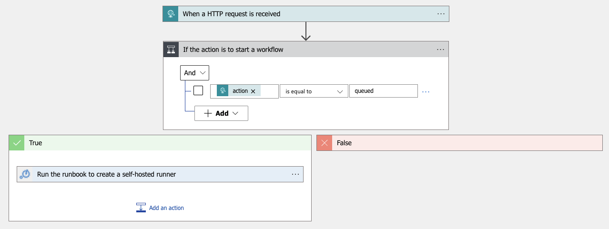

In recent blog posts, I've covered GitHub Actions from a few different angles:

- [Deploy to AKS from GitHub Actions](https://trstringer.com/deploy-to-aks-from-github-actions/)
- [Deploy to AKS Using a Managed Identity from a GitHub Actions Self-Hosted Runner](https://trstringer.com/deploy-to-aks-from-github-actions-self-hosted/)
- [Create Ephemeral Self-Hosted Runners for GitHub Actions](https://trstringer.com/create-ephemeral-self-hosted-runners-github-actions/)

In the last blog post, we got *really* close to a great solution. It used an image stored in a Shared Image Gallery (SIG) that included all of the bits to be able to run as a GitHub Actions self-hosted runner. That leaves us at the final step: **Automate the runner creation when a GitHub Actions workflow runs!**

## Automation runbook

Up until now, I've been manually creating the self-hosted runners in my Azure subscription with `az vm create`. The first step in automating this process is to create the Python code that accomplishes this same VM deployment, and then put it in a Python runbook in an Azure Automation account. Here is the content of that Python runbook:

```python
#!/usr/bin/env python3

import os
import azure.mgmt.resource
import automationassets

import random
import uuid
from azure.mgmt.authorization import AuthorizationManagementClient
from azure.mgmt.compute import ComputeManagementClient
from azure.mgmt.network import NetworkManagementClient
from azure.mgmt.resource import ResourceManagementClient

def get_automation_runas_credential(runas_connection):
    from OpenSSL import crypto
    import binascii
    from msrestazure import azure_active_directory
    import adal

    # Get the Azure Automation RunAs service principal certificate
    cert = automationassets.get_automation_certificate("AzureRunAsCertificate")
    pks12_cert = crypto.load_pkcs12(cert)
    pem_pkey = crypto.dump_privatekey(crypto.FILETYPE_PEM,pks12_cert.get_privatekey())

    # Get run as connection information for the Azure Automation service principal
    application_id = runas_connection["ApplicationId"]
    thumbprint = runas_connection["CertificateThumbprint"]
    tenant_id = runas_connection["TenantId"]

    # Authenticate with service principal certificate
    resource ="https://management.core.windows.net/"
    authority_url = ("https://login.microsoftonline.com/"+tenant_id)
    context = adal.AuthenticationContext(authority_url)
    return azure_active_directory.AdalAuthentication(
    lambda: context.acquire_token_with_client_certificate(
            resource,
            application_id,
            pem_pkey,
            thumbprint)
    )

# Authenticate to Azure using the Azure Automation RunAs service principal
runas_connection = automationassets.get_automation_connection("AzureRunAsConnection")
credential = get_automation_runas_credential(runas_connection)

subscription_id = runas_connection["SubscriptionId"]
location = "eastus"
resource_name = f"trstringergh{random.randint(1000, 9999)}"
resource_group_name = resource_name
# Identity ID can be retrieved from `az identity show -g $RG -n $IDENTITY --query id -o tsv`
identity_id = "IDENTITY ID"
# Identity principal ID can be retrieved from `az identity show -g $RG -n $IDENTITY --query principalId -o tsv`
identity_principal_id = "IDENTITY PRINCIPAL ID"

auth_client = AuthorizationManagementClient(
    credential,
    subscription_id=subscription_id                                                                                                                                    )
compute_client = ComputeManagementClient(
    credential,
    subscription_id=subscription_id
)
network_client = NetworkManagementClient(
    credential,
    subscription_id=subscription_id
)
resource_client = ResourceManagementClient(
    credential,
    subscription_id=subscription_id
)

print(f"Creating resource group {resource_group_name}")
resource_client.resource_groups.create_or_update(
    resource_group_name,
    {
        "location": location,
        "tags": {
            "operation": "cicd",
            "cycle": "delete"
        }
    }
)

print("Creating role assignment on resource group")
resource_group_id = f"/subscriptions/{subscription_id}/resourceGroups/{resource_group_name}"
# Role definition ID can be retrieved from `az role definition list --query "[?roleName == 'Virtual Machine Contributor'] | [0].id" -o tsv`
role_definition_id = "ROLE DEFINITION ID"
auth_client.role_assignments.create(
    scope=resource_group_id,
    role_assignment_name=str(uuid.uuid4()),
    parameters={
        "role_definition_id": role_definition_id,
        "principal_id": identity_principal_id
    }
)

vnet_name = f"{resource_group_name}vnet"
print("Creating virtual network")
vnet = network_client.virtual_networks.create_or_update(
    resource_group_name,
    vnet_name,
    {
        "location": location,
        "address_space": {
            "address_prefixes": ["10.0.0.0/16"]
        }
    }
).result()

subnet_name = f"{resource_name}subnet"
print("Creating subnet")
subnet = network_client.subnets.create_or_update(
    resource_group_name,
    vnet_name,
    subnet_name,
    {
        "address_prefix": "10.0.0.0/24"
    }
).result()

ip_name = f"{resource_name}ip"
print("Creating IP address")
ip = network_client.public_ip_addresses.create_or_update(
    resource_group_name,
    ip_name,
    {
        "location": location,
        "sku": {
            "name": "Standard"
        },
        "public_ip_allocation_method": "Static",
        "public_ip_address_version": "IPV4"
    }
).result()

nic_name = f"{resource_name}nic"
print("Creating NIC")
nic = network_client.network_interfaces.create_or_update(
    resource_group_name,
    nic_name,
    {
        "location": location,
        "ip_configurations": [
            {
                "name": f"{resource_name}ipconfig",
                "subnet": {
                    "id": subnet.id
                },
                "public_ip_address": {
                    "id": ip.id
                }
            }
        ]
    }
).result()

print("Creating VM")
compute_client.virtual_machines.create_or_update(
    resource_group_name,
    resource_name,
    {
        "location": "eastus",
        "storage_profile": {
            "image_reference": {
                # Image ID can be retrieved from `az sig image-version show -g $RG -r $SIG -i $IMAGE_DEFINITION -e $VERSION --query id -o tsv`
                "id": "IMAGE ID"
            }
        },
        "hardware_profile": {
            "vm_size": "Standard_B2s"
        },
        "os_profile": {
            "computer_name": resource_name,
            "admin_username": "ADMIN USERNAME",
            "linux_configuration": {
                "disable_password_authentication": True,
                "ssh": {
                    "public_keys": [
                        {
                            "path": "/home/ADMIN USERNAME/.ssh/authorized_keys",
                            # Add the public key for a key pair that can get access to SSH to the runners
                            "key_data": "SSH PUBLIC KEY"
                        }
                    ]
                }
            }
        },
        "network_profile": {
            "network_interfaces": [
                {
                    "id": nic.id
                }
            ]
        },
        "identity": {
            "type": "UserAssigned",
            "user_assigned_identities": {
                identity_id: {}
            }
        }
    }
)
```

At first glance, it looks like a long script but the initial part is taken from the docs to [add authentication to manage Azure resources](https://docs.microsoft.com/en-us/azure/automation/learn/automation-tutorial-runbook-textual-python-3#add-authentication-to-manage-azure-resources). The rest just creates the necessary resources, ending in creating the VM.

## Creating the webhook

The automation to create the runner VM is in the runbook above, but we need a way to link up GitHub with this runbook to create the runner. The way to accomplish that is through a **webhook**. At the moment using a webhook to start a Python runbook isn't supported. I got around that by creating a Logic App with an HTTP request trigger:



Stepping down through this, there is an HTTP request trigger (webhook) that when it gets a POST it will test the request body. If the `action` is `queued` (that's the indicator that GitHub Actions wants to start a workflow job) then run the automation runbook to create the runner.

## Link up GitHub with the webhook

With the Logic app created, now we want to retrieve the webhook URL. You can find this by expanding the HTTP received trigger and copying the field `HTTP POST URL`. In the GitHub repo navigate to **Settings** and then **Webhooks**. Here you want to create a new webhook with a content type of `application/json` and the **Workflow jobs** event. Take the Logic app HTTP POST URL and put it in the webhook's **Payload URL** field.

## Running the workflow

And that's it! To test this out, run the GitHub Actions workflow. You should be able to see the webhook request in the **Recent Deliveries** of the **Manage webhook** page. You should verify that you see the green check (indicating a successful request).

On the Azure side, you can see the webhook's Logic app **Trigger history** hopefully showing the successful trigger. Then look at the Logic apps **Runs history** to ensure that it ran successfully. Finally, you can see the Python Runbook's **Recent Jobs** and hopefully see a successful completion. The end result of this is a GitHub runner getting created and taking the next workflow job (the one that triggered the whole workflow).

When the workflow job (the "pipeline") completes, the VM will automatically deallocate itself (or delete if it's tagged correctly) and that's it!

## Summary

We've now successfully automated end-to-end provisioning a GitHub self-hosted runner in an Azure subscription to handle GitHub Actions workflow jobs, including the full lifecycle of the infrastructure. This is a powerful, automated, and secure way to run your GitHub Actions pipelines!
