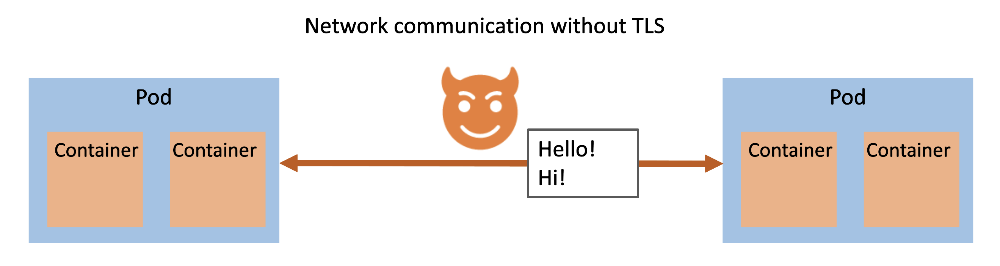
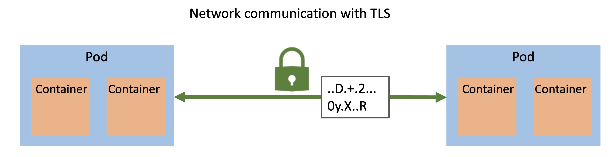
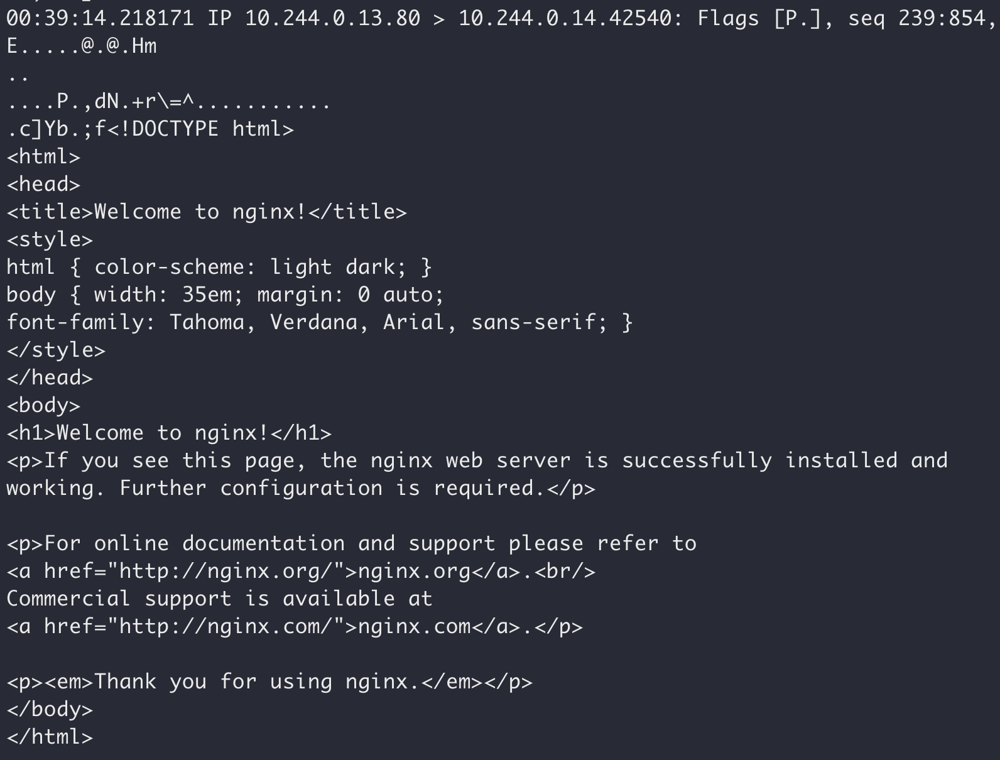
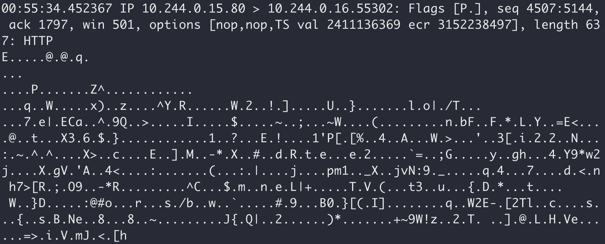

One of the great features of service meshes in Kubernetes is the ability to have an out-of-the-box zero-application-changes solution that delivers a powerful security feature: **mTLS** (mutual Transport Layer Security). But... why do we need mTLS? It's because a service mesh adds an extra layer of security (encrypted network traffic) at the point closest to the smallest unit of compute: Pods. And it's usually as easy as flipping a switch!

*Note: This blog post is not specific to any particular service mesh. Modern service meshes provide mTLS capabilities, and as such this information applies broadly.*

Sometimes it is hard to visualize the security issues (as well as the solution). So what does this look like *without* TLS between pods?



This illustration shows that if there is a bad actor inside the Kubernetes cluster they could perform a monster-in-the-middle attack and get the plaintext data between pods. That's a problem!

We need to ensure that we implement defense-in-depth to protect ourselves at all levels, even within the cluster. When you add encrypted network traffic between the pods, it now looks like this:



The bad actor is unsuccessful in viewing plaintext data.

Diagrams are great, but let's see this in a real Kubernetes cluster.

**client_server.yaml**

```yaml
kind: Pod
apiVersion: v1
metadata:
  name: server
  labels:
    app: web
spec:
  containers:
    - name: nginx
      image: nginx:1.21
    - name: tcpdump
      image: ubuntu:focal
      command: ["/bin/bash"]
      args: ["-c", "apt update && apt install -y tcpdump && tcpdump -nA -i eth0"]
---
kind: Pod
apiVersion: v1
metadata:
  name: client
spec:
  containers:
    - name: curl
      image: ubuntu:focal
      command: ["/bin/bash"]
      args: ["-c", "apt update && apt install -y curl && while true; do curl http://web; sleep 2; done"]
---
kind: Service
apiVersion: v1
metadata:
  name: web
spec:
  selector:
    app: web
  ports:
    - name: http
      port: 80
```

There are three resources:

- **Server pod** that has two containers: nginx (serving the default nginx page) and a container running `tcpdump` so that we can see traffic. This `tcpdump` is our "bad actor" intercepting all traffic between the client and the server.
- **Client pod** that is `curl`ing the server ever two seconds so we can generate traffic between the two pods.
- **Server service** to expose the web server.

Without TLS, our "bad actor" intercepting network traffic can see the plaintext communication:



Now, use a service mesh to implement mTLS between pods. And that same bad actor can no longer see the plaintext traffic:



You might've picked up on it that I have been referring to TLS, without the "m" of mTLS. TLS handles the two-way encrypted network communication. But we want two-way authentication to ensure that both communicators know and verify the other one (as opposed to the general public internet where authentication is typically only one-way). The mutual part is how we enforce zero trust in our contained Kubernetes network.

Hopefully this blog post has illustrated *why* we want mTLS from service meshes within our Kubernetes applications!
