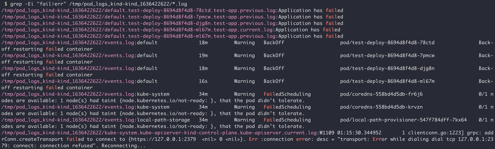

Kubernetes is a complex platform, and running your applications in Kubernetes adds a big layer of complexity. When diagnosing issues in your cluster it can be a difficult task to focus in on the issues, especially with a live system.

Sometimes it may be a good idea to get a log dump of all pods in the Kubernetes cluster. Why?

- You might want to share the logs with another engineer to help troubleshoot
- With the logs cached locally it can make searching through them quicker

***Note**: Logs can have sensitive data in them. Before sharing with other people you should review the data you're sending.*

I wrote a script that automates this:

1. Get all pod logs (current and previous)
1. Describe all pods
1. Get all events in the cluster

The script creates a tarball in case you want to quickly send it. Another helper in the script is that it also provides a `grep` command to search through the logs for all errors and failures!

The script can be found [in this GitHub repo](https://github.com/trstringer/kuberetes-log-dump).

**dump_pod_logs.sh**

```bash
#!/bin/bash

ROOT_OUTPUT_DIR="/tmp"
OUTPUT_DIR_NAME="pod_logs_$(kubectl config current-context)_$(date +%s)"
OUTPUT_DIR="${ROOT_OUTPUT_DIR}/${OUTPUT_DIR_NAME}"
EXTENSION="log"
echo "Using output dir $OUTPUT_DIR"
mkdir "$OUTPUT_DIR"

# Get all pod logs and describe
kubectl get po -A --no-headers | while read -r line; do
    NAMESPACE=$(echo "$line" | awk '{print $1}')
    POD_NAME=$(echo "$line" | awk '{print $2}')
    FILENAME="${OUTPUT_DIR}/${NAMESPACE}.${POD_NAME}.describe"
    kubectl describe pod -n "$NAMESPACE" "$POD_NAME" > "$FILENAME"
    for CONTAINER in $(kubectl get po -n "$NAMESPACE" "$POD_NAME" -o jsonpath="{.spec.containers[*].name}"); do
        FILENAME_PREFIX="${OUTPUT_DIR}/${NAMESPACE}.${POD_NAME}.${CONTAINER}"
        FILENAME="${FILENAME_PREFIX}.current.${EXTENSION}"
        echo "$FILENAME"
        kubectl logs -n "$NAMESPACE" "$POD_NAME" "$CONTAINER" > "$FILENAME"
        FILENAME="${FILENAME_PREFIX}.previous.${EXTENSION}"
        echo "$FILENAME"
        kubectl logs -p -n "$NAMESPACE" "$POD_NAME" "$CONTAINER" > "$FILENAME" 2> /dev/null
    done
done

# Dump all events
FILENAME="${OUTPUT_DIR}/events.log"
kubectl get events -A > "$FILENAME"

CWD=$(pwd)
cd $ROOT_OUTPUT_DIR || exit 1

TARBALL_FILE_NAME="${OUTPUT_DIR_NAME}.tar.gz"
tar -czvf "./${TARBALL_FILE_NAME}" "./${OUTPUT_DIR_NAME}"
mv "./${TARBALL_FILE_NAME}" "$OUTPUT_DIR"

echo
echo "Files located at $OUTPUT_DIR"
echo "Tarball located at ${OUTPUT_DIR}/${TARBALL_FILE_NAME}"
echo
echo "Search for errors:"
echo "  $ grep -Ei \"fail|err\" ${OUTPUT_DIR}/*.log"

cd "$CWD" || exit 1
```

Let's see this in action!

```text
$ ./dump_pod_logs.sh
Using output dir /tmp/pod_logs_kind-kind_1636422622
/tmp/pod_logs_kind-kind_1636422622/default.test-deploy-8694d8f4d8-78ctd.test-app.current.log
/tmp/pod_logs_kind-kind_1636422622/default.test-deploy-8694d8f4d8-78ctd.test-app.previous.log
/tmp/pod_logs_kind-kind_1636422622/default.test-deploy-8694d8f4d8-7pmcw.test-app.current.log
/tmp/pod_logs_kind-kind_1636422622/default.test-deploy-8694d8f4d8-7pmcw.test-app.previous.log
/tmp/pod_logs_kind-kind_1636422622/default.test-deploy-8694d8f4d8-djg8n.test-app.current.log
/tmp/pod_logs_kind-kind_1636422622/default.test-deploy-8694d8f4d8-djg8n.test-app.previous.log
/tmp/pod_logs_kind-kind_1636422622/default.test-deploy-8694d8f4d8-ml67m.test-app.current.log
/tmp/pod_logs_kind-kind_1636422622/default.test-deploy-8694d8f4d8-ml67m.test-app.previous.log
/tmp/pod_logs_kind-kind_1636422622/kube-system.coredns-558bd4d5db-fr6j6.coredns.current.log
/tmp/pod_logs_kind-kind_1636422622/kube-system.coredns-558bd4d5db-fr6j6.coredns.previous.log
/tmp/pod_logs_kind-kind_1636422622/kube-system.coredns-558bd4d5db-krvzn.coredns.current.log
/tmp/pod_logs_kind-kind_1636422622/kube-system.coredns-558bd4d5db-krvzn.coredns.previous.log
... output removed for brevity ...

Files located at /tmp/pod_logs_kind-kind_1636422622
Tarball located at /tmp/pod_logs_kind-kind_1636422622/pod_logs_kind-kind_1636422622.tar.gz

Search for errors:
  $ grep -Ei "fail|err" /tmp/pod_logs_kind-kind_1636422622/*.log
```

Once the script completes, you'll have a directory with all of the logs and a tarball with them in there. And as mentioned above, this script generates a quick `grep` command for you to search through all the logs. Let's see that in action!

```
$ grep -Ei "fail|err" /tmp/pod_logs_kind-kind_1636422622/*.log
```



I like this because it allows you to quickly see issues and correlate between the different pods and logs. Hopefully this can help you as well!
