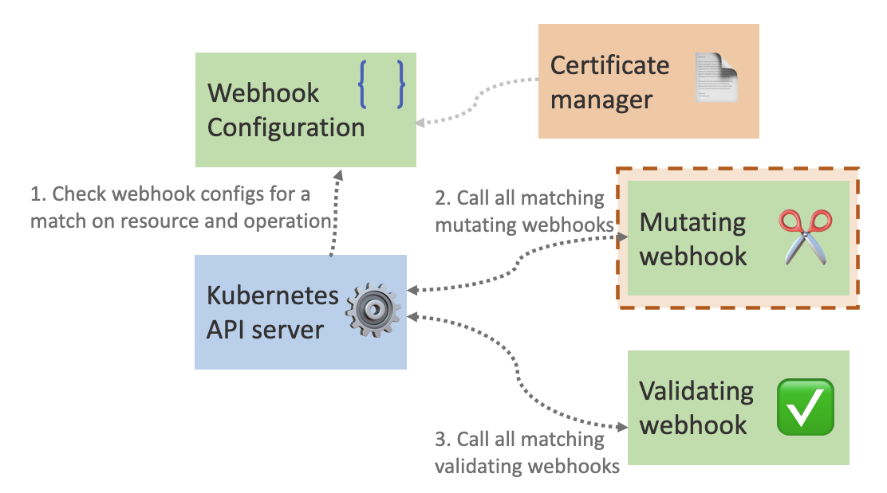

Kubernetes is a very powerful platform, and one of its biggest powers is how extendable it is. One of these features is *dynamic admission control*. What that means is that we can add custom logic to determine what and if Kubernetes objects are created. This is a small blog series that focuses on this topic:

- Create a Basic Kubernetes Mutating Webhook (this post)
- [Create a Basic Kubernetes Validating Webhook](https://trstringer.com/kubernetes-validating-webhook/)
- [Dynamic Admission Control Certificate Management with cert-manager](https://trstringer.com/admission-control-cert-manager/)

So how exactly does this work? What happens and when does it happen?



When you do an operation on a resource (e.g. pod) the Kubernetes API server will look at the webhook configurations to see if there are any admission controls that it needs to apply. For all matched operations, it will first apply the mutating webhooks and then take that resource output and apply that to the validating webhooks. In this post we will be working with the former.

*Note: The complete code can be found on [my GitHub repository](https://github.com/trstringer/kubernetes-mutating-webhook).*

An admission control webhook is not much more than a webserver. Let's create the initial function:

```go
func runWebhookServer(certFile, keyFile string) {
    cert, err := tls.LoadX509KeyPair(certFile, keyFile)
    if err != nil {
        panic(err)
    }

    fmt.Println("Starting webhook server")
    http.HandleFunc("/mutate", mutatePod)
    server := http.Server{
        Addr: fmt.Sprintf(":%d", port),
        TLSConfig: &tls.Config{
            Certificates: []tls.Certificate{cert},
        },
        ErrorLog: logger,
    }

    if err := server.ListenAndServeTLS("", ""); err != nil {
        panic(err)
    }
}
```

Here we create an HTTP server (with TLS, more on that in a following blog post) that listens on a single route: `/mutate`. And the handler for this route is:

```go
func admissionReviewFromRequest(r *http.Request, deserializer runtime.Decoder) (*admissionv1.AdmissionReview, error) {
    // Validate that the incoming content type is correct.
    if r.Header.Get("Content-Type") != "application/json" {
        return nil, fmt.Errorf("expected application/json content-type")
    }

    // Get the body data, which will be the AdmissionReview
    // content for the request.
    var body []byte
    if r.Body != nil {
        requestData, err := ioutil.ReadAll(r.Body)
        if err != nil {
            return nil, err
        }
        body = requestData
    }

    // Decode the request body into
    admissionReviewRequest := &admissionv1.AdmissionReview{}
    if _, _, err := deserializer.Decode(body, nil, admissionReviewRequest); err != nil {
        return nil, err
    }

    return admissionReviewRequest, nil
}

func mutatePod(w http.ResponseWriter, r *http.Request) {
    logger.Printf("received message on mutate")

    deserializer := codecs.UniversalDeserializer()

    // Parse the AdmissionReview from the http request.
    admissionReviewRequest, err := admissionReviewFromRequest(r, deserializer)
    if err != nil {
        msg := fmt.Sprintf("error getting admission review from request: %v", err)
        logger.Printf(msg)
        w.WriteHeader(400)
        w.Write([]byte(msg))
        return
    }

    // Do server-side validation that we are only dealing with a pod resource. This
    // should also be part of the MutatingWebhookConfiguration in the cluster, but
    // we should verify here before continuing.
    podResource := metav1.GroupVersionResource{Group: "", Version: "v1", Resource: "pods"}
    if admissionReviewRequest.Request.Resource != podResource {
        msg := fmt.Sprintf("did not receive pod, got %s", admissionReviewRequest.Request.Resource.Resource)
        logger.Printf(msg)
        w.WriteHeader(400)
        w.Write([]byte(msg))
        return
    }

    // Decode the pod from the AdmissionReview.
    rawRequest := admissionReviewRequest.Request.Object.Raw
    pod := corev1.Pod{}
    if _, _, err := deserializer.Decode(rawRequest, nil, &pod); err != nil {
        msg := fmt.Sprintf("error decoding raw pod: %v", err)
        logger.Printf(msg)
        w.WriteHeader(500)
        w.Write([]byte(msg))
        return
    }

    // Create a response that will add a label to the pod if it does
    // not already have a label with the key of "hello". In this case
    // it does not matter what the value is, as long as the key exists.
    admissionResponse := &admissionv1.AdmissionResponse{}
    var patch string
    patchType := v1.PatchTypeJSONPatch
    if _, ok := pod.Labels["hello"]; !ok {
        patch = `[{"op":"add","path":"/metadata/labels","value":{"hello":"world"}}]`
    }

    admissionResponse.Allowed = true
    if patch != "" {
        admissionResponse.PatchType = &patchType
        admissionResponse.Patch = []byte(patch)
    }

    // Construct the response, which is just another AdmissionReview.
    var admissionReviewResponse admissionv1.AdmissionReview
    admissionReviewResponse.Response = admissionResponse
    admissionReviewResponse.SetGroupVersionKind(admissionReviewRequest.GroupVersionKind())
    admissionReviewResponse.Response.UID = admissionReviewRequest.Request.UID

    resp, err := json.Marshal(admissionReviewResponse)
    if err != nil {
        msg := fmt.Sprintf("error marshalling response json: %v", err)
        logger.Printf(msg)
        w.WriteHeader(500)
        w.Write([]byte(msg))
        return
    }

    w.Header().Set("Content-Type", "application/json")
    w.Write(resp)
}
```

Hopefully the comments of this main function explain what's happening, but in short we get the AdmissionReview from the request and then do a test on the labels that the pod has:

```go
    if _, ok := pod.Labels["hello"]; !ok {
        patch = `[{"op":"add","path":"/metadata/labels","value":{"hello":"world"}}]`
    }
```

If the pod has a label with the key `hello` then there will be no action. But if the pod does not have this label, then it will create a JSON patch that adds a new label with the key `hello` and the value `world`.

Now let's create this webhook in the Kubernetes cluster. First define the Dockerfile:

**Dockerfile**

```Dockerfile
FROM ubuntu:focal
WORKDIR /opt
COPY ./bin/mutating-webhook .
CMD ["./mutating-webhook", "--tls-cert", "/etc/opt/tls.crt", "--tls-key", "/etc/opt/tls.key"]
```

And now create the deployment:

**webhook-deployment.yaml**

```yaml
kind: Deployment
apiVersion: apps/v1
metadata:
  name: mutating-webhook
spec:
  replicas: 1
  selector:
    matchLabels:
      app: mutating-webhook
  template:
    metadata:
      labels:
        app: mutating-webhook
    spec:
      containers:
        - name: mutating-webhook
          image: localhost:5000/mutating-webhook:latest
          imagePullPolicy: Always
          ports:
            - containerPort: 443
          volumeMounts:
            - name: cert
              mountPath: /etc/opt
              readOnly: true
      volumes:
        - name: cert
          secret:
            secretName: server-cert
```

And now we need the service that points to our webhook:

**webhook-service.yaml**

```yaml
kind: Service
apiVersion: v1
metadata:
  name: mutating-webhook
spec:
  selector:
    app: mutating-webhook
  ports:
    - port: 443
      targetPort: 443
```

And finally, we need to create the `MutatingWebhookConfiguration` which tells the Kubernetes API server when and how to call our mutating webhook:

**mutating-webhook-config.yaml**

```yaml
kind: MutatingWebhookConfiguration
apiVersion: admissionregistration.k8s.io/v1
metadata:
  name: pod-label-add
  annotations:
    cert-manager.io/inject-ca-from: default/client
webhooks:
  - name: pod-label-add.trstringer.com
    clientConfig:
      service:
        namespace: default
        name: mutating-webhook
        path: /mutate
    rules:
      - apiGroups: [""]
        apiVersions: ["v1"]
        resources: ["pods"]
        operations: ["CREATE"]
        scope: Namespaced
    sideEffects: None
    admissionReviewVersions: ["v1"]
```

This does a couple of interesting things. It defines the `clientConfig`, which points to the `mutating-webhook` Kubernetes service that we created above (which, in turn, points to the deployment's pods for the webhook). It also defines that the API server should use the `/mutate` route that we specified in our webhook server. Then we create the `rules` on which resources to apply this mutating webhook to. In this case, the mutating webhook should apply to all pods.

Let's see how this works! Let's create a pod:

```bash
$ kubectl apply -f - <<EOF
kind: Pod
apiVersion: v1
metadata:
  name: test-app
spec:
  containers:
    - name: test-app
      image: ubuntu:focal
      command: ["/bin/bash"]
      args: ["-c", "sleep infinity"]
EOF
```

Notice that we don't define any labels for this pod. After the pod is created, let's take a look at it:

```bash
$ kubectl describe po test-app
Name:         test-app
Namespace:    default
Priority:     0
Node:         kind-control-plane/172.18.0.3
Start Time:   Sun, 14 Nov 2021 14:42:16 -0500
Labels:       hello=world
Annotations:  <none>
Status:       Running
... output removed for brevity
```

It looks like our mutating webhook worked! You can see that the label `hello=world` was added to the pod. But if we specify the `hello` key, let's verify that it doesn't mutate the pod:

```bash
$ kubectl apply -f - <<EOF
kind: Pod
apiVersion: v1
metadata:
  name: test-app
  labels:
    hello: universe
spec:
  containers:
    - name: test-app
      image: ubuntu:focal
      command: ["/bin/bash"]
      args: ["-c", "sleep infinity"]
EOF
```

And now let's see the labels:

```bash
$ kubectl describe po test-app
Name:         test-app
Namespace:    default
Priority:     0
Node:         kind-control-plane/172.18.0.3
Start Time:   Sun, 14 Nov 2021 14:47:44 -0500
Labels:       hello=universe
Annotations:  <none>
Status:       Running
... output removed for brevity
```

Great! Our `hello` label was preserved and not overwritten.

Hopefully this blog post has illustrated how to implement a basic mutating webhook for dynamic admission control!
