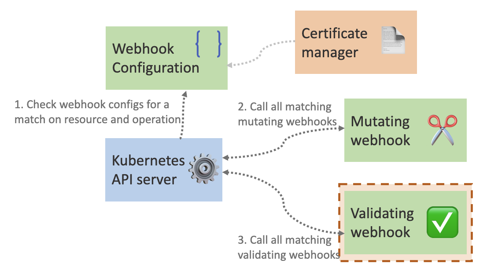

Using dynamic admission control in Kubernetes is a powerful way to impact what and how resources are created in your Kubernetes clusters. Last blog post I chatted about how to create a Kubernetes mutating webhook, now I'm going to dive into the next part of the admission process: Validating webhooks.

- [Create a Basic Kubernetes Mutating Webhook](https://trstringer.com/kubernetes-mutating-webhook/)
- Create a Basic Kubernetes Validating Webhook (this post)
- [Dynamic Admission Control Certificate Management with cert-manager](https://trstringer.com/admission-control-cert-manager/)

After the API server runs the resource through the mutating webhooks that match, it will then validate the manifest with all matching validating webhooks:



All of the code for this validating webhook can be found [on GitHub](https://github.com/trstringer/kubernetes-validating-webhook). I will not be going through the details of all the code like I did in the [mutating webhook blog post](https://trstringer.com/kubernetes-mutating-webhook/). Please reference that article to understand the full code from top to bottom. This post will focus on the code differences between the two.

For the validating webhook our function that creates the HTTP server looks like this:

```golang
func runWebhookServer(certFile, keyFile string) {
    cert, err := tls.LoadX509KeyPair(certFile, keyFile)
    if err != nil {
        panic(err)
    }

    fmt.Println("Starting webhook server")
    http.HandleFunc("/validate", validatePod)
    server := http.Server{
        Addr: fmt.Sprintf(":%d", port),
        TLSConfig: &tls.Config{
            Certificates: []tls.Certificate{cert},
        },
        ErrorLog: logger,
    }

    if err := server.ListenAndServeTLS("", ""); err != nil {
        panic(err)
    }
}
```

Here we expose the `/validate` route for the webhook.

*Note: You can use the same HTTP server for multiple validating webhooks, as well as mutating webhooks. This blog series shows separate processes and servers but that is not necessary.*

Let's see how our handler has changed:

```golang
func validatePod(w http.ResponseWriter, r *http.Request) {
    logger.Printf("received message on validate")

    // ... Common code with the mutating webhook removed for
    // ... brevity. Refer to the past blog post for full code.

    // Create a response that either allows or rejects the pod creation
    // based off of the value of the hello label. Also, check to see if
    // we should supply a warning message even it is allowed.
    admissionResponse := &admissionv1.AdmissionResponse{}
    admissionResponse.Allowed = true

    if value, ok := pod.Labels["hello"]; !ok {
        admissionResponse.Allowed = false
        admissionResponse.Result = &metav1.Status{
            Message: "missing required hello label",
        }
    } else if value == "world" {
        admissionResponse.Warnings = []string{"world will be deprecated for hello in the future"}
    }

    // ... Common code with the mutating webhook removed for
    // ... brevity. Refer to the past blog post for full code.
}
```

So there are three states that are possible here:

| `hello` label exists | Value | Result |
|----------------------|-------|--------|
| No | N/A | Rejected |
| Yes | `world` | Approved with warning |
| Yes | not `world` | Approved |

The deployment and service for this webhook are almost identical to the mutating webhook. But the configuration is now going to be a `ValidatingWebhookConfiguration` resource:

```yaml
kind: ValidatingWebhookConfiguration
apiVersion: admissionregistration.k8s.io/v1
metadata:
  name: pod-label-require
  annotations:
    cert-manager.io/inject-ca-from: default/client
webhooks:
  - name: pod-label-require.trstringer.com
    clientConfig:
      service:
        namespace: default
        name: validating-webhook
        path: /validate
    rules:
      - apiGroups: [""]
        apiVersions: ["v1"]
        resources: ["pods"]
        operations: ["CREATE"]
        scope: Namespaced
    sideEffects: None
    admissionReviewVersions: ["v1"]
```

Now the `path` is set to `/validate` for our webhook server. Let's see this validating webhook in action!

Trying to create this pod:

```bash
$ kubectl apply -f - <<EOF
kind: Pod
apiVersion: v1
metadata:
  name: test-app
spec:
  containers:
    - name: test-app
      image: ubuntu:focal
      command: ["/bin/bash"]
      args: ["-c", "sleep infinity"]
EOF
```

As expected, this pod is rejected because it doesn't have the `hello` label:

> Error from server: error when creating "STDIN": admission webhook "pod-label-require.trstringer.com" denied the request: missing required hello label

Let's try to get the warning now by specifying the `hello` label but with the value of `world`:

```bash
$ kubectl apply -f - <<EOF
kind: Pod
apiVersion: v1
metadata:
  name: test-app
  labels:
    hello: world
spec:
  containers:
    - name: test-app
      image: ubuntu:focal
      command: ["/bin/bash"]
      args: ["-c", "sleep infinity"]
EOF
```

Great! It worked with a warning:

> Warning: world will be deprecated for hello in the future
>
> pod/test-app created

Even with the warning, the pod was still created:

```bash
$ kubectl get po test-app
NAME       READY   STATUS    RESTARTS   AGE
test-app   1/1     Running   0          37s
```

And by having a value for the `hello` label that *isn't* `world`:

```bash
$ kubectl apply -f - <<EOF
kind: Pod
apiVersion: v1
metadata:
  name: test-app
  labels:
    hello: universe
spec:
  containers:
    - name: test-app
      image: ubuntu:focal
      command: ["/bin/bash"]
      args: ["-c", "sleep infinity"]
EOF
```

As expected, the pod is created without a warning:

> pod/test-app created

This example is contrived, but hopefully it has illustrated how you can create and implementat a validating webhook in Kubernetes!
