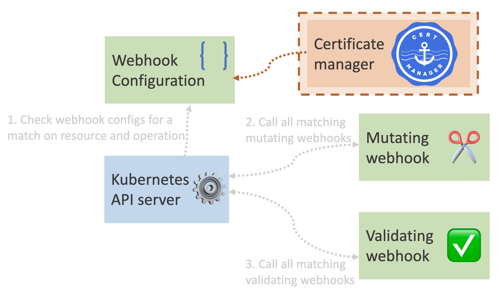
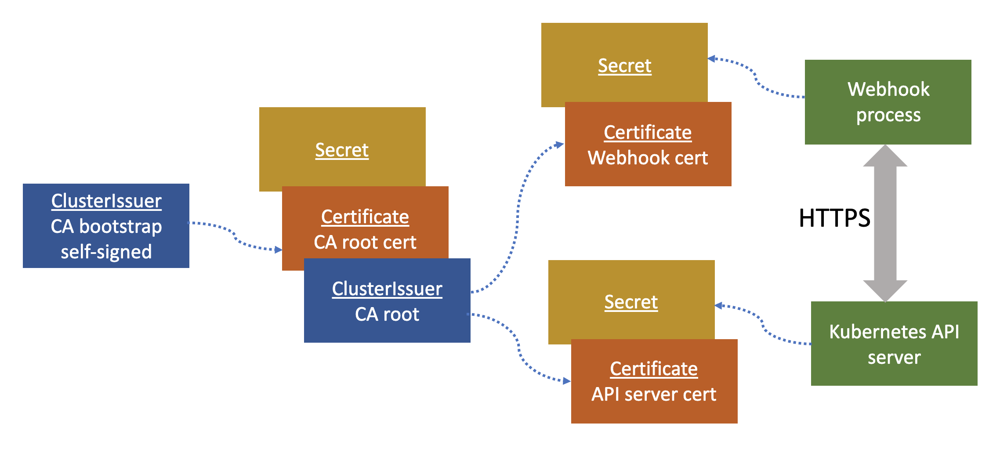

The last two blog posts during this mini-series has been focusing on the dynamic admission control webhooks. Now we will finish this with talking about a powerful and simple way to deal with certificate management for these webhooks.

- [Create a Basic Kubernetes Mutating Webhook](https://trstringer.com/kubernetes-mutating-webhook/)
- [Create a Basic Kubernetes Validating Webhook](https://trstringer.com/kubernetes-validating-webhook/)
- Dynamic Admission Control Certificate Management with cert-manager (this post)

Let's see where these components fit into the big picture:



Before we jump into this specific implementation, it's worth introducing the underlying product. [cert-manager](https://cert-manager.io/) is a fully managed X.509 certificate solution for issuers within your cluster. There are a lot of really cool features of cert-manager, so I highly recommend you take a look at it. We are going to utilize cert-manager to issue the certificates we will use for the validating and mutating webhooks.

Here is an overview of how we are going to use cert-manager to provide certificates to our webhook and the Kubernetes API server:



The setup for the certificates starts with creating the `ClusterIssuer` that will act as the CA boostrap:

```yaml
kind: ClusterIssuer
apiVersion: cert-manager.io/v1
metadata:
  name: ca-bootstrap
spec:
  selfSigned: {}
```

Now we will create the CA root certificate:

```yaml
kind: Certificate
apiVersion: cert-manager.io/v1
metadata:
  name: ca-root
  namespace: cert-manager
spec:
  secretName: ca-root
  isCA: true
  commonName: ca-root
  privateKey:
    algorithm: RSA
    size: 2048
  issuerRef:
    kind: ClusterIssuer
    name: ca-bootstrap
```

You can see that this root CA certificate references the boostrap `ClusterIssuer`. Another thing worth mentioning, when cert-manager creates a certificate it'll create a backing Kubernetes secret to store the different files:

- `ca.crt` - This is the CA bundle
- `tls.crt` - Certificate
- `tls.key` - Private key

Now that we have our CA root certificate, we need to create our `ClusterIssuer` for the CA so that we can create other certificates from this:

```yaml
kind: ClusterIssuer
apiVersion: cert-manager.io/v1
metadata:
  name: ca-root
spec:
  ca:
    secretName: ca-root
```

As you can see here, we reference the secret that was created for the root certificate by name. Now that we essentially have our CA setup, it's time to create the end certificates that will be used for the webhook and the Kubernetes API server so that these components can communicate with HTTPS.

First we will create the webhook certificate:

```yaml
kind: Certificate
apiVersion: cert-manager.io/v1
metadata:
  name: server
spec:
  issuerRef:
    name: ca-root
    kind: ClusterIssuer
  secretName: server-cert
  duration: 2160h
  renewBefore: 360h
  dnsNames:
    # - mutating-webhook.default.svc
    - validating-webhook.default.svc
  isCA: false
  privateKey:
    algorithm: RSA
    size: 2048
  usages:
    - client auth
    - server auth
```

A couple of interesting points here: `issuerRef` points to the `ClusterIssuer` that we just created for the CA. Also, we set `dnsNames` to whatever the name is of the webhook. In this case we use `validating-webhook.default.svc`, which refers to the webhook Kubernetes service with its fully qualified name.

Now we will create the certificate that the Kubernetes API server will use to access the webhook:

```yaml
kind: Certificate
apiVersion: cert-manager.io/v1
metadata:
  name: client
spec:
  issuerRef:
    name: ca-root
    kind: ClusterIssuer
  secretName: client-cert
  duration: 2160h
  renewBefore: 360h
  dnsNames:
    - pod-label-require.trstringer.com
  isCA: false
  privateKey:
    algorithm: RSA
    size: 2048
  usages:
    - client auth
    - server auth
```

With the certificates created, we now need to inject them into the [`caBundle`](https://kubernetes.io/docs/reference/kubernetes-api/extend-resources/validating-webhook-configuration-v1/#ValidatingWebhookConfiguration). This will allow the Kubernete API server to authenticate to the webhook server. One of the great features about cert-manager is its ability to *automatically inject the caBundle*. And it's as easy as adding an annotation to the webhook config:

```yaml
kind: ValidatingWebhookConfiguration
apiVersion: admissionregistration.k8s.io/v1
metadata:
  name: pod-label-require
  annotations:
    cert-manager.io/inject-ca-from: default/client
webhooks:
  - name: pod-label-require.trstringer.com
    clientConfig:
      service:
        namespace: default
        name: validating-webhook
        path: /validate
    rules:
      - apiGroups: [""]
        apiVersions: ["v1"]
        resources: ["pods"]
        operations: ["CREATE"]
        scope: Namespaced
    sideEffects: None
    admissionReviewVersions: ["v1"]
```

We create the annotation `cert-manager.io/inject-ca-from` with the value of the certificate for the Kubernetes API server: `default/client`. By specifying this annotation, cert-manager will inject the `caBundle` into this config:

```bash
$ kubectl get validatingwebhookconfigurations pod-label-require -o jsonpath='{.webhooks[0].clientConfig.caBundle}' |
    base64 -d |
    openssl x509 -noout -text
```

You can see that the certificate is the CA root that was created above. Because this annotation was specificied, we didn't have to do anything to get the `caBundle` injected and allowing the Kubernetes API server to talk to the webhook server.

And that's it! By having the webhook use the `server` certificate we created, and utilizing the `cert-manager.io/inject-ca-from` annotation on the webhook configuration we are able to have this whole process working and getting HTTPS between the Kubernetes API server and the webhook. Enjoy!
