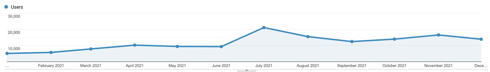
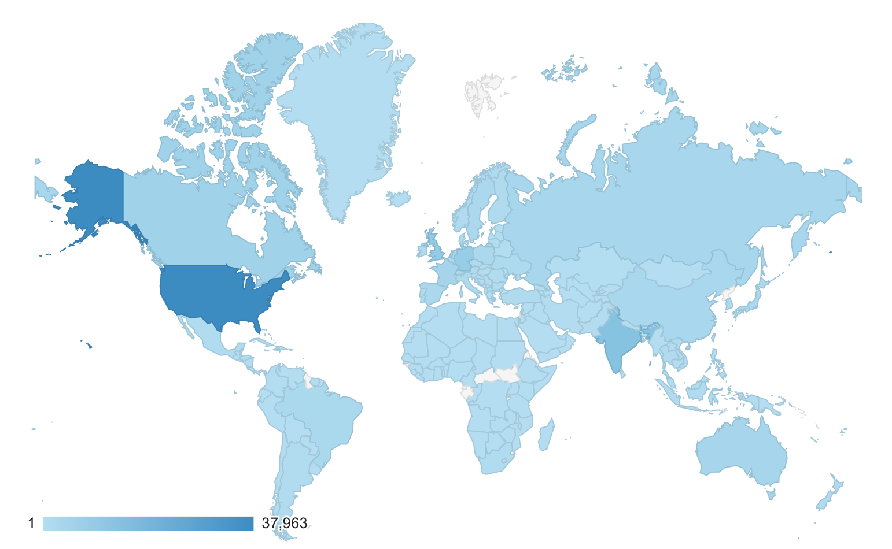
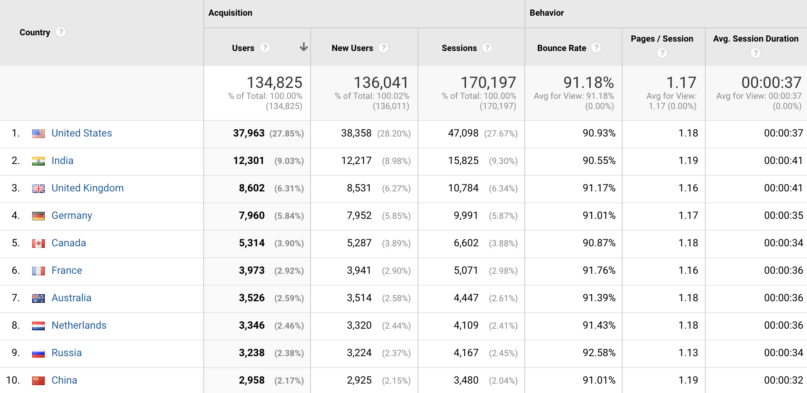
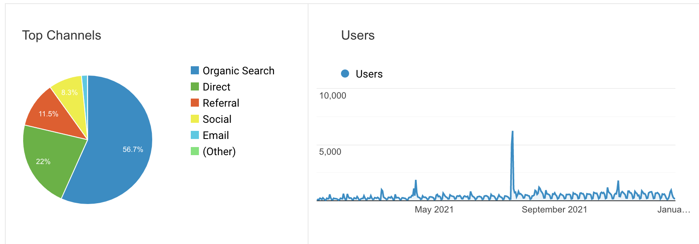

2021 was a year of many things for many people. For me, my primary personal project was to regularly write and publish technical blog posts. This will serve as a review on what I did and what came from it.

## What I did

This time last year I started out 2021 with the personal project of blogging regularly. How regularly? Well I started out the year releasing two blog posts per week. I kept this up until early April, when creating and releasing two blog posts a week was getting to be too much. At this time I switched to releasing a single blog post a week. And for the most part I was able to do this for the remainder of the year (although I must admit, there were a couple of weeks I missed).

So let's get into it then. What did I create? Over the course of 2021, I wrote **65 blog posts** and a total of **49,997 words** (laughably close to 50k). I wrote about many technical topics, primarily: **Azure**, **Kubernetes**, **Linux**, **DevOps**, **Go** and many others.

## What was the result

Now the fun part! From what I produced, here were the results. In 2021, my blog got **134,825 users** and a total of **199,407 page views**. Month-over-month I saw an increase in blog traffic:

For the most part, it was a steady increase (except for July, but I'll explain that below). One of the coolest graphs though is this one:

The blue indicates traffic from that country. The fact that my blog received traffic from almost every part of the globe is really refreshing for me to think about! Here are the top ten countries that visited my blog:

Most of my users came from organic search:

The top five blog posts with the most traffic!

1. [20 Questions a Software Engineer Should Ask When Joining a New Team](https://trstringer.com/20-questions-for-new-software-team/) (23,176 page views, 11.62% of all traffic)
1. [Logging, Flask, and Gunicorn... the Manageable Way](https://trstringer.com/logging-flask-gunicorn-the-manageable-way/) (12,576 page views, 6.3% of all traffic)
1. [Simple vs Oneshot - Choosing a systemd Service Type](https://trstringer.com/simple-vs-oneshot-systemd-service/) (9,271 page views, 4.65% of all traffic)
1. [Create a Release and Upload Artifacts with GitHub Actions](https://trstringer.com/github-actions-create-release-upload-artifacts/) (8,299 page views, 4.16% of all traffic)
1. [Azure Linux VM SSH Error - Permission denied (publickey)](https://trstringer.com/azure-linux-vm-ssh-public-key-denied/) (6,693 page views, 3.36% of all traffic)

That number one blog post was the reason for the big spike in July. As you can see from the numbers, it generated a lot of traffic.

## The effect

If I take a step back and really think about what benefits came from this.

**It helped people**. Even if it only helped 1% of the readers (hopefully it is more), that's still over 1,300 people that benefited from my writing. That's extremely humbling.

On a personal note, **it also helped me learn** many things. Writing about technical topics requires me to know the fine details of exactly what I'm talking about. And it fortifies this information in my brain because I had to write about it and "teach" it.

Another personal benefit was that it ultimately **helped grow my brand**. So if you are considering whether or not to start regularly blogging, hopefully this review can show the advantages of doing so for yourself and others.

## What's next?

Regularly weekly blogging was my personal project for 2021. But what about 2022? Well, first off I'm going to continue blogging. Perhaps not on a regular schedule, but technical blogging is something I really do enjoy and don't expect to stop for quite some time.

In 2022 I'm going to do something that I've been thinking about for awhile now: **I'm going to write a book!** More on these details later, but I'm really excited for what's to come this year.
