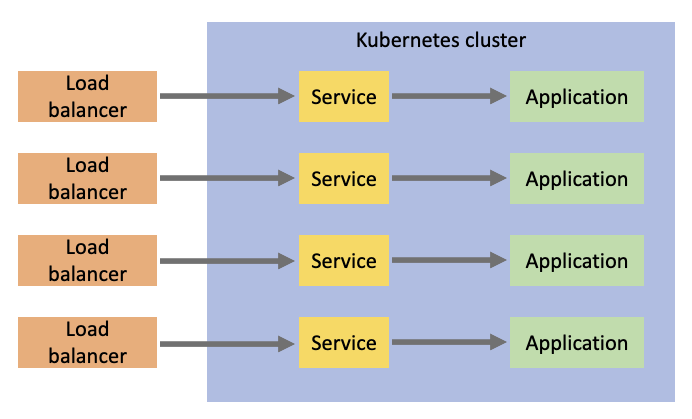
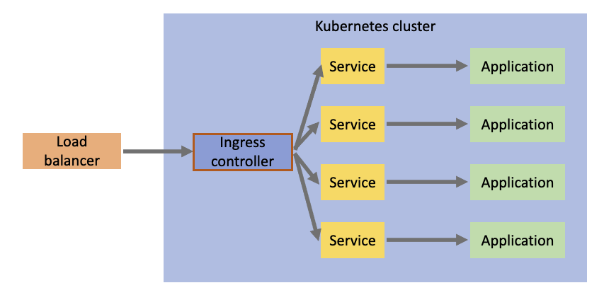
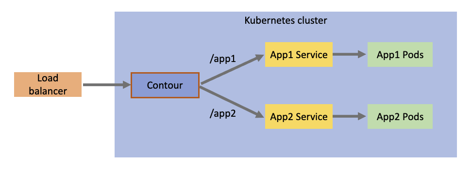

There are many challenges when working with Kubernetes, and one of the most common scenarios is getting user traffic to your applications. And on top of that, user traffice from *external* the Kubernetes cluster can be even more difficult. This is where we can start to plan for ingress. One of my favorites is [Contour](https://projectcontour.io/). Contour is a high performance ingress controller based on [Envoy](https://www.envoyproxy.io/), a layer 7 proxy. Both Contour and Envoy are [CNCF](https://www.cncf.io/) projects.

Before we start diving into Contour specifically, let's talk through ingress a little bit. Before we go into ingress, though, let's take a step back and look at what it is like *without* ingress.

## Life without ingress controllers

Ingress controllers are surely not a requirement to get user traffic from external to the Kubernetes cluster to your pods running inside. In fact, a common approach is to just create a service of type `LoadBalancer` for your application pod(s), and have your favorite cloud provider provision the necessary infrastructure to get traffic to your application.

But, this can lead to a handful of problems:

* The more applications you have, the more load balancers you need. This directly translates to more money. This approach can get expensive very fast.
* Your administration and maintanence of your cloud resources is also magnified, because you will likely have multiple load balancers to deal with.
* TLS termination has to be handled at your application pods. This is not a trivial task to setup, much less maintain.
* This approach can only supply simple scenarios. Once you start getting into more complex requirements, you will have to design your own solution.

Here's what this approach looks like:



As you can see, the external load balancers supporting this configuration can get to be a lot. This is where an ingress controller can help.

## Ingress controller benefits

There are many different ingress controllers out there, but they mostly fulfill the same requirement: To simplify ingress traffic to your Kubernetes cluster and to provide capabilities and benefits for more sophisticated networking scenarios. Once we add an ingress controller into our cluster, the flow of traffic now changes to something like this:



Now your external traffic will flow through a single load balancer into your ingress controller, which will take ingress configuration to determine which service to forward the traffic to.

## Deploying Contour

So now we know why we might need an ingress controller, the next *big* question is: **Which ingress controller should I use?** Great question. There are many out there, but Contour is my favorite for a few reasons:

* Developed as a Kubernetes-first ingress controller
* Support for dynamic configuration (thanks to Envoy)
* High performance (also thanks to Envoy)
* Development and support efforts for the future Gateway API
* Intuitive and powerful HTTPProxy API

With that being said, I'm ready to install Contour in my Kubernetes cluster. There are a few ways to do that, but the easiest is to just apply Contour's manifests:

```
$ kubectl apply -f https://projectcontour.io/quickstart/contour.yaml
namespace/projectcontour created
serviceaccount/contour created
serviceaccount/envoy created
configmap/contour created
customresourcedefinition.apiextensions.k8s.io/contourconfigurations.projectcontour.io created
customresourcedefinition.apiextensions.k8s.io/contourdeployments.projectcontour.io created
customresourcedefinition.apiextensions.k8s.io/extensionservices.projectcontour.io created
customresourcedefinition.apiextensions.k8s.io/httpproxies.projectcontour.io created
customresourcedefinition.apiextensions.k8s.io/tlscertificatedelegations.projectcontour.io created
serviceaccount/contour-certgen created
rolebinding.rbac.authorization.k8s.io/contour created
role.rbac.authorization.k8s.io/contour-certgen created
job.batch/contour-certgen-v1.20.1 created
clusterrolebinding.rbac.authorization.k8s.io/contour created
clusterrole.rbac.authorization.k8s.io/contour created
service/contour created
service/envoy created
deployment.apps/contour created
daemonset.apps/envoy created
```

As you can see, a lot of Kubernetes objects were created. Let's do a few checks to verify the installation:

```
$ kubectl get po,svc,deploy,daemonset -n projectcontour
NAME                                READY   STATUS      RESTARTS   AGE
pod/contour-76cbc54fbf-jl2t2        1/1     Running     0          74s
pod/contour-76cbc54fbf-rwnsk        1/1     Running     0          74s
pod/contour-certgen-v1.20.1-27m46   0/1     Completed   0          74s
pod/envoy-7mrw7                     2/2     Running     0          73s
pod/envoy-9vwhp                     2/2     Running     0          73s
pod/envoy-zrn2w                     2/2     Running     0          73s

NAME              TYPE           CLUSTER-IP    EXTERNAL-IP      PORT(S)                      AGE
service/contour   ClusterIP      10.0.170.78   <none>           8001/TCP                     74s
service/envoy     LoadBalancer   10.0.3.217    52.224.190.106   80:31665/TCP,443:32016/TCP   74s

NAME                      READY   UP-TO-DATE   AVAILABLE   AGE
deployment.apps/contour   2/2     2            2           74s

NAME                   DESIRED   CURRENT   READY   UP-TO-DATE   AVAILABLE   NODE SELECTOR   AGE
daemonset.apps/envoy   3         3         3       3            3           <none>          74s
```

All looks good! This output highlights the recommended approach to installing Contour, which is to have Envoy applied to the cluster as a daemonset. This means that an Envoy proxy will be running on all nodes in your cluster. This is definitely a good recommendation, but there can be some exceptions to this recommendation in which case you can install Envoy as a deployment and control the replicas there.

## Seeing Contour in action

To see this ingress controller working, let's consider this following desired configuration:



What we have here is two different applications: App 1 and App 2. We want a single endpoint going through the load balancer and ingress controller, but we want `/app1` traffic to go to App 1, and `/app2` traffic to go to App 2.

But first I needed to create a quick and easy web server that can take an environment variable to customize the message that it outputs (just so I know which application I'm hitting):

```go
package main

import (
    "fmt"
    "log"
    "net/http"
    "os"
)

func main() {
    fmt.Println("Starting web server...")

    message := os.Getenv("MESSAGE")
    fmt.Printf("Using message: %s\n", message)

    http.HandleFunc("/", func(res http.ResponseWriter, req *http.Request) {
        fmt.Println("Request received")
        fmt.Fprintf(res, "Message: %s", message)
    })

    log.Fatal(http.ListenAndServe(":8000", nil))
}
```

And now I'll bundle this up into an image:

```Dockerfile
FROM golang:1.17 AS builder
COPY . /var/app
WORKDIR /var/app
RUN ["go", "build", "-o", "app", "."]

FROM debian:bullseye
WORKDIR /var/app
COPY --from=builder /var/app/app .
CMD ["./app"]
```

And push it to my container registry (in my case, I'm using Azure Container Registry):

```
$ docker build -t trstringeraks1.azurecr.io/basic-web-server:latest .
$ az acr login -n trstringeraks1
$ docker push trstringeraks1.azurecr.io/basic-web-server:latest
```

Now I'll create the applications in the Kubernetes cluster. First is App 1:

```yaml
kind: Namespace
apiVersion: v1
metadata:
  name: app1
---
kind: Deployment
apiVersion: apps/v1
metadata:
  name: app1
  namespace: app1
spec:
  replicas: 2
  selector:
    matchLabels:
      app: app1
  template:
    metadata:
      labels:
        app: app1
    spec:
      containers:
        - name: app1
          image: trstringeraks1.azurecr.io/basic-web-server:latest
          imagePullPolicy: Always
          ports:
            - containerPort: 8000
          env:
            - name: MESSAGE
              value: hello from app1
---
kind: Service
apiVersion: v1
metadata:
  name: app1
  namespace: app1
spec:
  selector:
    app: app1
  ports:
    - port: 80
      targetPort: 8000
```

Next let's create App 2:

```yaml
kind: Namespace
apiVersion: v1
metadata:
  name: app2
---
kind: Deployment
apiVersion: apps/v1
metadata:
  name: app2
  namespace: app2
spec:
  replicas: 2
  selector:
    matchLabels:
      app: app2
  template:
    metadata:
      labels:
        app: app2
    spec:
      containers:
        - name: app2
          image: trstringeraks1.azurecr.io/basic-web-server:latest
          imagePullPolicy: Always
          ports:
            - containerPort: 8000
          env:
            - name: MESSAGE
              value: hello from app2
---
kind: Service
apiVersion: v1
metadata:
  name: app2
  namespace: app2
spec:
  selector:
    app: app2
  ports:
    - port: 80
      targetPort: 8000
```

Now that we have our applications setup, we need to setup the routing so that our Contour ingress controller knows where to send traffic to. We do this by creating a single root proxy and include two other proxies to direct traffic to their respective application. Let's first create our application proxies:

```yaml
kind: HTTPProxy
apiVersion: projectcontour.io/v1
metadata:
  name: app1
  namespace: app1
spec:
  routes:
    - services:
      - name: app1
        port: 80
---
kind: HTTPProxy
apiVersion: projectcontour.io/v1
metadata:
  name: app2
  namespace: app2
spec:
  routes:
    - services:
      - name: app2
        port: 80
```

There's not much to these, they are pretty much just target proxies that can be referenced and route all traffic to their service and port. The real routing comes into play with the root proxy:

```yaml
kind: HTTPProxy
apiVersion: projectcontour.io/v1
metadata:
  name: main
spec:
  virtualhost:
    fqdn: myapps
  includes:
    - name: app1
      namespace: app1
      conditions:
        - prefix: /app1
    - name: app2
      namespace: app2
      conditions:
        - prefix: /app2
```

This root proxy defines a virtual host of `myapps` and includes the two app proxies with the conditions based on the prefix route. `/app1` will route to the `app1` proxy, and `/app2` will route to the `app2` proxy. Once we create these three proxies, we should check to make sure that Contour accepted them and they are valid:

```
$ kubectl get proxy -A
NAMESPACE   NAME   FQDN     TLS SECRET   STATUS   STATUS DESCRIPTION
app1        app1                         valid    Valid HTTPProxy
app2        app2                         valid    Valid HTTPProxy
default     main   myapps                valid    Valid HTTPProxy
```

Now that we have all of the wiring created, let's make a request! First let's get the public IP address of the load balancer service entry point into the cluster:

```
$ INGRESS_IP=$(kubectl get svc -n projectcontour envoy -o jsonpath='{.status.loadBalancer.ingress[0].ip}')
```

And finally, let's curl App 1:

```
$ curl -H "host:myapps" $INGRESS_IP/app1
Message: hello from app1
```

Success! Our request was routed to our App 1's service and pods. Let's verify App 2:

```
$ curl -H "host:myapps" $INGRESS_IP/app2
Message: hello from app2
```

Great! Everything is working as expected.

## Summary

As your Kubernetes cluster starts to have requirements of taking external traffic in, a typical approach is to introduce an ingress controller to handle this. It gives you a lot of benefits (cost, security, etc.). Contour is a really great example of a modern ingress controller with great performance and an intuitive API. I highly recommend it, and hopefully this blog post has helped introduce you to Contour!
