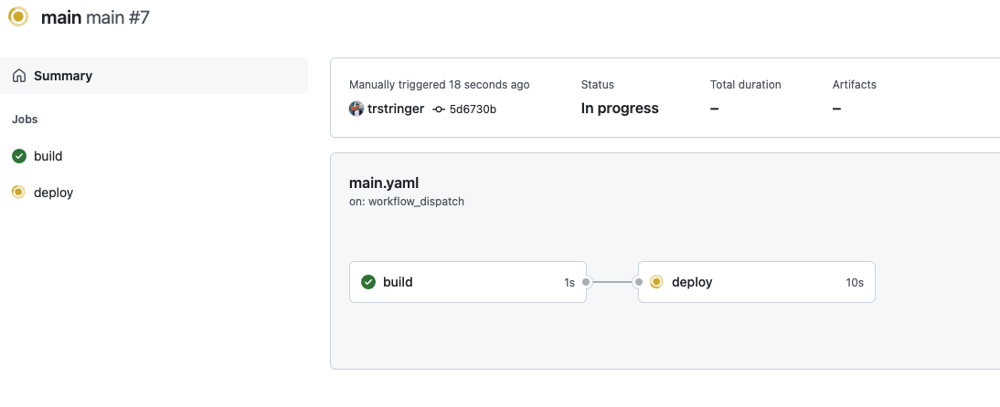
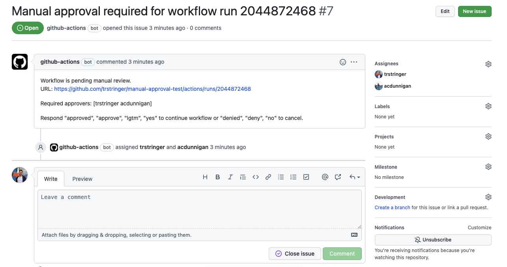
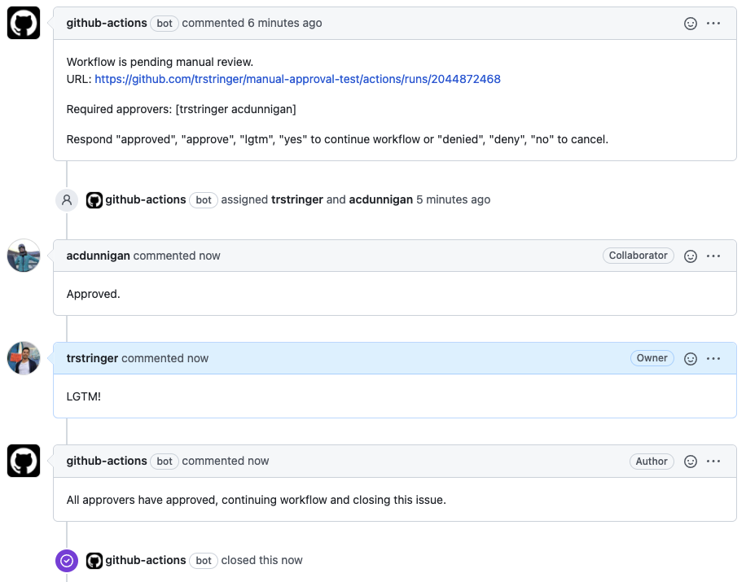
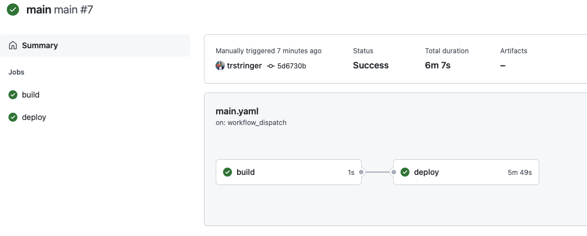
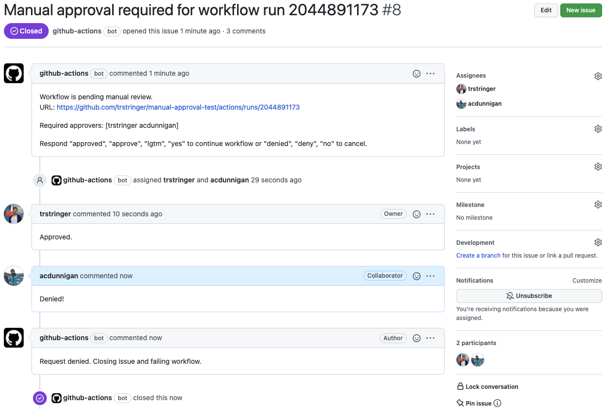
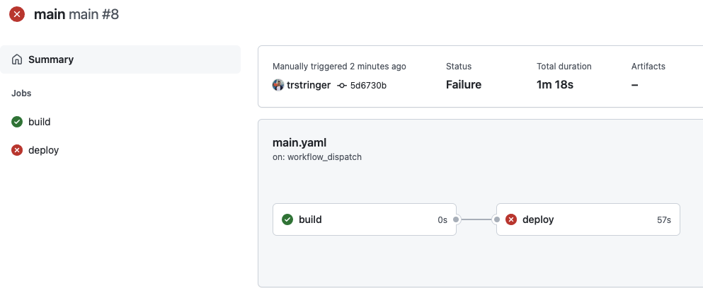

A typical requirement in a CI/CD pipeline is to pause prior to a large operation, such as a deployment, that needs to be manually approved. GitHub offers the ability to do this with [environments](https://docs.github.com/en/actions/deployment/targeting-different-environments/using-environments-for-deployment). With this approach though there are a couple of requirements that could be a barrier of usage:

* You are using environments (awesome feature, but not always something your workflow uses or needs)
* You are using this in a public repository (or in a private repository you need GitHub Enterprise)

GitHub Enterprise is a great product and well worth the investment, but it's not every GitHub user that needs and uses this tier of the product. With that being said, I wanted to create a way to allow manual approvals regardless of your repository visibility and without needing to use environments.

Introducing the manual-approval GitHub Action!

* [Marketplace Action](https://github.com/marketplace/actions/manual-workflow-approval)
* [GitHub repository](https://github.com/trstringer/manual-approval)

By using this action in your workflow it will pause until the designated approver(s) has/have approved (or denied) the continuation of the workflow. Here is the usage:


```yaml
steps:
  - uses: trstringer/manual-approval@v1
    with:
      secret: ${{ github.TOKEN }}
      approvers: user1,user2
```


`manual-approval` will create a GitHub issue in the corresponding repository and assign the issue to the specified `approvers`. The workflow will continue when all approvers have responded with an approval comment (e.g. "approved", "LGTM!"). Conversely, the workflow will fail if any of the `approvers` responds with a denial comment (e.g. "deny", "Denied!").

Let's see this in action. Say you have a workflow that you want to pause prior to deploying:


```yaml
name: main
on:
  workflow_dispatch:

jobs:
  build:
    name: build
    runs-on: ubuntu-latest
    steps:
      - name: Build
        run: echo building
  deploy:
    name: deploy
    runs-on: ubuntu-latest
    needs: build
    steps:
      - uses: trstringer/manual-approval@v1
        with:
          secret: ${{ github.TOKEN }}
          approvers: trstringer,acdunnigan
      - name: Deploy to production
        run: echo deploying
```


This workflow has two jobs: build and deploy. Deploy has a dependency on the completion of build. But before we actually deploy our software, this workflow will pause on `manual-approval` and require approval from these two GitHub users. Running this workflow we see the pause on deploy:



The action has automatically opened up an issue in the repository:



You can see that both approvers have been assigned the issue (this is helpful for notifications). Now both approvers either need to approve or deny the continuation of this workflow. Let's say both approvers want this to continue:



And we can see that our deployment successfully continues and completes:



Great! But what does it look like when an approver denies the workflow? Let's see that:



In this case, an approver has denied this workflow and we see that this fails the deployment job:



So if you need manual intervention in your GitHub Actions workflow but you don't want to have to use environments or you want to do this in a private repository (without GitHub Enterprise) hopefully this can help you! With any issues or suggestions, please [open up an issue on the trstringer/manual-approval repository](https://github.com/trstringer/manual-approval/issues).
