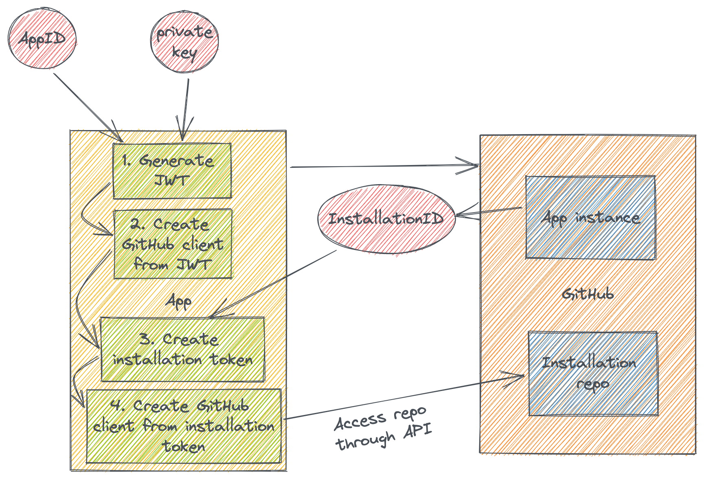

[GitHub Apps](https://docs.github.com/en/developers/apps/getting-started-with-apps/about-apps) are a really great way to extend GitHub and add custom integration. One of the trickier parts of GitHub Apps, though, is how it authenticates to GitHub so that it can access the target ("installation") repo. Another challenge is the GitHub App can prevent non-GitHub callers from making requests to the public webhook.

## Installation token

The way that a GitHub App authenticates to GitHub to do an action against the installation repo is by creating an installation token. This exchange can be seen here:



First we need to create a JSON Web Token (JWT). The claims that this JWT need are:

* "iat" - Issued at time which should be the Unix time of issuance (subtract some seconds, e.g. 60, to handle any time discrepancies).
* "exp" - Expiry time. This is also Unix time and can be a max of 10 minutes from issuance time.
* "iss" - This is the issuer claim, which should be the App ID for your registered GitHub App. You get the App ID when you register the GitHub App.

Then the token should be signed with the private key that you created with the GitHub App. This private key should be kept secret in secure storage.

Once we have the token we should make a request to the GitHub API (usually this is through a GitHub client) and specify the JWT. This request should list all installations of the GitHub App. **An installation is an owning user or organization login that has "installed" this App.** Typically there will be some filtering of the installations based off of the triggered action (this is out of the scope of this blog post, but the triggering action and corresponding payload would provide the login name to filter installations with).

Once you have the installation ID you can then create an installation token. Finally, this installation token can be used to access the target installation repo to handle the necessary request that the App needs to perform.

## Webhook secret

There's another part of auth for a GitHub App, but this time the other way. You can optionally specify a webhook secret that GitHub will use when it makes HTTP requests to your webhook server. What does this provide you and your GitHub App? This allows you to prevent *other* users from interacting with your software. Here's what that looks like:


GitHub will generate a SHA256 hash from the request body using the webhook secret as the HMAC (Hash-based Message Authentication Code). Then it will send this has in the `X-Hub-Signature-256` header in the form of `sha256=<hash>`. When your webhook receives the request, it should then calculate its own hash and compare it to the header value. If this succeeds, the request is verified to be from GitHub.

One way to verify this is with OpenSSL:

```bash
$ cat <request_body> | openssl dgst -sha256 -hmac <webhook_secret>
```

## Summary

GitHub Apps are a really great way to extend GitHub and add your own custom logic. One of the big barries is how the App authenticates to GitHub, both as an App but also against the installations' repos, and how GitHub authenticates to your App through the webhook secret. I hope this blog post has helped illustrate these workflows!
