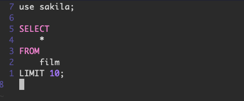

MySQL Shell is a very easy and efficient tool to use when running queries or administering a MySQL database instance. One of the awesome features about MySQL Shell (`mysqlsh`) is the ability to open your editor to construct a command. You can do this with either `\e` or `\edit`. Personally I'm a big fan and daily user of Vim, and I wanted to make this the best experience possible.

First, I wanted to be able to format my SQL in a nice way. I installed pgFormatter:

```
$ sudo apt install -y pgformatter
```

And then I configured Vim to run `pg_format` on SQL files in my `~/.vimrc`:

```
au FileType sql setl formatprg=/usr/bin/pg_format\ -
```

This is great! So in Vim if I was to type `gqG` it would format my SQL buffer with `pg_format`. But, MySQL Shell opens up a temp file with the format of `/tmp/mysqlsh.edit.tmp`. If there are multiple edit files open, it'll append an integer onto that (e.g. `/tmp/mysqlsh.edit.tmp550372692`). So I need to tell Vim that the filetype for these should be `sql` in my `~/.vimrc`:

```
au BufNewFile,BufRead mysqlsh.edit.tmp* set filetype=sql
```

Now when I'm using a MySQL Shell instance and run `\e`, it would look like this unformatted:


And then in Vim if I type `gggqG` it will automatically format for me:



This is a really great experience when working with MySQL with Vim!
