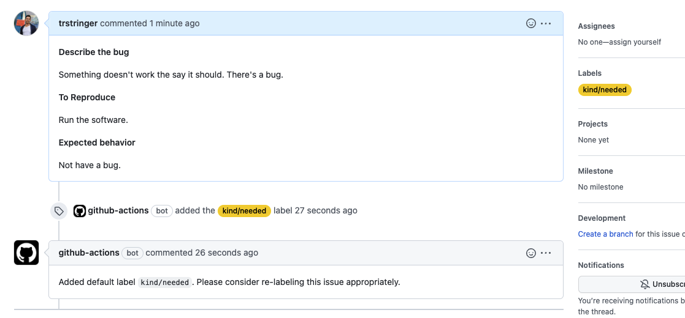

Without a doubt, GitHub is the leading place where people write software together. One of the biggest (and most used) features of the platform is issues. We use issues to report bugs, create feature requests, etc. Issues can become hard to manage and filter at a certain point for medium to larger projects. One common way to tackle this problem is through the use of labels. Labels allow you to apply a taxonomy to your issues so in the future other users can query by that certain label, or create reports based off of them.

There are a handful of default labels in GitHub:

* `bug`
* `documentation`
* `duplicate`
* `enhancement`
* ...and a few more

These work great for small projects starting out, but because they have a single dimension they don't scale very well. That's why many projects introduce a multi-dimension approach to labels for additional grouping with complexity. [Kubernetes](https://github.com/kubernetes/kubernetes), one of the largest projects on GitHub, is one of many that does this. For example, they have prefix issues for the `area`:

* `area/admin`
* `area/api`
* `area/batch`
* ...and many more

You can already start to see the benefits. If you want to query issues that are related to the API, you'd look for issues that are labelled `area/api`. All of them are grouped by the prefix `area/`. This project also does this with other prefixes, such as `kind`:

* `kind/documentation`
* `kind/feature`
* `kind/bug`
* ...and many more

Now you can start to do some really powerful querying with this more structured approach (for instance, to find all API bugs you'd filter for issues that have `area/api` and `kind/bug` labels). But, how do you enforce that these labels are added? That's a challenge. For these label taxonomies to be truly effective than there needs to be a large majority of the issues that follow this labelling.

To help with this, I've created the [Require Label Prefix GitHub Action](https://github.com/marketplace/actions/require-label-prefix) ([GitHub repo](https://github.com/trstringer/require-label-prefix)). When used in your repo, it looks through all issues for a tag prefix. If it doesn't find the prefix on an issue then it'll either just comment on it requesting adding the tag, or it will add a default tag with that prefix. Let's see that in action.


```yaml
jobs:
  myjob:
    runs-on: ubuntu-latest
    steps:
      - name: Require prefix
        uses: trstringer/require-label-prefix@v1
        with:
          secret: ${{ github.TOKEN }}
          prefix: kind
          addLabel: true
          defaultLabel: kind/needed
```


I require that there is a `kind/*` tag on all issues. If the tag doesn't exist, then I want to add a default label `kind/needed`. When this is run, an issue missing this tag prefix will have the following result:



As you can see, the original issue didn't have any `kind/*` labels so the action added the default `kind/needed` label and wrote a brief comment explaining this. Conversely, you can configure this to only analyze issues that are part of a milestone (set `onlyMilestone` to `true`). And furthermore, if your taxonomy doesn't use the "/" as a separator you can configure a non-default one with the `separator` field (such as ":").

Hopefully this can help your GitHub project with label taxonomy enforcement!
