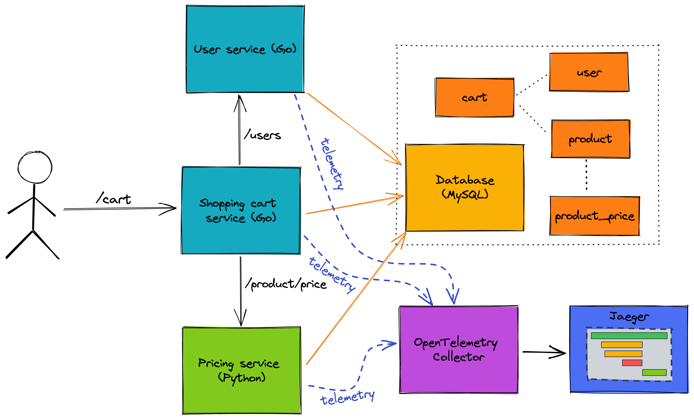
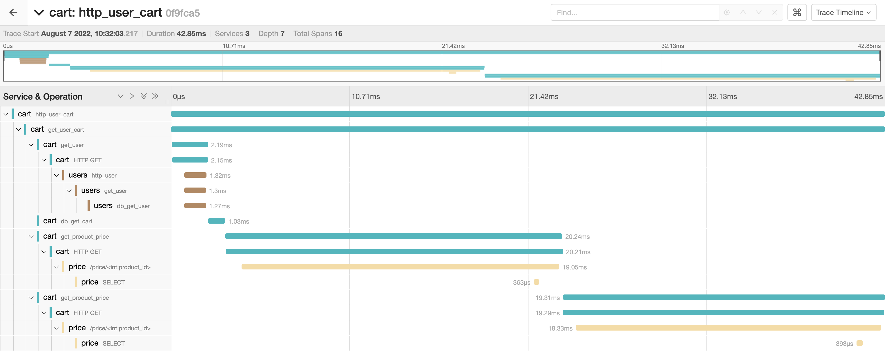

* **Part 1 - Introduction**
* [Part 2 - Instrumentation](https://trstringer.com/otel-part2-instrumentation/)
* [Part 3 - Exporting](https://trstringer.com/otel-part3-export/)
* [Part 4 - Collector](https://trstringer.com/otel-part4-collector/)
* [Part 5 - Propagation](https://trstringer.com/otel-part5-propagation/)
* [Part 6 - Ecosystem](https://trstringer.com/otel-part6-ecosystem/)
* [Sample OTel microservices application: trstringer/otel-shopping-cart](https://github.com/trstringer/otel-shopping-cart)

There's no doubt that you've probably heard the word **observability** tossed around many times in the past few years. For a lot of people this word is hard to understand what it really means. And for many, they mistakenly equate it to "monitoring". While the root definition of observability, and all that it entails, is much out of the scope of this blog post series, I highly recommend you pickup a copy of [Observability Engineering](https://www.oreilly.com/library/view/observability-engineering/9781492076438/), written by Charity Majors ([twitter](https://twitter.com/mipsytipsy?ref_src=twsrc%5Egoogle%7Ctwcamp%5Eserp%7Ctwgr%5Eauthor)), Liz Fong-Jones ([twitter](https://twitter.com/lizthegrey?ref_src=twsrc%5Egoogle%7Ctwcamp%5Eserp%7Ctwgr%5Eauthor)), and George Miranda ([twitter](https://twitter.com/gmiranda23)).

What this blog series *will* cover, though, is a full example and explanations of implementing observability with [OpenTelemetry](https://opentelemetry.io/), a CNCF project that is focused on making observability easier.

## What is OpenTelemetry?

OpenTelemetry is the result of the [merging of OpenCensus and OpenTracing](https://www.cncf.io/blog/2019/05/21/a-brief-history-of-opentelemetry-so-far/), which happened a few years ago. Since then, OpenTelemetry (also referred to as "OTel" for short) has positioned itself nicely as a vendor-agnostic approach to handling telemetry in the modern software world. Many would say that OpenTelemetry is the future of observability, and I'd tend to agree with this statement judging by my experience and exposure to it.

## OTel components

OpenTelemetry can be further divided into other logical components that comprise the typical OTel solution. They are **APIs**, **SDKs**, and the **Collector**.

### APIs and SDKs

One of the important things to understand initially when starting to work with OpenTelemetry is how the project distinguishes between APIs and SDKs. Briefly stated, APIs are in charge of gathering the telemetry and all the data that is part of it and the SDKs are what get this data out of the current observed process to another entity for analysis. As we go through this example in depth, this will make more sense but it is worth understanding the separation of concerns between the APIs and the SDKs.

Because they are separate, they allow us to decouple **what is observed** (API) to **how it is handled** (SDK). There is a wide variety of language support, including (but not limited to): Go, Python, Java, Ruby, JavaScript, .NET, and more! For more information on language support, take a look at the [documentation for instrumentation](https://opentelemetry.io/docs/instrumentation/). We will be covering instrumentation in a later blog post.

### Collector

Part of the job of the SDK is to get the data out of the process that is being observed, but there needs to be somewhere to send this data to. This separate process is what we will refer to as the collector. The collector's entire job can be broken down into three different stages:

* **Receive** telemetry data
* **Process** telemetry data
* **Export** telemetry data

The collector is an ETL pipeline for telemetry data. While you don't have to use an OTel solution, a common and good example of such one is the [OpenTelemetry Collector](https://opentelemetry.io/docs/collector/), which will be the focus of this series and covered more in a later blog post.

## Traces, metrics, and logs

Telemetry and observability includes three distinct signals: **Traces**, **metrics**, and **logs**. While logs and metrics are the traditional data points that we've dealt with for quite some time now, many would argue that it is traces that really unlock the power of observability. Through the collection of high-cardinality traces, we are able to quickly answer questions without having to make code changes. We can compare outliers to normal operation, and much more.

This blog series will focus mostly on tracing, and if you want to read more about the differences between these signals then please refer to the *Observability Engineering* book mentioned at the beginning of this post.

## Sample application

The primary role of this blog series is to show *how* to observe your software with OpenTelemetry. To do this, I have created a sample application that will be used to illustrate many of these points in the articles. The design of this application can be seen with this diagram:

It is a sample shopping cart application which is comprised of there different web services:

* **Cart** - Service handling user requests for shopping cart data (written in Go)
* **User** - Handles user verification and lookup requests from the cart service (written in Go)
* **Price** - Serves update pricing information for products (written in Python)

The backend persistent application data storage is with **MySQL**.

Instrumentation is entirely with OpenTelemetry's APIs and SDKs. Telemetry collection is achieved through the OpenTelemetry Collector sending trace data to Jaeger.

Here is an example of a distributed trace that is captured with OpenTelemetry and displayed in Jaeger:

All of the code and instructions on how to run this locally can be found on [GitHub: trstringer/otel-shopping-cart](https://github.com/trstringer/otel-shopping-cart).

## Summary

Hopefully by now you are familiar with what OpenTelemetry is, what the different tenants are that make it up, and how we are going to dive into the implementation for the rest of the series. This is just the beginning! Follow along with the rest of this blog post series to learn how to observe your applications with OpenTelemetry.
