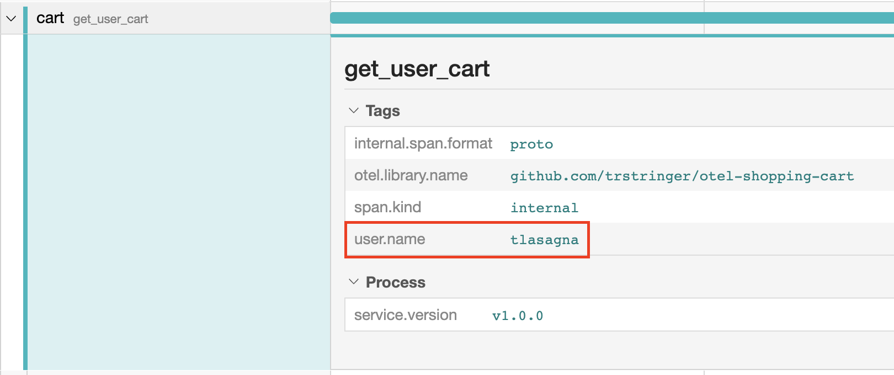
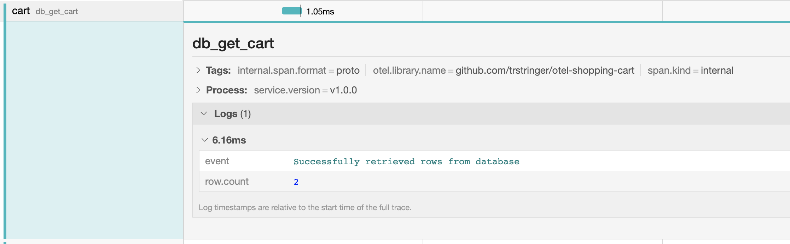
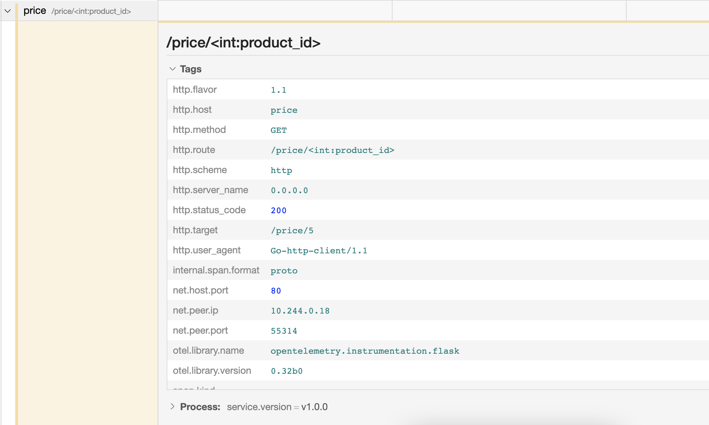
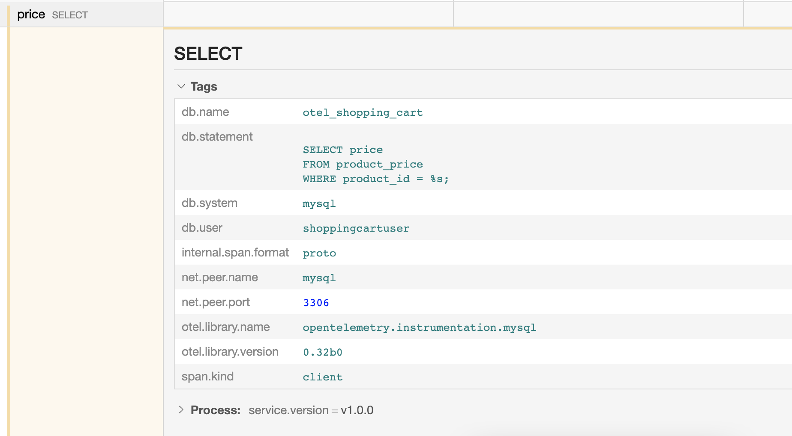

* [Part 1 - Introduction](https://trstringer.com/otel-part1-intro/)
* **Part 2 - Instrumentation**
* [Part 3 - Exporting](https://trstringer.com/otel-part3-export/)
* [Part 4 - Collector](https://trstringer.com/otel-part4-collector/)
* [Part 5 - Propagation](https://trstringer.com/otel-part5-propagation/)
* [Part 6 - Ecosystem](https://trstringer.com/otel-part6-ecosystem/)
* [Sample OTel microservices application: trstringer/otel-shopping-cart](https://github.com/trstringer/otel-shopping-cart)

This is the second part of a multi-part blog post series covering OpenTelemetry. In the previous post we talked about what OpenTelemetry is and what makes it up. Now we're going to discuss how exactly we can collect telemetry and trace data with OTel.

## Manual instrumentation

When we talk about "instrumentation", we are referring to the act of collecting trace data. There are two ways to do that: Manual and automatic (discussed below). As the name indicates, manual instrumentation is explicitly telling our software what data to expose. This is what would be considered more advanced and customized telemetry. Both manual and automatic instrumentation have their respective places, which we will see below.

OpenTelemetry defines a trace as a particular request's entire path through the codebase (and possibly multiple services). A trace includes one or more spans, which are the instances of a particular operation. A span has a parent span that it is linked to, unless it is the first span in the trace in which case its span parent ID is all zeros.

*Note: The sample application is written mostly in Go and some Python. I will be using Go to show code samples but the same principles apply to other languages that OTel support.*

The way that we can add spans to an existing trace (or start a new one) is through the API. For Go that means we will be working with the `go.opentelemetry.io/otel` module, which will include all of the packages that we need to start adding manual instrumentation. We can create a span by making a call to the global tracer provider:

```go
import "go.opentelemetry.io/otel"

// ... other code ...

ctx, span := otel.Tracer("my-telemetry-library").Start(r.Context(), "get_user_cart")
defer span.End()
```

There are a couple of things to note here. First off, we create a new span by first retrieving the global tracer provider. We will discuss what a tracer provider is in much more depth in the next blog post, but the tracer provider is an artifact of the SDK and in charge of where and how the telemetry data gets moved out of the process.

You can either use the global tracer provider by making a call to `otel.Tracer` or by passing around the tracer provider explicitly. This sample app relies on the global tracer provider. When we make a call to `otel.Tracer`, we pass in the instrumentation name which is typically going to be the library that is handling the instrumentation itself. For my application, that'll be set to "github.com/trstringer/otel-shopping-cart".

Once we have the tracer provider, we call `Start` and pass it two things: The context and the name of the span. The context can either be created (e.g. `context.Background()`) or passed through from a previous parent context (in this case I'm using the HTTP request context). The span name can be any string, but in this project I have standardized on using description identifiers separated with underscores.

The returned values of `Start` are the context, which we can use to pass to other code paths that need to handle other context-related operations (such as creating a child span) and the span object itself, which we will use to do a few things. The first, as you can see in this example, is to defer the calling of `span.End` so that we can mark this span as complete. We will also be using this `Span` to add attributes to it as well.

It's also worth noting that spans are meant to be nested. When a span starts, it's common to call into another code path that also starts another span. This is what creates the nested relationship of spans and accurately illustrates the code path that the request went through.

### Attributes

When working with traces, we typically want to add any and all relevant data to that span so that we can answer future questions when observing this system. It's through the use of high-cardinality data that we can achieve this. We can set these span attributes like the following:

```go
span.SetAttributes(attribute.String("user.name", userName))
```

This creates a string attribute named `user.name` and sets the value from a variable. Let's take a look at this attribute after this span is recorded:

```
Span #4
    Trace ID       : d6b58718e2d607f2a881e55200b387d5
    Parent ID      : ef6c51753d66f227
    ID             : 95dcb2657f5bca91
    Name           : get_user_cart
    Kind           : SPAN_KIND_INTERNAL
    Start time     : 2022-08-07 16:37:51.184919236 +0000 UTC
    End time       : 2022-08-07 16:37:51.231164398 +0000 UTC
    Status code    : STATUS_CODE_UNSET
    Status message :
Attributes:
     -> user.name: STRING(tlasagna)
```

Great! Now the `get_user_cart` span includes this new attribute `user.name`. We can also see this in the trace displayed in Jaeger:



### Events

Many times with traces you will want to record some text, or event, that happened during the time of the span. Consider these log entries that are correlated with a particular request. You can do this by calling `span.AddEvent`:

```go
span.AddEvent(
    "Successfully retrieved rows from database",
    trace.WithAttributes(attribute.Int("row.count", rowCount)),
)
```

When this event is recorded, it is added to the span. You are also able to add attributes to an event as well, as you can see in this example.

```
Span #1
    Trace ID       : 2d77674bf5bee80afcaf0df064f961ed
    Parent ID      : 5989852864910844
    ID             : f47e44dd5e23f016
    Name           : db_get_cart
    Kind           : SPAN_KIND_INTERNAL
    Start time     : 2022-08-07 18:37:39.167046809 +0000 UTC
    End time       : 2022-08-07 18:37:39.168098188 +0000 UTC
    Status code    : STATUS_CODE_UNSET
    Status message :
Events:
SpanEvent #0
     -> Name: Successfully retrieved rows from database
     -> Timestamp: 2022-08-07 18:37:39.16803511 +0000 UTC
     -> DroppedAttributesCount: 0
     -> Attributes:
         -> row.count: INT(2)
```



## Automatic instrumentation

The previous example showed how to do manual instrumentation by making intentional and explicit decisions on when to record a span. One of the really great features of OpenTelemetry, though, is a wide array of support for automatic instrumentation. When is automatic instrumentation helpful? Here are a few scenarios:

* New to OTel and you just want to light up telemetry data as quickly as possible
* Brownfield development where you're trying to introduce OTel on an existing codebase
* A component or service that doesn't need any special telemetry considerations, and the "default" of automatic instrumentation should suffice for the time being

In my shopping cart sample application, I used automatic instrumentation in the Python service (the price service) for two different things:

* Flask web server
* MySQL connection

```python
from opentelemetry.instrumentation.flask import FlaskInstrumentor
from opentelemetry.instrumentation.mysql import MySQLInstrumentor

app = Flask(__name__)

FlaskInstrumentor().instrument_app(app)
MySQLInstrumentor().instrument()
```

The wild thing about automatic instrumentation is... that's all it requires! And now magically I get some really great data about the Flask routes and MySQL queries for free with zero work or additional code. Here's the span from the Flask auto instrumentation:



It shows a ton of relevant information to the request, such as the `http.target`, `net.peer.ip`, `http.method`, and many others.

The MySQL auto instrumentation is also helpful:



This is great. Zero code changes, and I automatically get the span which already tells me an important data point: The duration of the query. On top of that, I can see the query that ran, and the user that ran it. With long-running queries, this is enough data to start troubleshooting what might be happening from the database side of the application. All because of a single line of code to add MySQL automatic instrumentation!

## Summary

Instrumentation is at the core of OpenTelemetry. It's how we define *what* telemetry data we collect, whether we choose to do that manually or by leveraging existing automatic instrumentation libraries. In the next blog post, we're going to see how the OTel SDKs handle this data!
