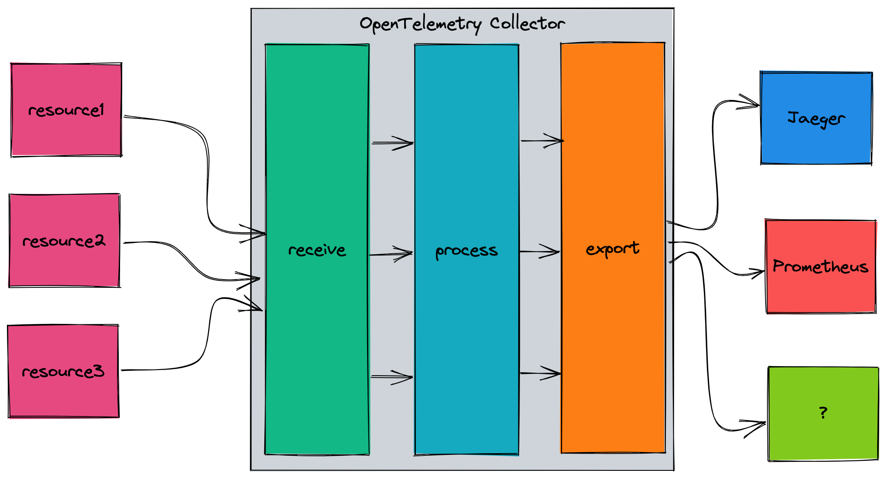
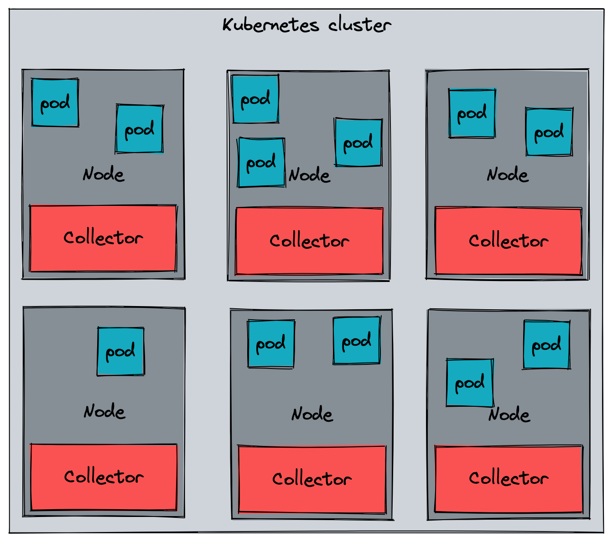
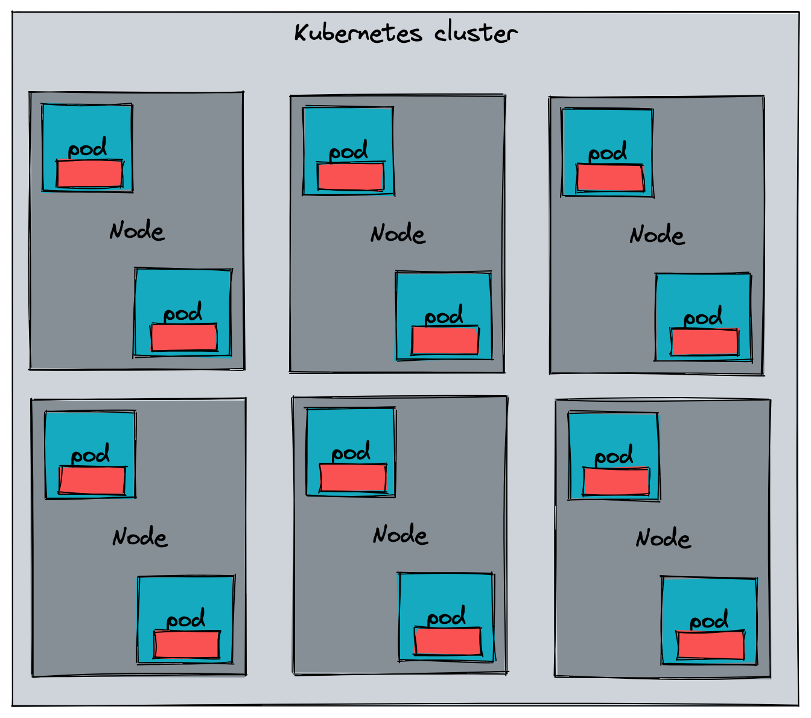

* [Part 1 - Introduction](https://trstringer.com/otel-part1-intro/)
* [Part 2 - Instrumentation](https://trstringer.com/otel-part2-instrumentation/)
* [Part 3 - Exporting](https://trstringer.com/otel-part3-export/)
* **Part 4 - Collector**
* [Part 5 - Propagation](https://trstringer.com/otel-part5-propagation/)
* [Part 6 - Ecosystem](https://trstringer.com/otel-part6-ecosystem/)
* [Sample OTel microservices application: trstringer/otel-shopping-cart](https://github.com/trstringer/otel-shopping-cart)

In the last blog post, we discussed how to use the SDK and tracer providers to get the telemetry data outside of the process that is being observed. There are many different types of exporters, but the typical destination to export data is to the [OpenTelemetry Collector](https://github.com/open-telemetry/opentelemetry-collector). This post will dive into the collector and how you can use it.

## OTel Collector vs. others

Like mentioned in the last blog post, I talked about using the OTLP exporter to send data to the OTel Collector. Like I alluded to before, that is not the only destination for telemetry data. So why choose the OTel Collector when you can send directly to Jaeger, Prometheus, or the console? Because of *flexibility*:

* Duplicate telemetry data from the collector to multiple endpoints
* Process the data (adding/removing attributes, handling batching, etc.) before sending it to another destination
* Decouple the producer with the consumer

Here is a very high-level overview of how the OTel Collector works:



The main components for the collector are:

* **Receivers** - Collect telemetry from outside of the collector (e.g. OTLP, Kafka, MySQL, syslog)
* **Processors** - Process or transform the data (e.g. attributes, batch, Kubernetes attributes)
* **Exporters** - Send the processed data to another endpoint (e.g. Jaeger, AWS Cloud Watch, Zipkin)
* **Extensions** - Modularized addition to the collector (e.g. HTTP forwarder)

## Running in Kubernetes

There are many ways to run the OTel Collector. For instance, you could run this as a standalone process. Many scenarios will involve a Kubernetes cluster, and there are two main ways to run the collector. The first (and what is used in the sample application) is as a DaemonSet, with a collector pod on every single cluster node:



In this scenario, you would export your telemetry data to the node and the collector instance that is running there. Typically you would have a gateway collector that then receives the data from the node collectors.

Another way to run the collector in Kubernetes is as sidecars to the application pods. In this case, you would have a 1:1 mapping between application pods and collector instances.



The way this can be achieved is by using the [OpenTelemetry Operator](https://github.com/open-telemetry/opentelemetry-operator#sidecar-injection) to handle the sidecar injection into the application pods by using the annotation `sidecar.opentelemetry.io/inject`.

## Core vs. contrib

As you have seen above, the OTel Collector is a very pluggable system. And that's a good thing, because with all of the current and future receivers, processors, exporters, and extensions we need a way to extend the collector. OpenTelemetry has the notion of a collector **distribution**, which is basically a differentiation of builds including different components.

At the time of writing this blog post, there are two distributions: [**Core**](https://github.com/open-telemetry/opentelemetry-collector) and [**contrib**](https://github.com/open-telemetry/opentelemetry-collector-contrib). Named appropriately, the core distribution includes *just* enough for the basics. But what's in contrib? Everything. You can see the long lists of [receivers](https://github.com/open-telemetry/opentelemetry-collector-contrib/tree/main/receiver), [processors](https://github.com/open-telemetry/opentelemetry-collector-contrib/tree/main/processor), and [exporters](https://github.com/open-telemetry/opentelemetry-collector-contrib/tree/main/exporter).

## Building your own distribution

So... if core has the bare minimum and contrib has everything, where does that leave you and your requirements? You probably need more than core has, but don't want all of the unnecessary components of contrib. Create your own collector distribution! OpenTelemetry provides a tool, [ocb](https://github.com/open-telemetry/opentelemetry-collector/tree/main/cmd/builder), to help you do just that.

`ocb` requires a YAML manifest to define how it needs to build the collector distro. I've found an easy thing to do is take the [contrib manifest.yaml](https://github.com/open-telemetry/opentelemetry-collector-releases/blob/main/distributions/otelcol-contrib/manifest.yaml) and just delete the components you don't need in your distro. For my application, I ended up with a small manifest so that it was able to handle my collector scenario, and nothing more:

```yaml
dist:
  module: github.com/trstringer/otel-shopping-cart/collector
  name: otel-shopping-cart-collector
  description: OTel Shopping Cart Collector
  version: 0.57.2
  output_path: ./collector/dist
  otelcol_version: 0.57.2

exporters:
  - import: go.opentelemetry.io/collector/exporter/loggingexporter
    gomod: go.opentelemetry.io/collector v0.57.2
  - gomod: github.com/open-telemetry/opentelemetry-collector-contrib/exporter/jaegerexporter v0.57.2

processors:
  - import: go.opentelemetry.io/collector/processor/batchprocessor
    gomod: go.opentelemetry.io/collector v0.57.2

receivers:
  - import: go.opentelemetry.io/collector/receiver/otlpreceiver
    gomod: go.opentelemetry.io/collector v0.57.2
```

I modified a few `dist` properties and removed a *lot* of the `exporters`, `processors`, and `receivers`. Now I can build my own collector distro!

```
$ ocb --config ./collector/manifest.yaml
2022-08-09T20:38:24.325-0400    INFO    internal/command.go:108 OpenTelemetry Collector Builder {"version": "0.57.2", "date": "2022-08-03T21:53:33Z"}
2022-08-09T20:38:24.326-0400    INFO    internal/command.go:130 Using config file       {"path": "./collector/manifest.yaml"}
2022-08-09T20:38:24.326-0400    INFO    builder/config.go:99    Using go        {"go-executable": "/usr/local/go/bin/go"}
2022-08-09T20:38:24.326-0400    INFO    builder/main.go:76      Sources created {"path": "./collector/dist"}
2022-08-09T20:38:24.488-0400    INFO    builder/main.go:108     Getting go modules
2022-08-09T20:38:24.521-0400    INFO    builder/main.go:87      Compiling
2022-08-09T20:38:25.345-0400    INFO    builder/main.go:94      Compiled        {"binary": "./collector/dist/otel-shopping-cart-collector"}
```

The output is a binary which, for me, is located at `./collector/dist/otel-shopping-cart-collector`. But I'm not done there because I'm running this collector in Kubernetes so I need to create a container image. I used the [contrib Dockerfile](https://github.com/open-telemetry/opentelemetry-collector-releases/blob/main/distributions/otelcol-contrib/Dockerfile) as a starting point and ended up with this:

**Dockerfile**

```dockerfile
FROM alpine:3.13 as certs
RUN apk --update add ca-certificates

FROM alpine:3.13 AS collector-build
COPY ./collector/dist/otel-shopping-cart-collector /otel-shopping-cart-collector
RUN chmod 755 /otel-shopping-cart-collector

FROM ubuntu:latest

ARG USER_UID=10001
USER ${USER_UID}

COPY --from=certs /etc/ssl/certs/ca-certificates.crt /etc/ssl/certs/ca-certificates.crt
COPY --from=collector-build /otel-shopping-cart-collector /
COPY collector/config.yaml /etc/collector/config.yaml
ENTRYPOINT ["/otel-shopping-cart-collector"]
CMD ["--config", "/etc/collector/config.yaml"]
EXPOSE 4317 55678 55679
```

In my scenario, I embed the `config.yaml` directly in the image, but you might want to have this more dynamic by using a ConfigMap in your cluster:

**config.yaml**

```yaml
receivers:
  otlp:
    protocols:
      grpc:
      http:

processors:
  batch:

exporters:
  logging:
    logLevel: debug
  jaeger:
    endpoint: jaeger-collector:14250
    tls:
      insecure: true

service:
  pipelines:
    traces:
      receivers: [otlp]                                                                                                                                                      processors: [batch]
      processors: [batch]
      exporters: [logging, jaeger]
```

Finally with this image created, I need to create the DaemonSet manifest:


```yaml
apiVersion: apps/v1
kind: DaemonSet
metadata:
  name: otel-collector-agent
spec:
  selector:
    matchLabels:
      app: otel-collector
  template:
    metadata:                                                                                                                                                                labels:
        app: otel-collector
    spec:
      containers:
      - name: opentelemetry-collector
        image: "{{ .Values.collector.image.repository }}:{{ .Values.collector.image.tag }}"
        imagePullPolicy: "{{ .Values.collector.image.pullPolicy }}"
        env:
        - name: MY_POD_IP
          valueFrom:
            fieldRef:                                                                                                                                                                apiVersion: v1
              fieldPath: status.podIP
        ports:
        - containerPort: 14250
          hostPort: 14250
          name: jaeger-grpc
          protocol: TCP                                                                                                                                                        - containerPort: 4317
          hostPort: 4317
          name: otlp
          protocol: TCP
        - containerPort: 4318
          hostPort: 4318
          name: otlp-http
          protocol: TCP
      dnsPolicy: ClusterFirst
      restartPolicy: Always
      terminationGracePeriodSeconds: 30
```


I'm using a [helm chart](https://github.com/trstringer/otel-shopping-cart/tree/main/charts/otel-shopping-cart), so some of these values are dynamically set on installation. Now when I install my custom collector, I can see that this is being used by looking at the collector logs:

```
2022-08-10T00:47:00.703Z    info    service/telemetry.go:103    Setting up own telemetry...
2022-08-10T00:47:00.703Z    info    service/telemetry.go:138    Serving Prometheus metrics  {"address": ":8888", "level": "basic"}
2022-08-10T00:47:00.703Z    info    components/components.go:30 In development component. May change in the future. {"kind": "exporter", "data_type": "traces", "name":
2022-08-10T00:47:00.722Z    info    extensions/extensions.go:42 Starting extensions...
2022-08-10T00:47:00.722Z    info    pipelines/pipelines.go:74   Starting exporters...
2022-08-10T00:47:00.722Z    info    pipelines/pipelines.go:78   Exporter is starting... {"kind": "exporter", "data_type": "traces", "name": "logging"}
2022-08-10T00:47:00.722Z    info    pipelines/pipelines.go:82   Exporter started.   {"kind": "exporter", "data_type": "traces", "name": "logging"}
2022-08-10T00:47:00.722Z    info    pipelines/pipelines.go:78   Exporter is starting... {"kind": "exporter", "data_type": "traces", "name": "jaeger"}
2022-08-10T00:47:00.722Z    info    pipelines/pipelines.go:82   Exporter started.   {"kind": "exporter", "data_type": "traces", "name": "jaeger"}
2022-08-10T00:47:00.722Z    info    pipelines/pipelines.go:86   Starting processors...
2022-08-10T00:47:00.722Z    info    jaegerexporter@v0.57.2/exporter.go:186  State of the connection with the Jaeger Collector backend   {"kind": "exporter", "data_type
2022-08-10T00:47:00.722Z    info    pipelines/pipelines.go:90   Processor is starting...    {"kind": "processor", "name": "batch", "pipeline": "traces"}
2022-08-10T00:47:00.722Z    info    pipelines/pipelines.go:94   Processor started.  {"kind": "processor", "name": "batch", "pipeline": "traces"}
2022-08-10T00:47:00.722Z    info    pipelines/pipelines.go:98   Starting receivers...
2022-08-10T00:47:00.722Z    info    pipelines/pipelines.go:102  Receiver is starting... {"kind": "receiver", "name": "otlp", "pipeline": "traces"}
2022-08-10T00:47:00.722Z    info    otlpreceiver/otlp.go:70 Starting GRPC server on endpoint 0.0.0.0:4317   {"kind": "receiver", "name": "otlp", "pipeline": "traces"}
2022-08-10T00:47:00.722Z    info    otlpreceiver/otlp.go:88 Starting HTTP server on endpoint 0.0.0.0:4318   {"kind": "receiver", "name": "otlp", "pipeline": "traces"}
2022-08-10T00:47:00.722Z    info    pipelines/pipelines.go:106  Receiver started.   {"kind": "receiver", "name": "otlp", "pipeline": "traces"}
2022-08-10T00:47:00.722Z    info    service/collector.go:215    Starting otel-shopping-cart-collector...    {"Version": "0.57.2", "NumCPU": 4}
```

The last line shows the name of my custom distro: "otel-shopping-cart-collector". And just like that, I have a collector that is everything my requirements need... and nothing more!

## Summary

The OpenTelemetry Collector is a powerful tool, and one of the great parts of it is that you can create your own collector distro to meet your needs. In my opinion, the collector is one of the strengths of the OpenTelemetry ecosystem.
