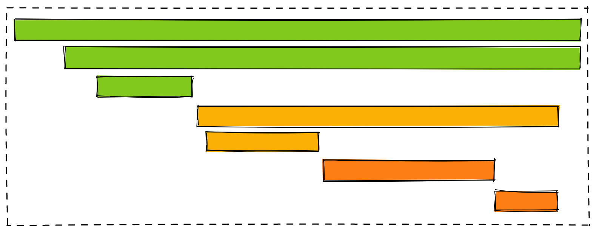
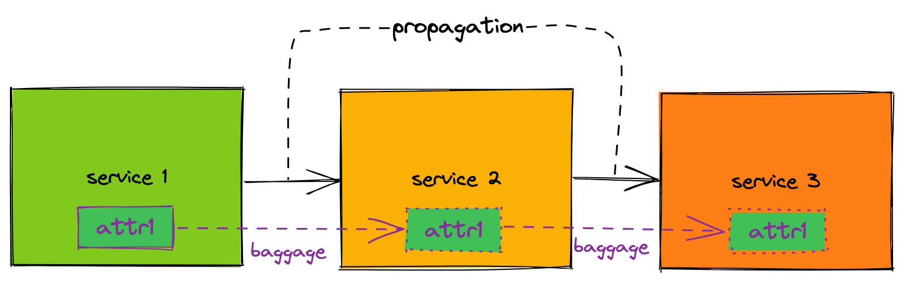
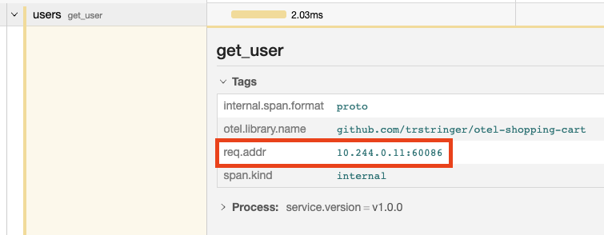

* [Part 1 - Introduction](https://trstringer.com/otel-part1-intro/)
* [Part 2 - Instrumentation](https://trstringer.com/otel-part2-instrumentation/)
* [Part 3 - Exporting](https://trstringer.com/otel-part3-export/)
* [Part 4 - Collector](https://trstringer.com/otel-part4-collector/)
* **Part 5 - Propagation**
* [Part 6 - Ecosystem](https://trstringer.com/otel-part6-ecosystem/)
* [Sample OTel microservices application: trstringer/otel-shopping-cart](https://github.com/trstringer/otel-shopping-cart)

The applications we develop come in very different sizes and shapes: Some are monoliths, and others are microservices. Monolithic applications are fairly easy to add telemetry to, as all of it stays within the same process. But microservices can add a challenge. Oftentimes, it's just the network that connects different services in a distributed microservices application. But we can't let that stop us from creating useful and valid traces, like the following:



Even with a microservices application, we want to see a similar trace where the user path goes from start to finish, even if that means crossing the boundaries of multiple services. This is what we mean when we refer to **distributed tracing**. But how can we accomplish this? How can we make a trace go across multiple processes, that might be living on very different infrastructure?

## Propagation

OpenTelemetry's answer to this challenge is **propagation**. This is how we can transfer the trace ID (and the parent span ID) to called services so that they can add spans to the distributed trace. Here's is a visualization:



Here we have three services, and by using propagation we are able to transfer the trace ID and parent span ID as headers. In Go, we can handle propagation by setting this globally:

```go
import (
    "go.opentelemetry.io/otel"
    "go.opentelemetry.io/otel/propagation"
)

// ...

otel.SetTextMapPropagator(
    propagation.NewCompositeTextMapPropagator(
        propagation.TraceContext{},
        propagation.Baggage{}),
)
```

And in our server instantiation, we can set this at the handler level:

```go
http.Handle(
    fmt.Sprintf("/%s/", rootPath),
    otelhttp.NewHandler(
        http.HandlerFunc(userCart),
        "http_user_cart",
        otelhttp.WithTracerProvider(otel.GetTracerProvider()),
        otelhttp.WithPropagators(otel.GetTextMapPropagator()),
    ))
```

When I make HTTP requests from the service to other services, I can use `otelhttp` which adds helper functions for adding spans to the requests:

```go
import "go.opentelemetry.io/contrib/instrumentation/net/http/otelhttp"

// ...

resp, err := otelhttp.Get(ctx, fmt.Sprintf("%s/%s", userServiceEndpoint, userName))
```

## Baggage

In the above diagram, you'll notice that `service 1` generated some data called `attr1`. This is relevant data to `service 1`, and this might be an attribute that we want to add to spans in `service 2` and/or `service 3`. But those services might not have access to this particular data. The way we can solve this with OpenTelemetry is through the use of **baggage**. Baggage essentially allows us to pass data through requests for other services to use.

In Go, the way we can add baggage can be seen below:

```go
    reqAddrBaggage, err := baggage.NewMember("req.addr", r.RemoteAddr)
    if err != nil {
        // Handle error...
    }

    reqBaggage, err := baggage.New(reqAddrBaggage)
    if err != nil {
        // Handle error...
    }
    ctx = baggage.ContextWithBaggage(ctx, reqBaggage)
```

Now our HTTP requests will include the baggage `req.addr`.

In our consuming service (in the diagram, this could either be `service 2` or `service 3`) we can now parse the baggage from the request:

```go
import "go.opentelemetry.io/otel/baggage"

// ...

reqBaggage := baggage.FromContext(ctx)
span.SetAttributes(attribute.String(
    "req.addr",
    reqBaggage.Member("req.addr").Value()),
)
```

This code gets the request baggage and adds it as a span attribute to the current span.

## Example

We've talked about propagation and baggage, but now let's see how OpenTelemetry sends this data. In my sample shopping cart application, if I made a request and dump the headers from either the price or the user service, then I'll see the following two headers:

```
Baggage: req.addr=10.244.0.11%3A60086
Traceparent: 00-9861e8c7b097206fed82e0f6b379aae0-4aa019606aed70b6-01
```

The `traceparent` header shows the trace ID (in this case it is "9861e8c7b097206fed82e0f6b379aae0") and the parent span ID ("4aa019606aed70b6"). There is also the `baggage` header which includes the `req.addr` baggage member that was added in the source service (cart). We can see this baggage being referenced in the user service:



## Summary

OpenTelemetry has great support for the "distributed" part of "distributed tracing" through the usage of propagation and baggage. This really gives you the power to make meaningful traces and collect helpful data!
