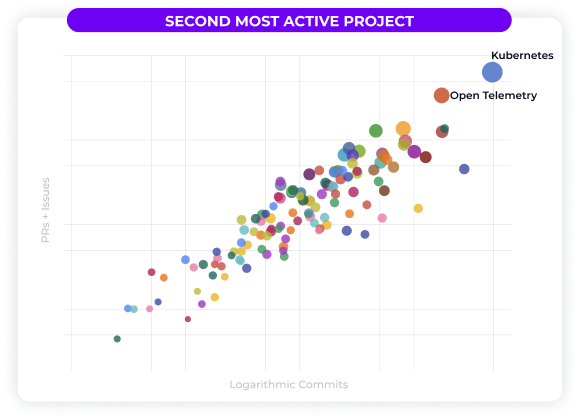

* [Part 1 - Introduction](https://trstringer.com/otel-part1-intro/)
* [Part 2 - Instrumentation](https://trstringer.com/otel-part2-instrumentation/)
* [Part 3 - Exporting](https://trstringer.com/otel-part3-export/)
* [Part 4 - Collector](https://trstringer.com/otel-part4-collector/)
* [Part 5 - Propagation](https://trstringer.com/otel-part5-propagation/)
* **Part 6 - Ecosystem**
* [Sample OTel microservices application: trstringer/otel-shopping-cart](https://github.com/trstringer/otel-shopping-cart)

The past five articles have covered the technical details on how to work with OpenTelemetry to observe your applications. I think there's a lot of value in finishing up this blog post series with some information on the OTel ecosystem. There is *a lot* happening with OpenTelemetry, and those that are new to it might be slightly overwhelmed or confused where to find certain things.

As discussed previously, OpenTelemetry is a CNCF project. But, how does it stack up? Measured by pull requests, issues, and commits OpenTelemetry is the **second most active CNCF project**, behind only Kubernetes:

*[Image and data source (twitter)](https://twitter.com/hab_mic/status/1557012045677092866?s=20&t=-Chw2r-CBO6W2gVTRlZgyw)*

This is a really exciting time to dive into the world of OpenTelemetry. Hopefully it is obvious now, but I believe that OpenTelemetry is here to stay and will serve a significant role in the cloud native ecosystem.

## Project site

The first place to start with OpenTelemetry is the project site: [opentelemetry.io](https://opentelemetry.io/). Here you'll find a wealth of information and a good index for a lot of the ecosystem. Here you'll also find some great "Getting Started" documentation to start familiarizing yourself with OTel and how to implement it in your software.

One part of the OpenTelemetry site worth keeping an eye on is the [project blog](https://opentelemetry.io/blog/). Here you'll find a lot of updates and announcements.

Generally speaking, if you're new to OpenTelemetry I highly recommend you spend some time poking around the project site.

## Community

If there's one thing that this blog post series has highlighted, OTel has a large featureset. And with these capabilities oftentimes comes with some level of complexity. At some point, you may need assistance from the community. I have found that the best way to chat with members the community (including maintainers!) is through the CNCF Slack workspace. OpenTelemetry has a handful of channels that might interest you. The main one is `#opentelemetry`, which is the general discussion. There's a chance you want to be part of more specific conversations, though. Here are some other OTel channels:

* `#otel-collector` - All things OpenTelemetry Collector
* `#otel-go` - OpenTelemetry Go (API, SDK, implementation)
* `#otel-python` - OpenTelemetry Python (API, SDK, implementation)

And a few more! Search for `#otel` in Slack to see other OpenTelemetry channels.

This could be part of the next section, but it's worth a callout here. The [community repository](https://github.com/open-telemetry/community) has a lot of great information, such as: Governance, areas of interest, meetings and calendars, and much more. If you're looking at getting involved in OTel, this is a great place to start.

## Repositories

I have to admit, one of the more confusing things to me when I was getting started with OpenTelemetry is how the [GitHub repositories](https://github.com/open-telemetry) were organized.

The primary components of OpenTelemetry (not language or collector specific) can be found in these repositories:

* [open-telemetry/opentelemetry-specification](https://github.com/open-telemetry/opentelemetry-specification) - The OTel spec (procotol, metrics, traces, logs, baggage, and many other specifications for root OTel), schema, and semantic conventions
* [open-telemetry/oteps](https://github.com/open-telemetry/oteps) - Enhancement proposals for the project
* [open-telemetry/opentelemetry-proto](https://github.com/open-telemetry/opentelemetry-proto) - Protobuf definitions for OTLP

OTel Collector repositories are:

* [open-telemetry/opentelemetry-collector](https://github.com/open-telemetry/opentelemetry-collector) - Core collector code, including the [ocb](https://github.com/open-telemetry/opentelemetry-collector/tree/main/cmd/builder) tool for custom collector distro building
* [open-telemetry/opentelemetry-collector-contrib](https://github.com/open-telemetry/opentelemetry-collector-contrib) - Contrib receivers, extensions, processors, and exporters for the collector
* [open-telemetry/opentelemetry-collector-releases](https://github.com/open-telemetry/opentelemetry-collector-releases) - Releases for core and contrib distros are not in the above two repos, but they are here including the manifests and Dockerfiles for the release distros
* [open-telemetry/opentelemetry-operator](https://github.com/open-telemetry/opentelemetry-operator) - Kubernetes operator to handle the collector, including collector sidecar injection for observed application pods

A huge part of OTel is the language-specific instrumentation. Here is a sample that explains how they are organized in the project:

* [open-telemetry/opentelemetry-go](https://github.com/open-telemetry/opentelemetry-go) - Go API and SDK
* [open-telemetry/opentelemetry-go-contrib](https://github.com/open-telemetry/opentelemetry-go-contrib) - Extensions for OTel Go, including [instrumentation](https://github.com/open-telemetry/opentelemetry-go-contrib/tree/main/instrumentation) and [propagators](https://github.com/open-telemetry/opentelemetry-go-contrib/tree/main/propagators)
* [open-telemetry/opentelemetry-python](https://github.com/open-telemetry/opentelemetry-python) - Python API and SDK
* [open-telemetry/opentelemetry-python-contrib](https://github.com/open-telemetry/opentelemetry-python-contrib) - Extensions for OTel Python

This is the general pattern for language implementations, but they can vary. For instance, Java has `open-telemetry/opentelemetry-java`, but also `open-telemetry/opentelemetry-java-contrib` for extensions but a separate repo for auto instrumentation with `open-telemetry/opentelemetry-java-instrumentation`.

## Registry

The final part of the ecosystem that I think should be noted is the [OpenTelemetry Registry](https://opentelemetry.io/registry/). Because of the wide array of implementations and products in the project, this is a great way to search through *everything* to see what is available for your requirement.

## Summary

OpenTelemetry is a great project that provides a way to implement a high level of observability within the software that we develop. Through the usage of OTel, we're able to have maximized insights and answer future questions without having to make any code changes. I highly recommend you dive into the wonderful world of OpenTelemetry! Once you do, you'll never want to go without it!
