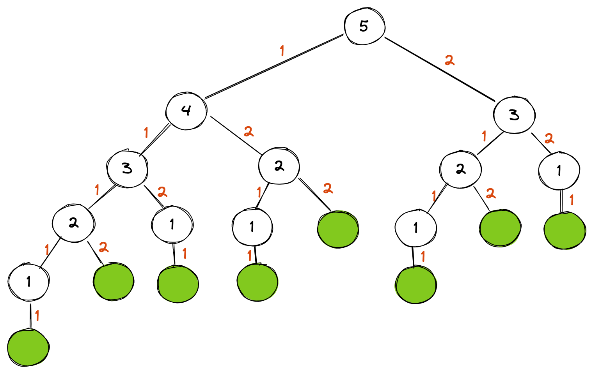
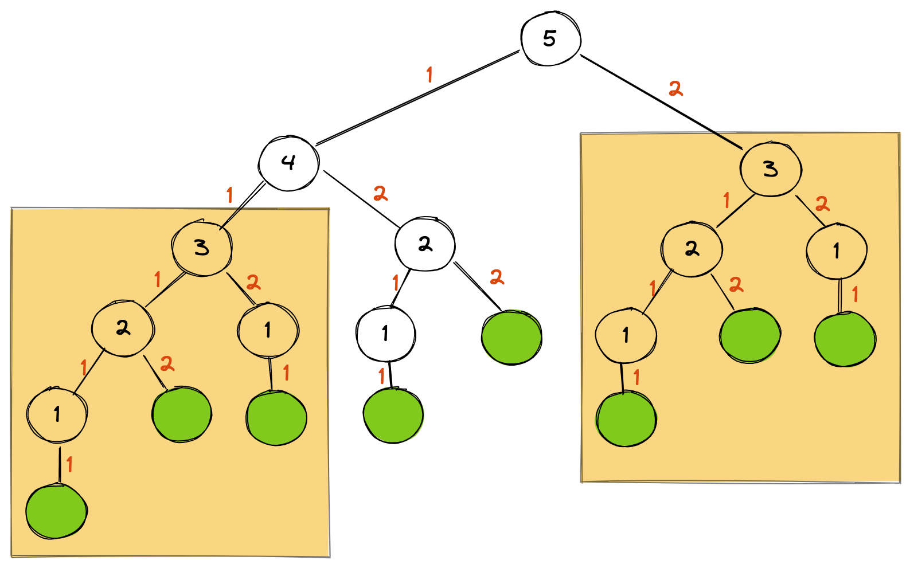

Oftentimes when we are doing intensive computing in our software, we can run into performance bottlenecks. In this blog post, I talk about one strategy that can be used under certain situations. If you have a particular code path or function that is run multiple times *and* is deterministic, you could see varying degrees of optimization with *memoization*. This is the practice of storing process results in a cache so that they can be referenced and values used instead of running expensive and redundant computations again.

Let's take an example. If you are trying to get all paths in increments one and two from zero to a set number, you could visualize it as a tree:



This diagram is a visual representation of all the combinations for the value `5`. As you can see, there are eight paths:

```
[1 1 1 1 1]
[1 1 1 2]
[1 1 2 1]
[1 2 1 1]
[1 2 2]
[2 1 1 1]
[2 1 2]
[2 2 1]
```

One way to solve this with Go code is to use a recursive strategy:

```go
func pathCount(level int) int {
	if level < 0 {
		return 0
	}
	if level == 0 {
		return 1
	}

	return pathCount(level-1) + pathCount(level-2)
}
```

For small values, like `5`, this works just fine. But what happens when we get to larger values, like `50`? Let's run some benchmarks:

```go
func BenchmarkPathCount5(b *testing.B) {
	for i := 0; i < b.N; i++ {
		pathCount(5)
	}
}

func BenchmarkPathCount10(b *testing.B) {
	for i := 0; i < b.N; i++ {
		pathCount(10)
	}
}

func BenchmarkPathCount30(b *testing.B) {
	for i := 0; i < b.N; i++ {
		pathCount(30)
	}
}

func BenchmarkPathCount50(b *testing.B) {
	for i := 0; i < b.N; i++ {
		pathCount(50)
	}
}
```

The results of the benchmark test are:

```
BenchmarkPathCount5-4                   26200759                46.68 ns/op
BenchmarkPathCount10-4                   2137870               562.7 ns/op
BenchmarkPathCount30-4                       136           8776269 ns/op
BenchmarkPathCount50-4                         1        132752639031 ns/op
```

Whoa! With `30`, we have 8.7 ms but that quickly gets out of control resulting in over **132 seconds** when we passed in `50`. This is where memoization can really help here. If you remember the previous visualization, you'll see that some subtrees are redundant. In the example with `5`, the subtree with `3` at the root is referred to twice:



Instead of running the function for this tree again, we can cache the value the first time and then refer to this cached value in subsequenet calls. The cache implementation in Go is:

```go
func pathCountWithCache(level int) int {
	cache := make(map[int]int)
	return pathCountCacheLookup(level, cache)
}

func pathCountCacheLookup(level int, cache map[int]int) int {
	if level < 0 {
		return 0
	}

	if level == 0 {
		return 1
	}

	cachedVal, ok := cache[level]
	if ok {
		return cachedVal
	}

	cache[level] = pathCountCacheLookup(level-1, cache) + pathCountCacheLookup(level-2, cache)
	return cache[level]
}
```

Let's run some new benchmarks:

```go
func BenchmarkPathCountWithCache5(b *testing.B) {
	for i := 0; i < b.N; i++ {
		pathCountWithCache(5)
	}
}

func BenchmarkPathCountWithCache10(b *testing.B) {
	for i := 0; i < b.N; i++ {
		pathCountWithCache(10)
	}
}

func BenchmarkPathCountWithCache30(b *testing.B) {
	for i := 0; i < b.N; i++ {
		pathCountWithCache(30)
	}
}

func BenchmarkPathCountWithCache50(b *testing.B) {
	for i := 0; i < b.N; i++ {
		pathCountWithCache(50)
	}
}
```

And running these benchmarks with the cache we see *huge* gains:

```go
BenchmarkPathCountWithCache5-4          10140656               118.6 ns/op
BenchmarkPathCountWithCache10-4          2222676               537.1 ns/op
BenchmarkPathCountWithCache30-4           390424              2895 ns/op
BenchmarkPathCountWithCache50-4           263592              4320 ns/op
```

We brought the `50` run from a couple of minutes to sub-millisecond. You will notice that there is a cost, though. With the cache implementation, smaller amounts of iterations (like with `5`) were actually longer-running than without the caching. With my implementation, it seems like the tipping point for the cache solution improvement is around `10`. After that, the gains with memoization are increasingly large.

Hopefully this blog post has highlighted optimization with memoization!
