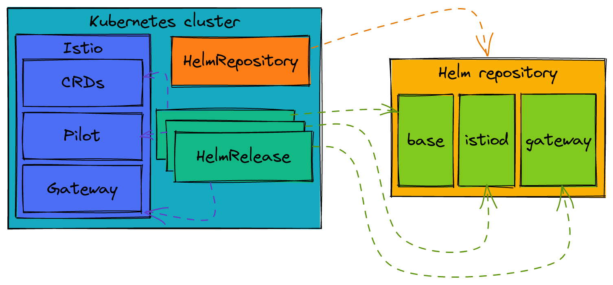
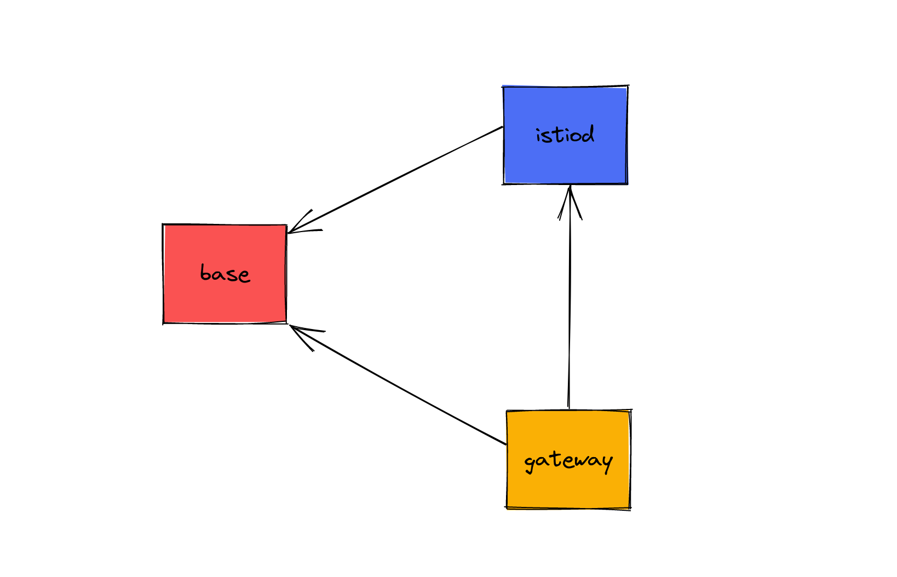

There are a couple of ways to install Istio in your cluster. The first, and most common way, is with `istioctl`. But you can also install Istio through a few [Helm charts](https://istio.io/latest/docs/setup/install/helm/). Sure, you can install these charts with `helm install`, but a popular approach is to use CD tooling, like [Flux](https://fluxcd.io/). Flux is a CNCF project aimed at continuous delivery, providing a GitOps experience for deploying your software.

If we want to install Istio with Helm charts, we can use Flux to accomplish this! Flux introduces a few resources that help us with Helm that we will be looking at today: `HelmRepository` and `HelmRelease`.

* `HelmRepository` is a representation of a Helm repository where we can find and retrieve Helm charts.
* `HelmRelease` is a release of a Helm chart in your Kubernetes cluster.

Here is a diagram that shows the relationship between all of these components:



So let's see this in action!

First we will start out with a Kubernetes cluster. I'm going to install Flux on it without any bootstrapping (for more information on how to bootstrap a Flux installation, please refer to the [documentation](https://fluxcd.io/flux/installation/#bootstrap)):

```
$ flux check --pre
► checking prerequisites
✔ Kubernetes 1.24.6 >=1.20.6-0
✔ prerequisites checks passed

$ flux install
✚ generating manifests
✔ manifests build completed
► installing components in flux-system namespace
CustomResourceDefinition/alerts.notification.toolkit.fluxcd.io created
CustomResourceDefinition/buckets.source.toolkit.fluxcd.io created
CustomResourceDefinition/gitrepositories.source.toolkit.fluxcd.io created
CustomResourceDefinition/helmcharts.source.toolkit.fluxcd.io created
CustomResourceDefinition/helmreleases.helm.toolkit.fluxcd.io created
CustomResourceDefinition/helmrepositories.source.toolkit.fluxcd.io created
CustomResourceDefinition/kustomizations.kustomize.toolkit.fluxcd.io created
CustomResourceDefinition/ocirepositories.source.toolkit.fluxcd.io created
CustomResourceDefinition/providers.notification.toolkit.fluxcd.io created
CustomResourceDefinition/receivers.notification.toolkit.fluxcd.io created
Namespace/flux-system created
ServiceAccount/flux-system/helm-controller created
ServiceAccount/flux-system/kustomize-controller created
ServiceAccount/flux-system/notification-controller created
ServiceAccount/flux-system/source-controller created
ClusterRole/crd-controller-flux-system created
ClusterRoleBinding/cluster-reconciler-flux-system created
ClusterRoleBinding/crd-controller-flux-system created
Service/flux-system/notification-controller created
Service/flux-system/source-controller created
Service/flux-system/webhook-receiver created
Deployment/flux-system/helm-controller created
Deployment/flux-system/kustomize-controller created
Deployment/flux-system/notification-controller created
Deployment/flux-system/source-controller created
NetworkPolicy/flux-system/allow-egress created
NetworkPolicy/flux-system/allow-scraping created
NetworkPolicy/flux-system/allow-webhooks created
◎ verifying installation
✔ helm-controller: deployment ready
✔ kustomize-controller: deployment ready
✔ notification-controller: deployment ready
✔ source-controller: deployment ready
✔ install finished
```

With Flux installed, it is now time to create the Istio `HelmRepository` custom resource. But first we need to create the `istio-system` namespace:

```
$ kubectl create ns istio-system
namespace/istio-system created
```

**helm-istio-repository.yaml**

```yaml
apiVersion: source.toolkit.fluxcd.io/v1beta2
kind: HelmRepository
metadata:
  name: istio
  namespace: istio-system
spec:
  interval: 5m
  url: https://istio-release.storage.googleapis.com/charts
```

```
$ kubectl apply -f ./helm-istio-repository.yaml
helmrepository.source.toolkit.fluxcd.io/istio created
```

The `HelmRepository` resource mainly points to a URL which, in our case, is the Istio charts repo location. With the repository created, we now need to install Istio. As per the documentation, we cannot just install all three charts at the same time. There is a level of dependency: The base chart needs to be installed first prior to the istiod and ingress gateway charts. A visual representation showing the chart dependencies would be helpful!



Because the base release is required, we'll create that first:

**helm-release-istio-base.yaml**

```yaml
apiVersion: helm.toolkit.fluxcd.io/v2beta1
kind: HelmRelease
metadata:
  name: istio-base
  namespace: istio-system
spec:
  interval: 5m
  chart:
    spec:
      chart: base
      sourceRef:
        kind: HelmRepository
        name: istio
        namespace: istio-system
      interval: 1m
```

```
$ kubectl apply -f ./helm-release-istio-base.yaml
helmrelease.helm.toolkit.fluxcd.io/istio-base created
```

This installs the base Helm chart (including CRDs) and refers to the previous `HelmRepository` that we created before. Now with the base release created, we can install our dependent charts:

**helm-release-istiod.yaml**

```yaml
apiVersion: helm.toolkit.fluxcd.io/v2beta1
kind: HelmRelease
metadata:
  name: istiod
  namespace: istio-system
spec:
  interval: 5m
  dependsOn:
    - name: istio-base
      namespace: istio-system
  chart:
    spec:
      chart: istiod
      sourceRef:
        kind: HelmRepository
        name: istio
      interval: 1m
```

```
$ kubectl apply -f ./helm-release-istiod.yaml
helmrelease.helm.toolkit.fluxcd.io/istiod created
```

This Helm release is for Pilot, the Istio control plane. You can see that we create a dependency on the base release. This `HelmRelease` should not install without the existence of the dependency.

Now we can optionally move on to creating the Istio gateway. First we need to create the target namespace:

```
$ kubectl create ns istio-ingress
namespace/istio-ingress created

$ kubectl label ns istio-ingress istio-injection=enabled
namespace/istio-ingress labeled
```

And now we can create the gateway `HelmRelease`:

**helm-release-istio-gateway.yaml**

```yaml
apiVersion: helm.toolkit.fluxcd.io/v2beta1
kind: HelmRelease
metadata:
  name: istio-ingress
  namespace: istio-ingress
spec:
  interval: 5m
  dependsOn:
    - name: istio-base
      namespace: istio-system
    - name: istiod
      namespace: istio-system
  chart:
    spec:
      chart: gateway
      sourceRef:
        kind: HelmRepository
        name: istio
        namespace: istio-system
      interval: 1m
```

```
$ kubectl apply -f ./helm-release-istio-gateway.yaml
helmrelease.helm.toolkit.fluxcd.io/istio-ingress created
```

And just like that, we now have a Istio installed through Flux! We can verify this a few ways. First let's show all Helm releases with the `helm` bin:

```
$ helm ls -A
NAME            NAMESPACE       REVISION        UPDATED                                 STATUS          CHART           APP VERSION
istio-base      istio-system    1               2023-01-04 22:58:34.99915801 +0000 UTC  deployed        base-1.16.1     1.16.1     
istio-ingress   istio-ingress   1               2023-01-04 23:00:48.082369764 +0000 UTC deployed        gateway-1.16.1  1.16.1     
istiod          istio-system    1               2023-01-04 22:59:00.041388135 +0000 UTC deployed        istiod-1.16.1   1.16.1 
```

We can also show the `HelmRelease` resources:

```
$ kubectl get hr -A
NAMESPACE       NAME            AGE     READY   STATUS
istio-ingress   istio-ingress   4m2s    True    Release reconciliation succeeded
istio-system    istio-base      6m18s   True    Release reconciliation succeeded
istio-system    istiod          5m50s   True    Release reconciliation succeeded
```

Hopefully this blog post has highlighted how you can install Istio with Flux!
