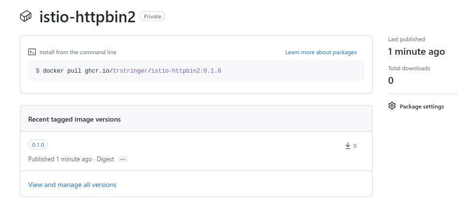

Utilizing Helm charts to deploy software to Kubernetes applications is a great way to manage and maintain your applications. One of the main components of this workflow is a registry where you need to store your chart packages. There are many different products that can handle this for you, but one of the most common platforms that everybody has access to is **GitHub container registry**.

GitHub provides a first-class [container registry](https://docs.github.com/en/packages/working-with-a-github-packages-registry/working-with-the-container-registry) that is typically used to store container images. What might not be well known is that GitHub container registry supports the OCI format. Using Helm, we are able to push to OCI-based registries.

I'm going to take my [istio-httpbin2](https://github.com/trstringer/istio-httpbin2/tree/main/charts/istio-httpbin2) chart as an example to show how it can be pushed to GitHub. First, I need to package up my chart in a local tarball:

```
$ helm package ./istio-httpbin2
Successfully packaged chart and saved it to: /home/trstringer/dev/istio-environment/charts/istio-httpbin2-0.1.0.tgz
```

Before I can push this chart to GitHub, though, I'll need to authenticate. If you're doing this locally, the first step would be to create a personal access token (PAT). Go to **Settings** -> **Developer settings** -> **Personal access tokens** -> **Tokens (classic)**. You'll notice that there is a beta feature for fine-grained tokens but currently at the time of writing this blog post you need to use the classic tokens for container registry access.

Create a personal access token with the `write:packages` permission. Once that is created, store that securely somewhere. Now you can login to GitHub with Helm:

```
$ echo $GITHUB_TOKEN_REGISTRY | helm registry login ghcr.io/trstringer --username trstringer --password-stdin
Login Succeeded
```

Once you are logged in, you can now push your chart to the container registry:

```
$ helm push ./istio-httpbin2-0.1.0.tgz oci://ghcr.io/trstringer
Pushed: ghcr.io/trstringer/istio-httpbin2:0.1.0
Digest: sha256:046d6f046a3c506e00c615694507abbf4c87e2d453a1d2cb9b820fdcec749092
```

And now once it is pushed, I can navigate to my packages to see it there!



You'll notice that the package defaults to *private* so if you want to make this package available for others to consume then you would go into **Package settings** and scroll down to **Change package visibility**.

Now when I want to use this Helm chart, I can just install it directly in my Kubernetes cluster:

```
$ helm upgrade --install istio-httpbin2 oci://ghcr.io/trstringer/istio-httpbin2 --version 0.1.0
Release "istio-httpbin2" does not exist. Installing it now.
NAME: istio-httpbin2
LAST DEPLOYED: Sat Jan 21 12:02:15 2023
NAMESPACE: default
STATUS: deployed
REVISION: 1
TEST SUITE: None
```

And just like that, I now have this Helm chart installed directly from my package stored in GitHub container registry! In a future blog post, I'll talk about how to deploy a Helm chart to GitHub container registry directly from a GitHub Actions workflow for automated continuous delivery.
