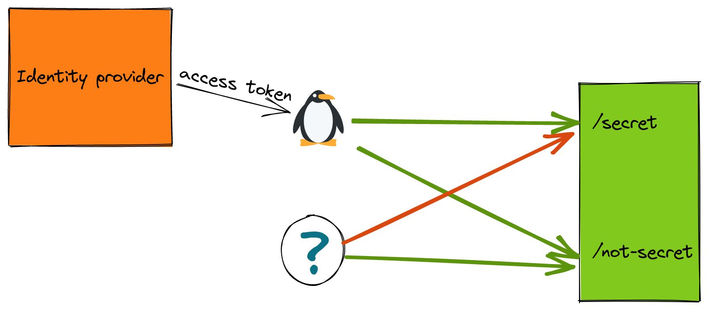

For most applications, authentication (and authorization) have a significant role. Usually, there are certain groups of users that can access a particular resources. But sometimes you might have other resources that should be available to any user and request.

Istio makes that possible by allowing only JWT-authenticated requests to certain routes, and allowing unauthenticated requests to other routes. That's a lot to take in, so here's a diagram what I'm referring to:

*Note: For a more in depth explanation on JWT auth flow, please refer to the blog post [JWT Authorization Flow with an Identity Provider](https://trstringer.com/jwt-authz-identity-provider-flow/).*



In this instance, we want our authenticated user to be able to access both routes: `/secret` and `/not-secret`. But we want our unauthenticated users to only be able to successfully reach `/not-secret`. With Istio we can accomplish this with a combination of `RequestAuthentication` and `AuthorizationPolicy` resources:

```yaml
apiVersion: security.istio.io/v1beta1
kind: RequestAuthentication
metadata:
  name: test-jwt
spec:
  jwtRules:
    - issuer: "https://sts.windows.net/my-tenant-id/"
      jwksUri: "https://login.microsoftonline.com:443/common/discovery/v2.0/keys"
  selector:
    matchLabels:
      app: httpbin2
```

This `RequestAuthentication` identifies my JWT issuer (in my case, I'm using Azure AD for my identity provider) and the JWKS URI. I use a workload selector so this only applies to a particular workload, as opposed to the whole namespace. This `RequestAuthentication` requires that all requests with an authorization bearer match this single issuer. It's worth noting, though, it will not prevent unauthenticated requests. This will just pass them through.

Now we need to create the authorization component of this scenario:

```yaml
apiVersion: security.istio.io/v1beta1
kind: AuthorizationPolicy
metadata:
  name: test-authz
spec:
  selector:
    matchLabels:
      app: httpbin2
  rules:
    - from:
        - source:
            requestPrincipals: ["*"]
    - to:
        - operation:
            paths: ["/not-secret"]
```

This authorization policy defines two different rules, which effectively say this:

1. For all authenticate requests, allow all destination routes
1. For any request (including unauthenticated), allow access to `/not-secret`

Let's see this in action!

```bash
INGRESS_IP=$(kubectl get svc -n istio-system istio-ingressgateway -o jsonpath='{.status.loadBalancer.ingress[0].ip}')
ACCESS_TOKEN=$(az account get-access-token --query accessToken -o tsv)

curl -H "Authorization: Bearer $ACCESS_TOKEN" -H "host: httpbin2.com" http://${INGRESS_IP}/secret
(httpbin2-7fdc8bf54c-5vggd)

curl -H "Authorization: Bearer $ACCESS_TOKEN" -H "host: httpbin2.com" http://${INGRESS_IP}/not-secret
(httpbin2-7fdc8bf54c-5vggd)

curl -H "host: httpbin2.com" http://${INGRESS_IP}/secret
RBAC: access denied

curl -H "host: httpbin2.com" http://${INGRESS_IP}/not-secret
(httpbin2-7fdc8bf54c-5vggd)
```

And there is the proof: Our authenticated request can reach all routes, but our request with no authorization bearer token can only successfully access the `/not-secret` route.

Hopefully this has helped illustration how you can accomplish this authentication/authorization scenario! The remainder of resource manifests for this full example end-to-end can be found below:

```yaml
apiVersion: apps/v1
kind: Deployment
metadata:
  name: httpbin2
spec:
  replicas: 1
  selector:
    matchLabels:
      app: httpbin2
  template:
    metadata:
      labels:
        app: httpbin2
    spec:
      containers:
        - name: httpbin2
          image: ghcr.io/trstringer/httpbin2:latest
          command: ["/httpbin2"]
          args:
            - "--message-hostname"
            - "--port"
            - "8080"
          ports:
            - containerPort: 8080
---
apiVersion: v1
kind: Service
metadata:
  name: httpbin2
spec:
  selector:
    app: httpbin2
  ports:
    - name: http
      port: 80
      targetPort: 8080
---
apiVersion: networking.istio.io/v1beta1
kind: VirtualService
metadata:
  name: httpbin2
spec:
  hosts:
    - "httpbin2.com"
  gateways:
    - httpbin2
  http:
    - match:
        - uri:
            prefix: "/"
      route:
        - destination:
            host: httpbin2
            port:
              number: 80
---
apiVersion: networking.istio.io/v1beta1
kind: Gateway
metadata:
  name: httpbin2
spec:
  selector:
    istio: ingressgateway
  servers:
    - hosts:
        - "httpbin2.com"
      port:
        number: 80
        protocol: http
        name: http
```
