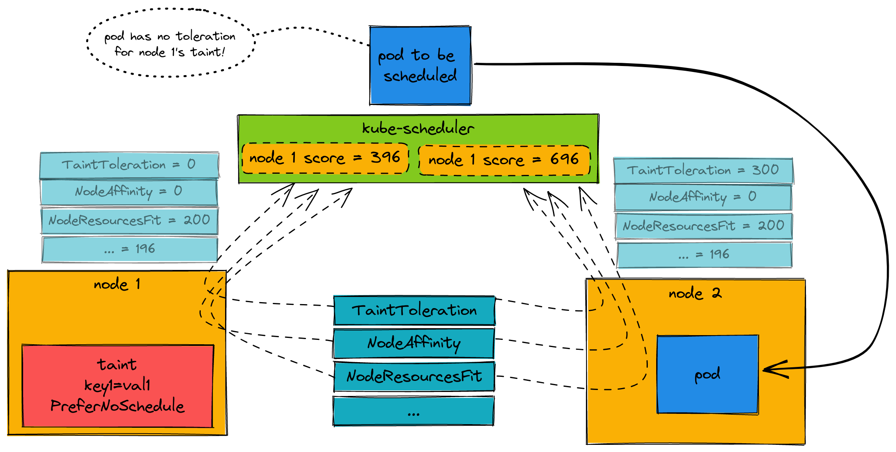

Within a Kubernetes cluster, it is common to want to stop pods from being scheduled on a node, or even terminated if they are already scheduled. These are referred to as **taints** (on the node) and **tolerations** (on the pods that want to be scheduled on a node). Taints and tolerations are comprised of three different components: Key, value, and effect. When you create a taint on a node, you specify all three of those:

```
$ kubectl taint node <node_name> <key>=<value>:<effect>
```

There are three different effects:

* `NoExecute` - Any pods that are already on the node that don't tolerate this taint will be evicted. New pods without a toleration will not be scheduled on this node.
* `NoSchedule` - Any new pods that don't have a toleration for this taint will not be schedule on this node.
* `PreferNoSchedule` - *More below...*

While `NoExecute` and `NoSchedule` are straightforward, the [Kubernetes documentation](https://kubernetes.io/docs/concepts/scheduling-eviction/taint-and-toleration/) explains `PreferNoSchedule` as:

> if there is no un-ignored taint with effect NoSchedule but there is at least one un-ignored taint with effect PreferNoSchedule then Kubernetes will *try* to not schedule the pod onto the node

That's not a very concrete answer, and when determining what your taints and tolerations are could be impacted by what that *really* means.

To understand how Kubernetes handles the `PreferNoSchedule` taint, it's important to first understand how a pod's destination node is determined. What's happening is that `kube-scheduler` will try to find a node that a new pod can be scheduled on. Part of that process is determining which is the **best** node. Kubernetes has the notion of score plugins for potential and possible nodes for a new pod. There are a handful of plugins, and one of them is the **TaintToleration** plugin, which a `PreferNoSchedule` taint (and lack of toleration) will affect. After Kubernetes calculates the score of each individual plugin per node, it aggregates them (by node). The node with the highest score is the one that will get the pod scheduled on it. Let's see this illustrated:



In this scenario, because node1 has a taint with `PreferNoSchedule`, and the pod that should be scheduled doesn't have a toleration for this then it will have an impact in the node's overall score. In the end, because of the TaintToleration plugin, node2 has a higher score than node1 and therefore the pod gets scheduled on node2. But! Even with the `PreferNoSchedule` taint, you can see above that other factors and score plugins could still cause the pod to be scheduled on node1. That's why it's a soft preference, and not a hard requirement (like `NoSchedule`).

Let's see this in a demo. First I'll create my local kind cluster (adding in a kubeadm patch so that kube-scheduler has verbose logging):

**scheduler-verbose-logging.yaml**

```yaml
kind: Cluster
apiVersion: kind.x-k8s.io/v1alpha4
nodes:
- role: control-plane
  kubeadmConfigPatches:
  - |
    kind: ClusterConfiguration
    scheduler:
      extraArgs:
        v: "10"
- role: worker
- role: worker
```

```
$ kind create cluster --config ./scheduler-verbose-logging.yaml
```

My Kubernetes cluster nodes look like this:

```
$ kubectl get no
NAME                 STATUS   ROLES           AGE    VERSION
kind-control-plane   Ready    control-plane   105m   v1.25.2
kind-worker          Ready    <none>          105m   v1.25.2
kind-worker2         Ready    <none>          105m   v1.25.2
```

I want to create a taint on `kind-worker` node:

```
$ kubectl taint node kind-worker key1=val1:PreferNoSchedule 
node/kind-worker tainted
```

The taint has key **key1** with a value of **val1** and an effect of `PreferNoSchedule`. Now let's create a simple pod:

**pod.yaml**

```yaml
apiVersion: v1
kind: Pod
metadata:
  name: taint-toleration-test
spec:
  containers:
    - name: httpbin2
      image: ghcr.io/trstringer/httpbin2:latest
      command: ["/httpbin2"]
```

This pod doesn't have a toleration for `kind-worker`'s taint, and as expected it gets scheduled on the other node (`kind-worker2`):

```
$ kubectl get po -o wide
NAME                    READY   STATUS    RESTARTS   AGE   IP           NODE           NOMINATED NODE   READINESS GATES
taint-toleration-test   1/1     Running   0          36m   10.244.2.2   kind-worker2   <none>           <none>
```

Let's see what the `kube-scheduler` pods show!

```
schedule_one.go:646] "Plugin scored node for pod" pod="default/taint-toleration-test" plugin="VolumeBinding" node="kind-worker2" score=0
schedule_one.go:646] "Plugin scored node for pod" pod="default/taint-toleration-test" plugin="VolumeBinding" node="kind-worker" score=0
schedule_one.go:646] "Plugin scored node for pod" pod="default/taint-toleration-test" plugin="PodTopologySpread" node="kind-worker2" score=200
schedule_one.go:646] "Plugin scored node for pod" pod="default/taint-toleration-test" plugin="PodTopologySpread" node="kind-worker" score=200
schedule_one.go:646] "Plugin scored node for pod" pod="default/taint-toleration-test" plugin="InterPodAffinity" node="kind-worker2" score=0
schedule_one.go:646] "Plugin scored node for pod" pod="default/taint-toleration-test" plugin="InterPodAffinity" node="kind-worker" score=0
schedule_one.go:646] "Plugin scored node for pod" pod="default/taint-toleration-test" plugin="NodeResourcesBalancedAllocation" node="kind-worker2" score=99
schedule_one.go:646] "Plugin scored node for pod" pod="default/taint-toleration-test" plugin="NodeResourcesBalancedAllocation" node="kind-worker" score=99
schedule_one.go:646] "Plugin scored node for pod" pod="default/taint-toleration-test" plugin="ImageLocality" node="kind-worker2" score=0
schedule_one.go:646] "Plugin scored node for pod" pod="default/taint-toleration-test" plugin="ImageLocality" node="kind-worker" score=0
schedule_one.go:646] "Plugin scored node for pod" pod="default/taint-toleration-test" plugin="TaintToleration" node="kind-worker2" score=300
schedule_one.go:646] "Plugin scored node for pod" pod="default/taint-toleration-test" plugin="TaintToleration" node="kind-worker" score=0
schedule_one.go:646] "Plugin scored node for pod" pod="default/taint-toleration-test" plugin="NodeAffinity" node="kind-worker2" score=0
schedule_one.go:646] "Plugin scored node for pod" pod="default/taint-toleration-test" plugin="NodeAffinity" node="kind-worker" score=0
schedule_one.go:646] "Plugin scored node for pod" pod="default/taint-toleration-test" plugin="NodeResourcesFit" node="kind-worker2" score=97
schedule_one.go:646] "Plugin scored node for pod" pod="default/taint-toleration-test" plugin="NodeResourcesFit" node="kind-worker" score=97
schedule_one.go:704] "Calculated node's final score for pod" pod="default/taint-toleration-test" node="kind-worker2" score=696
schedule_one.go:704] "Calculated node's final score for pod" pod="default/taint-toleration-test" node="kind-worker" score=396
default_binder.go:52] "Attempting to bind pod to node" pod="default/taint-toleration-test" node="kind-worker2"
```

The scheduler shows the score plugin (and resulting score) for each node when trying to schedule, and ends up with the following:

|plugin|kind-worker|kind-worker2|
|---|---|---|
|VolumeBinding|0|0|
|PodTopologySpread|200|200|
|InterPodAffinity|0|0|
|NodeResourcesBalancedAllocation|99|99|
|ImageLocality|0|0|
|**TaintToleration**|**0**|**300**|
|NodeAffinity|0|0|
|NodeResourcesFit|97|97|
|**TOTAL**|**396**|**696**|

Finally, `kind-worker2` has a higher score and gets the pod. Hopefully this exercise has shown you that while a `PreferNoSchedule` taint (and lack of toleration) has an impact in pod scheduling, there are other factors involved which could end up affecting the final destination node!
