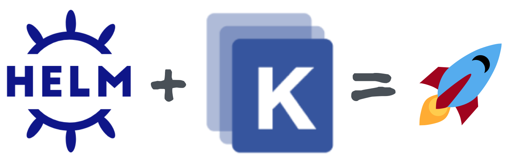

I see this question asked all the time:

> Should I use Helm ***or*** Kustomize?

There are definitely times when you will just want to use Helm charts. And likewise, there are times when you will want use just Kustomize. But what is rarely talked about is when and how to use them *together*.



## TLDR

You might want to use Helm and Kustomize together when:

* You don't have control over the Helm chart (it's not yours).
* You want different config for different environments.
* You don't want your secrets in a Helm chart, but you want them patched in by Kustomize.
* Cross-cutting fields
* And more...

The two main (mutually exclusive) ways to use them together are:

1. `helm template` generates the manifest and dumps it into a file, and then you run `kubectl kustomize`. The downside is that Helm doesn't manage any release.
1. `helm install` (or `helm upgrade --install`) and specifying a custom post-renderer that runs `kubectl kustomize`. The benefit is that Helm manages the release and its full lifecycle.

## Helm and Kustomize intro

Before we dive into the specifics on how to use them together, it's wort mentioning a brief overview of what each tool is.

### Helm

Helm allows you to create and use charts in your Kubernetes clusters. A Helm chart is a layer on top of your resources that logically combines them, and allows you to treat them as a single entity for their lifecycle.

An example: If you have an application that is comprised of 2 deployments, a namespace, a service account, and service. Without Helm you are creating and updating these items separately and individually. Helm allows you to group these into a chart as a single unit. Another benefit of Helm is the ability to parameterize certain aspects of this "application" (the manifests) so that you can specify different values from different requirements.

More information about Helm can be found on the [Helm site](https://helm.sh/).

### Kustomize

Kustomize is a tool that allows you to augment and modify your Kubernetes resource manifests by taking a declarative approach (instead of a templated one, like with Helm).

An example: You have your Kubernetes manifests but you would like to specify a different namespace for different cluster lifecycles. You could use Kustomize to patch your manifests prior to applying them to your cluster.

More information about Kustomize can be found on the [Kustomize site](https://kustomize.io/).

## Why use them together?

Before I show the "how", we should first understand why and in what situations you would consider using them together.

* **You don't control the Helm chart** - One of the benefits of Helm is that it's considered the "package manager of Kubernetes". It's quite common to pull and use a Helm chart somebody else published in a Helm repository. What if you want to modify something in the manifests? Kustomize makes this simple.
* **Different environments** - One of the more natural uses of Kustomize is to have different configurations for different evironments. While you could achieve this solely with Helm, it would be a cleaner solution to maintain different environment kustomizations abstracted away from the Helm charts.
* **Secret creation** - When working with Secret and ConfigMap resources, you might not (and probably don't) want them baked into your Helm charts. Having Kustomize create the resources after Helm has inflated the charts is a common way to inject this sensitive data in the cluster.
* **Cross-cutting fields** - In certain instances, you may want to force all (or a subset of) resources to a namespace, or apply a label to these resources. Typically you wouldn't want to have that in your Helm charts, but Kustomize can easily overlay this configuration on your resources.
* **And many more...** - Each environment is different, and there are likely countless other times when you may want to use Helm and Kustomize together. Know and understand your requirements prior to making your initial technical decisions.

## Sample application and setup

Before I dive into how to use Helm and Kustomize together, I want to first introduce the very basic application I'll be using as a target for my Helm + Kustomize documentation. It is a Helm chart which comprises of a single pod manifest. Here are the Helm chart files:

**Chart.yaml**

```yaml
apiVersion: v2
name: helm-kustomize
description: Helm plus Kustomize
type: application
version: 0.1.0
appVersion: "1.16.0"
```

The single template is an httpbin2 pod:

**templates/pod.yaml**

```yaml
apiVersion: v1
kind: Pod
metadata:
  name: httpbin2
spec:
  containers:
    - name: httpbin2
      image: "{{ .Values.image.repository }}:{{ .Values.image.tag}}"
      imagePullPolicy: {{ .Values.image.pullPolicy }}
      command: ["/httpbin2"]
```

Default values configuration file:

**values.yaml**

```yaml
image:
  repository: ghcr.io/trstringer/httpbin2
  pullPolicy: Always
  tag: latest
```

And finally, I want to use Kustomize to modify the namespace to be in `my-app` instead of the default namespace.

**kustomization.yaml**

```yaml
namespace: my-app

resources:
  - resources.yaml
```

This kustomization just applies the namespace `my-app` to all resources in the `resources.yaml` file. Basic, but powerful.

Some final setup, I'll create a [kind](https://kind.sigs.k8s.io/) cluster for the application, and the namespace to contain the components:

```
$ kind create cluster

$ kubectl create ns my-app
```

Ok, great! Now we have all the infrastructure in place. It's time to see the different ways to use Helm and Kustomize together.

## Option 1: helm template

The first approach is the most common that I have seen. It uses `helm template` to generate the manifests, and then pipes that through Kustomize to do the patching. Here's how we could do this with our application:

```bash
helm template ./helm-kustomize --set image.tag=0.1.0 > resources.yaml
kubectl kustomize | kubectl apply -f -
rm resources.yaml
```

This runs `helm template` with an override to set the image tag to `0.1.0` and dumps it into the `resources.yaml` file. Then it runs Kustomize through `kubectl kustomize` (defaulting to using the `kustomization.yaml` in the current directly, shown above). This patched manifest is then piped into `kubectl apply`, which creates the resources in the cluster.

And the pod is created!

```
$ kubectl get po -n my-app

NAME       READY   STATUS    RESTARTS   AGE
httpbin2   1/1     Running   0          99s
```

And as expected, setting the image tag override used the right version of the image:

```
$ kubectl get po -n my-app httpbin2 -o jsonpath='{.spec.containers[0].image}'

ghcr.io/trstringer/httpbin2:0.1.0
```

So what's the downside of this approach? Well, you're using Helm to generate, or inflate, the chart into manifests. This is great! In fact, you can even keep your `resources.yaml` around for further inspection or checking into version control. But that's the extent of what Helm does for you. You don't have a Helm release, and therefore no application lifecycle management. Helm knows nothing about this application:

```
$ helm ls

NAME    NAMESPACE       REVISION        UPDATED STATUS  CHART   APP VERSION
```

To do an upgrade, the commands are essentially the same (with the updated chart or updated values):

```bash
helm template ./helm-kustomize --set image.tag=0.1.1 > resources.yaml
kubectl kustomize | kubectl apply -f -
rm resources.yaml
```

Verification that the new image tag is reflected in the updated pod:

```
$ kubectl get po -n my-app httpbin2 -o jsonpath='{.spec.containers[0].image}'

ghcr.io/trstringer/httpbin2:0.1.1
```

## Option 2: helm install/upgrade

Another way to approach this may not be obvious. You can still use all the greatness of Helm managing your releases and applications by using `helm install` (or `helm upgrade --install`), and by having Kustomize still modify the manifests prior to applying them in the cluster. This is accomplished by using a Helm post-renderer. A post-render is any executable that you pass the rendered manifests to. You likely don't want to pass `kubectl kustomize` directly, as we need to specify the `resources` in the `kustomization.yaml`, like above. So we wrap all this logic in a shell script:

**kustomize.sh**

```bash
cat > resources.yaml
kubectl kustomize
rm resources.yaml
```

Because Helm sends the rendered manifests in through stdin, we just need to run `cat > resources.yaml` to transfer the manifest to the single file `resources.yaml`. Then, like above, we run `kubectl kustomize` to apply the `kustomization.yaml` configuration. Now we have our post-renderer shell script, let's plug this into a Helm install (I prefer to use `helm upgrade --install` to handle both install and upgrade scenarios):

```bash
helm upgrade \
    hk \
    ./helm-kustomize \
    --set image.tag=0.1.0 \
    --install \
    --post-renderer ./kustomize.sh
```

Here I run a `helm upgrade` and name the release `hk` and specify to use the local `helm-kustomize` chart. Like the previous example, I override the default and set the image tag to `0.1.0`. Finally, I specify the `kustomize.sh` shell script as the post-renderer. After running this I see that the release is created:

```
Release "hk" does not exist. Installing it now.
NAME: hk          
LAST DEPLOYED: Tue Mar  7 19:33:37 2023
NAMESPACE: default                                                                  
STATUS: deployed
REVISION: 1
TEST SUITE: None
```

And unlike the `helm template` approach, I see that Helm is now managing this release:

```
$ helm ls

NAME    NAMESPACE       REVISION        UPDATED                                 STATUS          CHART                   APP VERSION
hk      default         1               2023-03-07 19:33:37.567719501 -0500 EST deployed        helm-kustomize-0.1.0    1.16.0
```

I can even dump the manifest directly from Helm:

```
$ helm get manifest hk

apiVersion: v1
kind: Pod
metadata:
  name: httpbin2
  namespace: my-app
spec:
  containers:
  - command:
    - /httpbin2
    image: ghcr.io/trstringer/httpbin2:0.1.0
    imagePullPolicy: Always
    name: httpbin2
```

Upgrades look similar:

```bash
helm upgrade \
    hk \
    ./helm-kustomize \
    --set image.tag=0.1.1 \
    --install \
    --post-renderer ./kustomize.sh
```

The only thing that changed was the image tag in this example.

```
Release "hk" has been upgraded. Happy Helming!
NAME: hk          
LAST DEPLOYED: Tue Mar  7 19:37:41 2023
NAMESPACE: default                                                                  
STATUS: deployed
REVISION: 2
TEST SUITE: None
```

And we can see Helm tracks both release revisions:

```
$ helm ls

NAME    NAMESPACE       REVISION        UPDATED                                 STATUS          CHART                   APP VERSION
hk      default         2               2023-03-07 19:37:41.554857108 -0500 EST deployed        helm-kustomize-0.1.0    1.16.0 
```

With this approach, not only are we able to use Kustomize on our Helm charts, but we still retain the powerful Helm features of a release.

## Summary

I hope this blog post has highlighted a few things:

* That you *can* use both Helm and Kustomize together.
* *When* you might want to use them together.
* *How* to use them together (`helm template` vs `helm install/upgrade`), including the implementation differences.

Enjoy!
