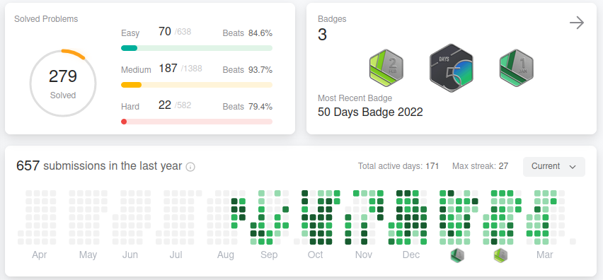

Love it or hate it, LeetCode-style interviews are part of our reality as software engineers. While not _all_ potential employers do these types of interviews (data structures and algorithms, code challenges, etc.), there is a significant portion that do. While I respect the stance of software engineers that claim they will never partake in such an interview, you will be eliminating a lot of great possible companies to work for.

But this blog post is not intended to convince you whether or not LeetCode-style interviews are good or bad (I'll reserve my opinion for a later time and post). I wanted to share what worked for _me_ as I learned and prepared. More specifically, I think the following advice can apply to many senior+ software engineers that are looking to get ready for these interviews.

## It takes a lot of time

I wasn't sure which one to put first, but I think this is one of the more _real_ aspects of preparing: It takes time... a *lot* of time. I have no doubt there are software engineers that can spend a week or two on DSA prep and then be ready, but most of us are not that. And even so, there is such a large variety of algorithms you might be really good in one algorithm but struggle in another.

It takes time, and don't expect to be comfortable and confident after a short amount of prep. Here is my LeetCode activity:

Somewhere along that calendar I became really comfortable with DSA problems. Because it isn't binary to go from "not great" to "good" at these questions, it's hard to pinpoint what that time is. Unlike riding a bike, there was never a Eureka moment. It's very gradual, but I'd say my comfort level was high a few months into consistent preparation. Don't get me wrong, I could get stumped, but for the most part I was able to successfully solve a large variety.

Be patient, understand it's a long process, and try to enjoy the journey.

## Stay consistent

Do at least a single problem a day. Instead of doing 8 questions one day and taking off the next 6 days, I'm a big fan of doing a little bit very often. During this time period, I was doing anywhere from 1 - 3 problems a day. There was an occasional weekend day where I did more than that, but that was an exception to the rule.

As you can see from my activity graph above, there weren't many days I was taking off. But, I was forgiving with myself. If I was on a snowboarding trip for the weekend, for example, I'd chalk up a few days to doing no problems and had no issues with that. But if I was home and local and otherwise available, I'd do a problem. At least one. Much like Rome wasn't built in a day, DSA skills weren't achieved in week.

I'm a big fan of consistency and discipline. Remember, motivation will vary from day to day and week to week. That's ok. But discipline should remain constant, and discipline is what gets you through the times of low motivation. I like schedules. For me, I'm an early riser. It's common for me to wake up around 5am every morning, so my routine was to get my hot cup of green tea and do a LeetCode question around that time right when I wake up, long before I start work for the day. If something prevented me from doing a problem in the morning, I'd typically make up for it in the evening around 8pm. Since I wake up early, I tried to not do a challenge past 9pm, because I found that my brain was still racing and it could be hard to sleep.

This is my routine. Find your routine, something that works for you. DSA problems are brain-intensive, so choose a time when your brain is the freshest. For me, that's around 5:30am. But be consistent, and use your discipline to stay with your routine.

## NeetCode

I _highly_ recommend that when you are starting out on your DSA prep journey you should first look towards [NeetCode](https://neetcode.io/practice) to guide you through the higher level topics and provide samples of questions for each different topic. The reason that NeetCode is so effective for somebody getting into DSA prep is that it's hard to know which topics you need to learn and perfect if you don't already know about them.

NeetCode divides them up into 18 different topics, including: Arrays and hashing, pointers, sliding window, trees, tries, linked lists, heaps, and many more. While there are 150 problems in NeetCode, I personally just focused on a little over half of them for each topic.

## Daily challenges and random questions

NeetCode will get you far, but I'd argue that completing NeetCode is the end of a chapter, not the whole book. So what problems should you do then? I did a combination of a few things during different times.

I intially would just do random problems. I'd select "medium" and "to do" (problems I didn't complete or attempt) and select "Pick One". That's the one I'd do. That was great. I also used the daily challenges to select problems of a large variety for me. There were a couple months, even, that I did the daily challenges every single day.

Outside of this, I found that it was helpful to read my brain energy and desire. If I didn't get enough sleep and wasn't really focused, I probably wasn't going to do a hard problem. In fact, I found that doing one of the easier mediums was helpful on days like this. Looking for an easier day? Filter medium questions with a higher acceptance rate (>60%). Looking for a bigger challenge? Filter mediums for a lower acceptance rate (<40%). Average day? Find a medium problem somewhere in between 40% and 60%. This was *really* helpful. Otherwise you just get frustrated if your brain isn't up to the task of a bigger challenge. That's ok, read your vibe and adjust accordingly.

## Do mostly mediums

While you can run into interviews that fall into the "easy" or "hard" LeetCode categories, most of them will be "medium" level. Because of that, I highly recommend focusing on medium questions. I think it's good to use easy questions to familiarize yourself with a topic. As for hards, they can be of varying degrees of usefulness. You'll find that some are just so unbelievably hard, or cover such an uncommon topic that I think the return on spending a lot of time on them might not be the best investment. I will say, though, sometimes there is a hard problem that is a combination of multiple topics that you need to employ to solve it. Those are interesting and valuable, but it's not easy to filter through these different types of hards.

Medium problems are mostly what you'll see out in the wild, and because of that I primarily focused on mediums.

## You might end up enjoying LeetCode

Something I really like to do is sudoku. It is fun and challenging, and really exercises my brain. Another thing that is a brain challenge for me that I really enjoy is the game [Rush Hour](https://www.thinkfun.com/products/rush-hour/). I found that LeetCode problems gave me a similar challenge and satisfaction. Sudoku, Rush Hour, and LeetCode are brain intensive activites that I can casually spend 10 minutes to an hour on (depending on difficulty) with a similar experience. Because of that, LeetCode questions became an enjoyable daily activity for me, not something I dreaded.

## Summary

Hopefully this blog post has given you some tools and ideas as you start (or continue) your DSA interview prep. It's a long and difficult journey, but it is one with a satisfying end. And you'll probably learn quite a bit along the way!
