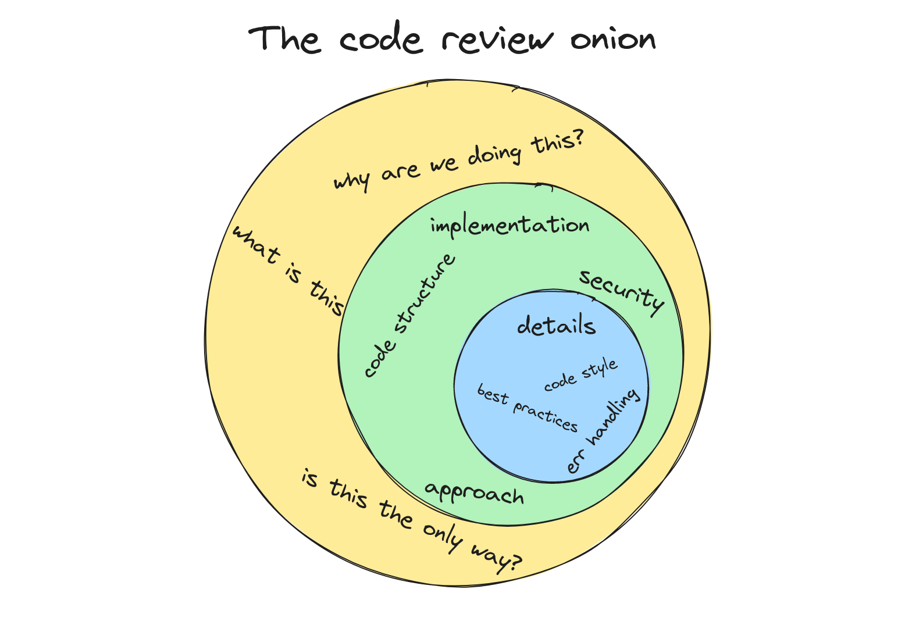

Writing code is difficult. But _reviewing_ code can be a whole other level of challenging. 😱

Reading code that you didn't write is already tough (e.g. being introduced into a new-to-you codebase that has been around for some time), but reviewing code adds another layer on that: On top of understanding the code, you're tasked with critiquing it and determining if it's good enough to be merged in. So from a **technical** aspect, it is a lot.

But the discomfort doesn't stop there. There's also the **social** aspect that can be painful. After all, unless you're just green-checking LGTM'ing the pull request, there's a chance that you will be providing feedback that the author should consider to change their code. It's quite a normal feeling to have some hesitation to tell the developer that their code isn't good enough.

Because this task is so difficult, yet so common (after all, how many of you software engineers are working in a team and *not* routinely reviewing code?), it can weigh heavily on developers that are doing it. I like to have a methodical approach to code reviews. I call this the code review onion 🧅 and here I'll show you how I like to peel its layers.

## The Code Review Onion

Before I dive into the code review onion, I want to clarify that this is relevant for code reviews from 1 line to 10,000 lines (although I hope you don't run into many of the latter. Remind yourself and your fellow programmers that the smaller the pull request, the better. For many reasons, but that's out of the scope of this post).

When I approach code reviews, I like to picture it like an onion and work my way from the outside in.

### First layer - Big picture

This first layer is the one that is skipped the most, and I'd argue that it is one of the most important parts of the code review. In this first layer, I like to get my bearing. Opening up a pull request for the first time, it's common for me to have no clue what I'm even looking at. Why is this pull request opened up in the first place? What problem are we trying to solve solve? Is there a ticket that this resolves? Simply put... *what issue does this fix?*

Is this a bug fix 🐞? If yes, what is the bug? What is the condition that causes this bug to show? Understanding the problem is critical before you can even start to understand the solution. Otherwise the validation that the solution actually fixes it doesn't happen.

Is this a new feature 🌟? What exactly is the new feature? What does it do? Or better yet, what does it *need* to do (it wouldn't be the first time that an introduced feature doesn't actually fulfull the initial requirement. As the code reviewer, you need to confirm this)?

Is this tech debt resolution 🛠? If so, does it refactor the right thing and actually clean up the code? Are we making things better, or just making the mess even messier?

You know you're done with this first layer when:

* You understand the thing this code is trying to solve
* The right approach is validated

If either of those aren't complete then it's a good time to provide that feedback and stop the review.

### Second layer - Implementation

Now we want to start looking at how this is being implemented. Some things we're trying to validate here are whether or not this is the right way to solve the problem that we clarified in the first layer. This can be quite tricky and can require some experience with the problem domain, but it's common here to provide feedback that there is a different way to do this thing.

This is also the time when we should start keeping an eye out for security implications 🔐. Does this open up any holes or widen the surface attack area?

What about performance? Will this solution scale given a different workload? Or will it possibly tip over in production? 🔥

Here we should be looking generally at the approach and how the author implemented the solution. Look at code structure. Is this the best place to put this code? Does it adhere to the existing codebase? Does it follow the API standards that are already in place?

You know you're done with this second layer when:

* It seems like the right implementation
* The code is in the right place
* There are no glaring security or performance issues

Again, if any of those aren't met then provide the feedback and stop the review.

### Third layer - Details

This last layer is the most common one and where many reviewers just jump to without doing the outside two layers. Here we want to look at the details. This is when we're reading the code, line for line. Follow the code paths.

What we're looking for here are:

* Does this code follow the standardized style (not linting, this should be an automatic pull request gate that has to succeed before any reviewers even glance at this)?
* Are errors handled appropriately?
* Any possible bugs being introduced?
* Are there tests covering this new code? Are the tests valid?
* Does the code make sense?

## Other considerations

This is a lot, and reviewing code (especially a large amount of code) can be exhausting and stressful. Here are some other tips that I've found helpful with code reviews.

### Block time to review large PRs

A two-line pull request can be quick. You can go through those layers in probably just a couple of minutes. A 1,000 line code review, not as fast. It's easy to just say to yourself that you don't have the time today to review that big PR. You will never have the time. Block off a slot in your calendar to review that code. And communicate that to the author: "Hey, I saw you have a PR out there. I've blocked off 30 minutes tomorrow morning on my calendar to review it. I should have feedback then."

### Be respectful and constructive

Outside of an approval, you're essentially telling the author that this isn't good enough to ship. Yikes, that can be a tough message. But if you approach it with a positive, respectful, and constructive way then it will be a good experience for both the reviewer and the author.

Use words and phrases that don't put blame or shame on the author. Instead of saying "this is wrong", instead say "I would do it this way" and provide the reason why. Avoid using words like "simple", "obviously", "of course". They imply that the author should've known something. What's obvious to you, is not obvious to everybody. Obviously.

You don't always need to point out the bad. Also comment on things that are interesting or really well done. Even if there are requests for changes, having a comment like "this is a really good approach" can help build the confidence of the author and keep the positive vibes.

### Take the opportunity to learn

Reviewing code isn't zero gain for the reviewer. Learn something. If this is in a part of the codebase you're not as familiar with, dig in and see how it is done. Maybe the author incorporated something in the pull request that you aren't very familiar with, but now you have gained some exposure to. Keep your eyes open to also learning from the author.

## Summary

Code reviews are a very real part of our jobs as software engineers. Hopefully this blog post has provided an approach to make them more enjoyable and constructive!
