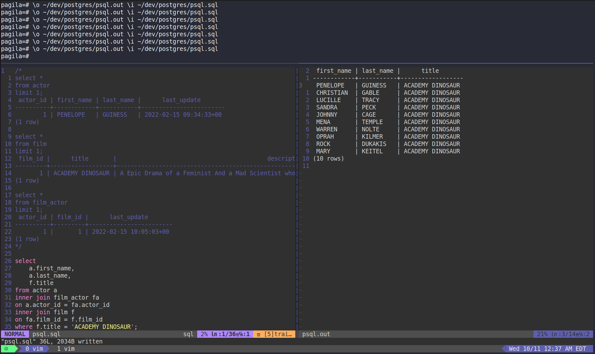

One of the common tools that PostgreSQL users end up having to work with is `psql`. It's a core client product that ships with postgres and for the most part it gets the job done and done well. In the past I've played around with ways to get the output formatted well by changing my pager and doing a lot of other modifications. On top of that, when writing longer queries (and iterating on those queries), that can be a little more paintful that I'd like to deal with routinely.

Because I treat my terminal as an IDE, I embrace that same approach with my query writing and executing. I use Vim for the SQL and getting the output, `psql` to actually run the queries, and `tmux` to handle the layout and multiple panes. The TLDR is this:



First, I open up a whole new tmux window and create a stacked pane. Then on the top pane I resize it down (`CTRL+B + :` then `resize-pane -U 15` works well for me), because it doesn't need much real estate. This is where I run `psql`.

Then in the bottom pane I run Vim. I like to have a development directory for all things postgres. In my case, that is `~/dev/postgres`. I have my main SQL "scratchpad", called `psql.sql`. And in the right pane I have my output buffer, which is `psql.out`.

Now all I need to do is write my queries in `psql.sql` and run them in `psql` with the following command!

```
\o ~/dev/postgres/psql.out \i ~/dev/postgres/psql.sql
```

Back in Vim, I just refresh the output buffer (`:e`) and voila! I'm looking at my query results. I really like this approach because it offers me a lot flexibilility. Not to mention, it keeps me where I spend most of my time already... Vim.
