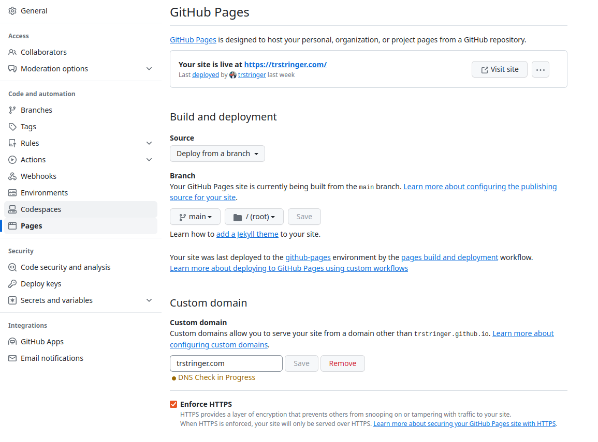

I get this question a lot, so I figured it is best to just publish this information for reference. And really for anybody that is interested in the technical details! It is a lot to dive into the world of blogging, and one of the major considerations is... _how_ can I do this? What's the technology?

I've tried (almost) all of it. From Wordpress to Medium, and everything in between. But for many years I have been on a single platform, with absolutely zero desire to move off of it. There were always things I didn't like about previous blogging platforms, but that has almost entirely gone away for me.

So... where do I host this blog?

[GitHub Pages](https://pages.github.com/)! By creating a repo named `username.github.io` (replacing "username" with your actual username), GitHub just gives you a hosted site. In my case, that site is this blog that you're reading. And the best part about all of this? **It's free**. That's right. Hosting this blog costs me $0.

So if that's how I host the site, where did I get the actual _site_ platform? I use [Jekyll, specifically the Chirpy theme](https://github.com/cotes2020/jekyll-theme-chirpy) to do static site generation. You are a GitHub fork away from having your own blog that you can modify and start publishing articles to.

But what handles generating and deploying the site? GitHub Actions! (You can see that GitHub plays a large role in all of this). Because this is GitHub Pages, there is an action `pages-build-deployment` that builds and deploys the site. It's all taken care of entirely for you.

For those that have worked with GitHub Pages before know that the default domain would be `username.github.io`. And as you can see here, I use a custom domain. This is a Google domain (I know, I need to migrate this elsewhere with the recent Google news) and then set this in the repo's configuration (also setting "Enforce HTTPS"):

So what does my workflow look like to write and release a blog post?

1. Write a draft blog post in the `_drafts` directory (I always start with this, because I like to control when I release blog posts to "production").
1. Once I am happy with this and am ready to release this, I move the draft post to `_posts`, making sure that I prefix the post filename with the date (e.g. `2023-10-18`). This is what picks up and generates the timeline for the posts on the actual site itself.
1. This is all based on a git repository, so locally I just `git add`, followed by a `git commit`, and then finally `git push` up to my GitHub repo.
1. After a few minutes, GitHub Pages deploys my updated code (in this case, my blog post) and it's live!

A few of the things I absolutely _love_ about hosting my blog in this way:

❤ It's free  
❤ It's easy to use   
❤ Writing and releasing a blog post is just a `git push`  
❤ It's zero administration for me (I get to just be a writer and not the sysadmin)

So if you're considering getting into the wonderful world of blogging, hopefully this shows just how approachable having a hosted blog is.
